<p align="center">
  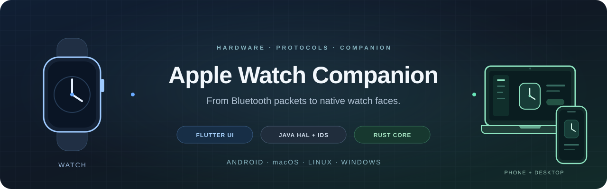
</p>

<h1 align="center">Apple Watch Companion</h1>

<p align="center">
  <strong>Android · macOS · Linux · Windows</strong><br>
  Native protocols. Physical hardware. A shared Companion.<br>
  Bluetooth · Pairing · IDS · Native Faces · Flutter · Java · Rust
</p>

<p align="center">
  <a href="#english"></a>
  &nbsp;
  <a href="#russian"></a>
  &nbsp;
  <a href="https://www.youtube.com/watch?v=5zvBRTuSM30"></a>
  &nbsp;
  <a href="docs/DONATIONS.md"></a>
</p>

<p align="center">
  <a href="#en-start">Start here</a> · <a href="#en-calls">Call map</a> · <a href="#en-pairing">Pairing</a> · <a href="#en-api">API</a> · <a href="#en-build">Build</a> · <a href="#en-evidence">Evidence</a>
</p>

---

<a id="english"></a>

## English

<h2 align="center">⚠️ TESTED ONLY ON watchOS 26.2 (23S303)</h2>

**Android Magisk module:** [Download Bridge 0.2.427 ZIP](https://github.com/LordixDemon/apple_watch_connector/releases/download/magisk-0.2.427/apple-watch-bridge-magisk-0.2.427.zip) · [Installation](#en-android-install)

**Connect Apple Watch to Android, Linux and Windows through native Bluetooth/IDS protocols and a shared Flutter Companion. macOS uses the same interface with a limited Bluetooth backend.**

This project reconstructs the path from discovery and pairing to activation, reconnection, preference exchange, and native watch-face management. Companion presents observed Watch state and submits commands on all four platforms. Android Bridge owns the phone connection and keys. Linux and Windows use a Rust desktop backend, native HCI brokers and the shared Java protocol engine; macOS uses Rust and CoreBluetooth. Linux and Windows pairing uses the six-digit Watch code; camera pairing is available on Android.

Release preparation now has a shared Java `protocol-runtime` module, isolated
research/debug probes, Linux artifact auditing and shared Android distribution
signing. See the [release guide](docs/BUILD_AND_RELEASE.md). Fresh pairing,
activation and same-pair encrypted reconnect are physically verified on Linux
and Windows with the tested hardware; desktop application service coverage
remains partial.

The Linux Rust backend separates observed state, worker I/O/lifetime and command
routing. Stop/failure states reject late ready events; EOF and bounded cleanup
prevent stale readiness and abandoned workers. Portable Java modules share strict
dependency locks. Linux packages include a verified schema-2 inventory and use
deterministic archive metadata. See [stage 93](docs/REFACTOR_RELEASE_93.md).
Linux now exposes Bluetooth adapter selection in All Watches, remembers the
address across HCI index changes and requires reselection when saved hardware
is missing. See [adapter selection](docs/LINUX_ADAPTER_SELECTION_94.md).

> **Documentation snapshot: October 9, 2026.** The main verified hardware is Apple Watch Ultra 2, `Watch7,5`, watchOS `26.2 / 23S303`. Source versions: Bridge **0.2.427 / code 627**, Companion **1.0.85+86**, Rust workspace **0.1.1**. Source versions do not establish installed device versions. Android camera pairing, Linux pairing on Mint 22.3 and Windows pairing on Windows 10 / Realtek `0bda:b00e` have separate hardware verification.

Development is ongoing. The hardware journal confirms camera pairing, activation, and a visible Watch face. Full Watch.app parity, every iPhone feature, and compatibility with every Apple Watch model remain incomplete. macOS discovery is implemented; the complete physical pairing → activation → IDS path is unfinished.

## Contents

- [Capabilities and verification boundaries](#en-status)
- [Project layout](#en-layout)
- [System architecture](#en-architecture)
- [End-to-end call map](#en-calls)
- [Protocol stack](#en-stack)
- [Fresh pairing, step by step](#en-pairing)
- [Activation and Setup completion](#en-setup)
- [Operational reconnection](#en-reconnect)
- [Complete Companion → Bridge API registry](#en-api)
- [IDS routes and handlers](#en-routes)
- [Native faces: read, mutate, import, resources](#en-faces)
- [Settings, pigments, and monograms](#en-preferences)
- [Notifications, finding devices, Wi-Fi, and Health](#en-features)
- [Modern StateReplicator and QUIC](#en-replicator)
- [Keys, storage, and ownership](#en-ownership)
- [Start from a clean machine](#en-start)
- [Build, test, and first run](#en-build)
- [macOS discovery build](#en-macos)
- [Linux connection and adapter selection](#en-linux)
- [Windows connection](#en-windows)
- [Update, backup, and rollback](#en-update)
- [Diagnostics and research commands](#en-diagnostics)
- [Source and evidence map](#en-evidence)
- [Glossary](#en-glossary)

<a id="en-status"></a>
## Capabilities and verification boundaries

This table distinguishes source implementation from retained hardware evidence. Consult the [feature registry](docs/WATCH_FEATURE_REGISTRY.md) and the [acceptance plan](docs/WATCH_FEATURE_COVERAGE_PLAN.md) for details. Older entries can describe stages that have since been superseded.

Release status: **experimental RC**. See the [platform support matrix and tested versions](docs/BUILD_AND_RELEASE.md#candidate-versions-and-support) and [changelog](CHANGELOG.md). Application services listed below apply to Android unless explicitly stated otherwise. Linux/Windows currently expose connection/setup controls; macOS exposes BLE discovery/link. The UI's Available Features panel reads declared backend support, independently of connection readiness.

| Area | Implemented path | Evidence and limits |
| --- | --- | --- |
| Android discovery / pairing | Actual discovery, explicit selection, PIN and optical PSK paths | Complete camera pairing, activation, and visible face in the [optical report](docs/live-20261006-optical-pairing/RESULT.md); verified on the specific hardware |
| Activation / Setup | PBBridge, initial properties, Watch language, PairedSync, completion policy | Activation, UI completion, and operational readiness are separate gates. [Completion report](docs/SETUP_COMPLETION_388.md) distinguishes native evidence and owner confirmation |
| Operational reconnect | Saved activated pair, encrypted link, IDS, separate foreground service | Connect does not replay pairing or Setup. Connected state and fresh battery were physically verified |
| Battery / About | Native observations and SystemSettings requests | [Battery evidence](docs/live-20261005-sync/BATTERY-346-HARDWARE-EVIDENCE.md); absent values remain unknown |
| Wi-Fi | Current phone network → native V2 ADD | Network reception and Watch join were confirmed in the hardware report; limited to the supported WPA2-PSK/CCMP network |
| Native faces | Inventory, select, duplicate, remove, reorder, update, add, resources, export | Native inventory is separate from local designs. Mutations require readback; family/preview coverage is evolving |
| Watch.app UI / previews | Native catalogs, options, palettes/shades, Photos, monograms, AppIntent metadata | Full visual parity and optimization remain open. Stage 90 swatch components are research output pending production UI integration |
| Settings | `RIGHT_WRIST`, `INVERT_SCREEN`, `TIME_24_HOUR` | Exact NPS key whitelist; other settings screens do not establish native writes |
| Notifications | Bulletin transport, Android listener, revision-bound actions | Delivery and handlers exist; all apps, attachments, sound, and actual actions need their own acceptance checks |
| Find devices | Phone → Watch sound; Watch → Phone effects/result | Receipts and physical effects are distinct. Sound/flash depend on Android permissions and phone state |
| Health | Encrypted ingress, replay, peer/registry binding, decode, defaults mirror | Does not establish complete Health/Activity import, correct anchors, or all data types |
| Calls / SMS / contacts | Research codecs and some Flutter methods | Current Companion IPC does not implement `triggerCall` or `callAction`; full calls/audio are unverified |
| StateReplicator | Authenticated discovery, pinned QUIC, native framing, handshake | Complete native snapshot/file reception and durable persistence remain unfinished |
| macOS | Shared Flutter UI, Rust C ABI, CoreBluetooth discovery/BLE, portable pairing codecs | Complete physical pairing/IDS awaits the authorized bootstrap transport |
| Linux | Rust HCI broker + shared Java protocol + Flutter UI | Physical pairing, activation and reconnect verified on Mint 22.3; Wi-Fi credentials and application services remain incomplete |
| Windows | Native Rust USB HCI + shared Java protocol + Flutter UI; DPAPI storage | PIN, activation and encrypted reconnect physically verified on Windows 10 / Realtek `0bda:b00e` / Watch7,5; other hardware and full application service coverage remain unverified |

<a id="en-layout"></a>
## Project layout

```text
.
├── apple-watch-companion/       Shared Flutter UI; Android IPC and desktop Rust FFI
├── apple-watch-bridge/
│   ├── core/                   Java wire codecs, crypto, policies, mirrors, JVM tests
│   ├── protocol-runtime/       Shared controller/session/stdin runtime; no Android SDK
│   ├── hal/                    Android root entry, Bluetooth HAL and file ownership adapters
│   └── app/                    Android services, Keystore/SQLite, permissions, IPC
├── crates/
│   ├── watch-protocol/         Rust framing, FE25 advertisements, BT_CL normal handoff
│   ├── watch-pairing/          Portable uIKE control/PIN security; no OS I/O
│   ├── watch-core/             Sessions, observations, transport interface
│   ├── watch-transport-macos/  CoreBluetooth ownership and callbacks
│   ├── watch-transport-linux/  Desktop worker, Linux HCI and Windows USB HCI brokers
│   ├── watch-transport-windows/ WinRT discovery/BLE diagnostic transport
│   ├── watch-core-ffi/         Versioned C ABI for Flutter desktop
│   └── watch-replicator-quic/  Socket-free pinned QUIC engine and Android JNI
├── src/                        Compatibility facade and USB framing utilities
├── tools/                      Builds, native captures, asset builders, verification
├── linux-watch-host/           Linux protocol host
├── windows-watch-host/         Windows protocol host and DPAPI storage
└── docs/                       Architecture, protocol documentation and verification
```

Build boundaries are defined in [Gradle settings](apple-watch-bridge/settings.gradle) and the [Cargo workspace](Cargo.toml). `artifacts/`, `target/`, `build/`, and historical `source-before/` trees contain many files outside the current application sources.

<a id="en-architecture"></a>
## System architecture

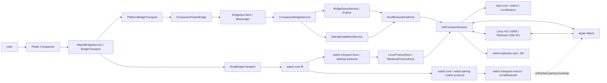

One Android Bridge APK contains `app`, `hal`, `protocol-runtime`, `core`, and the QUIC `.so`. Companion is a separate APK. The Java package `dev.applewatchandroid.bridge` remains shared across modules, with compile dependencies `app → hal → protocol-runtime → core` and `app → core`. Linux and Windows workers reuse `protocol-runtime` and `core` with platform controller and storage adapters. Rust owns desktop worker lifetime and public state; Flutter accesses it through the C ABI.

Flutter owns the user connection flow. The Bridge launcher redirects into Companion. Closing a screen leaves the operational foreground service running. One owner holds the HAL; one serial transport state machine orders packets.

Details: [Bridge architecture](docs/BRIDGE_ARCHITECTURE.md), [Companion architecture](docs/COMPANION_ARCHITECTURE.md), [macOS Rust core](docs/MACOS_RUST_CORE.md).

<a id="en-calls"></a>
## End-to-end call map

These maps cover implemented cross-layer transitions and significant calls. Arrows show work direction; some transitions are asynchronous queues. Source conditions and runtime evidence determine whether a particular branch executes.

### Companion → Watch command

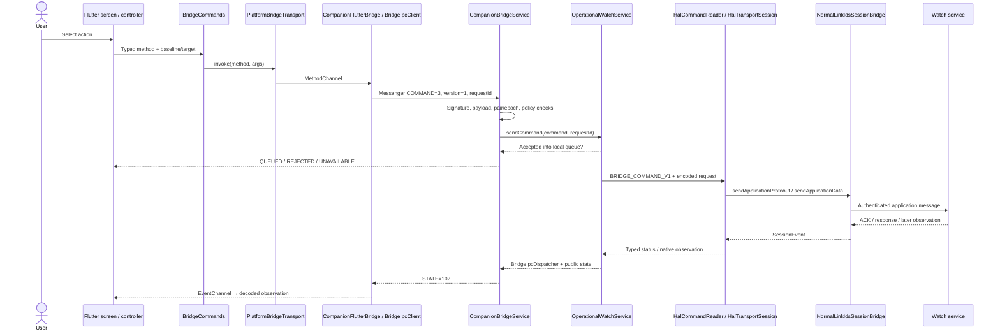

Pairing/activation use `BridgeSetupService`. Large `.watchface` packages pass through `NativeFaceTransferDispatcher` before the mutation command. Binding Companion to IPC does not start HAL or create a pair.

### Watch → UI observation

```text
Watch packet
  → Bluetooth HAL callback / HCI ACL
  → HalTransportSession
  → NormalLinkIdsSessionBridge.accept…
  → normal link: ERTM / NetworkRelay / authenticated ESP
  → IDS: IPv6 / TCP / NWSC / control or application stream
  → IdsModernSessionCoordinator.SessionEvent
  → handleIncomingProtobufEvent / feature receiver / typed observation
  → root stdout IPC → OperationalWatchService
  → BridgeIpcDispatcher + CompanionSessionState
  → CompanionBridgeService.state() / STATE=102
  → BridgeIpcClient → BridgeStateProjection
  → EventChannel → WatchBridgeService / BridgeObservation
  → WatchObservationController / WatchConnectionProvider / feature controller
  → Provider → widgets
```

A publication is decoded as a whole before its projections are emitted. Transport loss or pair changes invalidate connected/native state. Late replies from an earlier epoch must not restore stale state.

### What each confirmation proves

| Value / event | Meaning |
| --- | --- |
| `QUEUED` | Bridge accepted the request into its local queue |
| `HAL_ACCEPTED` | Root transport accepted the structured request |
| `IDS_QUEUED` | IDS allocated the message, correlated by message UUID |
| `APP_ACK_RECEIVED` | The matching application acknowledgment arrived |
| `APP_RESPONSE_RECEIVED` | The matching application response arrived; its meaning is protocol-specific |
| `NATIVE_FACE_APPLIED` | Complete correlated Watch readback confirmed the face transaction |
| `APPLIED` | A value accepted by the Flutter confirmed wrapper; cannot be inferred from queue/ACK |
| `EXPIRED`, `FAILED`, `REJECTED`, `UNKNOWN` | Distinct incomplete outcomes; `UNKNOWN` does not rule out a partial effect |
| `OBSERVED` | Public-state read response; individual field freshness still matters |

The stage enum is defined in [BridgeCommandCodec](apple-watch-bridge/core/src/main/java/dev/applewatchandroid/bridge/BridgeCommandCodec.java). This is not one universal linear pipeline: requests have different stages, and a persisted snapshot can be old.

<a id="en-stack"></a>
## Protocol stack

### Establishing the link

```text
BLE advertisement / FE25 setup metadata
  → explicitly selected fresh Watch candidate
  → HCI LE connection
  → L2CAP
  → BT_CL fixed signaling CID 0x003a
  → VERSION / services / CREATE / ACCEPT
  → dynamic pairing pipe
  → uIKE security + PIN/optical authentication
  → OOB / LE Secure Connections SMP / durable Bluetooth bond
  → encrypted normal-link registration
```

### IDS application traffic over the normal link

```text
Application protobuf / binary plist / resource / native face payload
  ↕ IDS application stream + ServiceMap topic
  ↕ NWSC service connector + TCP + inner IPv6
  ↕ authenticated ESP / Class-C or Class-D IPsec
  ↕ NetworkRelay
  ↕ L2CAP ERTM on negotiated dynamic channels
  ↕ HCI ACL
  ↕ Android Bluetooth HAL / controller
  ↕ BLE link
```

[NormalLinkIdsSessionBridge](apple-watch-bridge/core/src/main/java/dev/applewatchandroid/bridge/NormalLinkIdsSessionBridge.java) defines the boundary: normal link owns IKE/ESP/NetworkRelay/ERTM; IDS owns decrypted IPv6/TCP, NWSC, and control/data streams. IKE establishes SAs; ordinary application payloads travel through ESP.

**A topic is not a separate TCP connection.** Services sharing priority and protection class use the same canonical connector. Class-C/D identify protected routes, not separate apps or radio channels.

<a id="en-pairing"></a>
## Fresh pairing, step by step

### 1. Admit a session owner

Companion calls `beginPairing` or `beginOpticalPairing`. `CompanionConnectionPolicy` checks Bluetooth permission, known saved identity, and exclusive ownership. A normal begin does not replace a saved pair. Explicit `replacePairOptically` requires the current saved pair UUID and a verified encrypted replacement backup.

### 2. Start the root controller runtime

`BridgeSetupService / BridgeSetupEngine → RootBluetoothHalHost → HalTransportSession.initialize() → runTransportHandshake()`.

The root host validates invocation and acquires the exclusive HAL lease. Transport configures the controller, receives stable local identity from the app, and sets ACL buffer/credits and event masks. MainActivity does not own this process.

### 3. Discover and select the actual Watch

Scanning yields advertisements. Valid setup metadata identifies product/watchOS/candidate information. `WatchDiscoverySelection` publishes bounded temporary tokens. Companion submits `selectDiscoveredWatch`, and freshness is rechecked before use. Manufacturer data alone does not establish pairability.

### 4. Open the pairing transport

After LE connection, BT_CL negotiates version/services/CREATE/ACCEPT. Dynamic CIDs come from negotiation, not constants. In HAL this reaches `probeControlSaInit()`.

### 5. Establish control security

Calls in [HalTransportSession](apple-watch-bridge/protocol-runtime/src/main/java/dev/applewatchandroid/bridge/HalTransportSession.java):

```text
runTransportHandshake()
  → probeControlSaInit()
  → probeAdditionalKeyExchange()
  → probeControlIkeAuth()
  → selected authentication branch
```

These negotiate security and validate authenticated payloads. They do not yet establish a durable bond, IDS readiness, or activation.

### 6. Authenticate through PIN or optical pairing

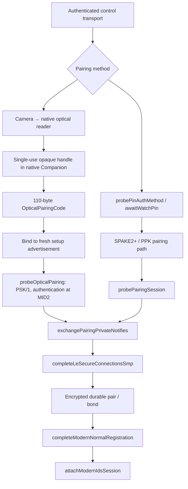

PIN and optical pairing have different authentication paths and message counters. Optical code is bound to fresh setup advertisement data. Decoding an image does not authenticate a pair.

The Android camera reader runs in a separate native `:optical` process. Dart receives a public name and a temporary handle. Explicit Pair/Replace transfers native payload through signature-protected IPC. The handle is single-use; its documented lifetime is 120 seconds and request deadline 10 seconds.

The current spatial reader uses a local hash-pinned transitional `23G71` firmware backend generated at build time. An independent portable spatial detector remains unfinished. Arm64 is supported; other native ABIs reject initialization. Required binary inputs cannot be replaced with arbitrary files.

### 7. Persist security material and the bond

`exchangePairingPrivateNotifies()` leads to OOB/SMP and `completeLeSecureConnectionsSmp()`. The app seals records and returns persistence results to root. `BOND-STORED` / `PAIRING-SESSION-STORED` differ from merely requesting persistence; a storage failure cannot advance a successful commit.

### 8. Establish the normal link and IDS

`completeModernNormalRegistration() → attachModernIdsSession()` establishes the normal pipe and protected routes. NetworkRelay/IKE Class-D and Class-C precede IDS control Hello, service routing, and data lanes. Device-info and NanoRegistry property exchange follow.

Sources: [optical result](docs/live-20261006-optical-pairing/RESULT.md), [typed setup state chain](docs/live-20261006-optical-pairing/SETUP-387-STATE-CHAIN.md), [PairingSessionRecord](apple-watch-bridge/core/src/main/java/dev/applewatchandroid/bridge/PairingSessionRecord.java).

<a id="en-setup"></a>
## Activation and Setup completion

### Sequence after security and IDS

| Step | Owner / data | Transition condition |
| --- | --- | --- |
| 1. IDS bootstrap | `IdsModernSessionCoordinator`, `IdsBootstrapState`, device info | Authenticated identity and live control/data lanes |
| 2. Initial registry | `AppleWatchInitialSetupIdsAdapter`, NanoRegistry properties | Required properties received and identity reconciled |
| 3. Language / locale | `WatchLocaleSnapshot`, preference archive | Authenticated Watch language/locale only; no Android-locale fallback |
| 4. Commit `isPaired` | Initial setup coordinator and durable record | Required checkpoints/barriers valid |
| 5. Activation | `HalPostCommitOrchestrator`, `ActivationProxyWorker`, PBBridge | Actual activation result; owner input travels separately |
| 6. Normal / initial sync prep | PBBridge 36, then 21 / response 18 | Correlated response; not Setup completion |
| 7. Wi-Fi | `InitialWifiSyncWorker` | Supported network, same pair/generation, live setup Class-C lane |
| 8. PairedSync | NPS domain, active/completed sync state | Native observer/saga conditions, not progress wording alone |
| 9. Exit Setup | Buddy / Carousel and completion policy | Separate native evidence or explicit owner confirmation of a visible face |
| 10. Normal reconnect | Operational policy | Same eligible saved pair; setup transport safely stopped |

### Native Watch path reconstructed from binaries

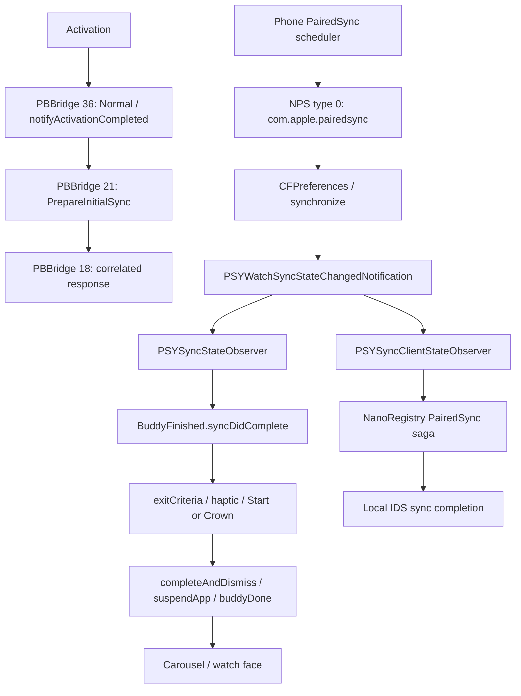

There are two independent observer branches. PBBridge 4 activation, response 18, AppACK, and sent progress do not independently establish visible Clock. Exact handlers and build distinctions (`23S303`, `23U67`, `23G71`) are retained in [SETUP_CHAIN.md](docs/live-20261005-sync/SETUP_CHAIN.md).

### Public phases and durable checkpoints

`SetupProgressState.Phase` defines:

```text
IDLE, STARTING, DISCOVERING, CONNECTING, PIN_REQUIRED, SECURITY, IDS,
REGISTRY, CONFIGURING, ACTIVATING, ACTIVATION_INPUT, ACTIVATED, SYNCING,
WAITING_FOR_WATCH, VERIFYING_RECONNECT, VERIFIED, FAILED, STOPPING, STOPPED
```

This is projection vocabulary, not one mandatory order for every scenario. `BridgeSetupEngine` prevents regression and clears late owner-input fields.

`PairingSessionRecord` preserves durable wire numbering:

| Value | Checkpoint | Value | Checkpoint |
| ---: | --- | ---: | --- |
| 1 | `PAIRING_MATERIAL_PERSISTED` | 10 | `INITIAL_PROPERTIES_RECEIVED` |
| 2 | `SMP_BONDED_RAW` | 11 | `READY_TO_COMMIT_IS_PAIRED` |
| 3 | `STOCK_BOND_IMPORTED` | 12 | `IS_PAIRED_COMMITTED` |
| 4 | `STOCK_ENCRYPTED_RECONNECT` | 13 | `ACTIVATION_CONFIRMED` |
| 5 | `NETWORK_RELAY_PRELUDE_NEGOTIATED` | 14 | `IS_SETUP_CONFIRMED` |
| 6 | `CLASS_D_ESTABLISHED` | 15 | `PAIRED_SYNC_COMPLETE` |
| 7 | `CLASS_C_ESTABLISHED` | 16 | `SETUP_COMPLETE` |
| 8 | `IDS_CONTROL_READY` | 17 | `CLOCK_VISIBLE_CONFIRMED` |
| 9 | `IDS_DATA_READY` | 18 | `OPERATIONAL_HEALTH_CONFIRMED` |

Flags, evidence, and identity are checked as well. A high ordinal alone does not admit operational mode. Owner confirmation is stored separately from native evidence. Unobserved legacy terminal records are not automatically eligible for normal reconnect.

<a id="en-reconnect"></a>
## Operational reconnection

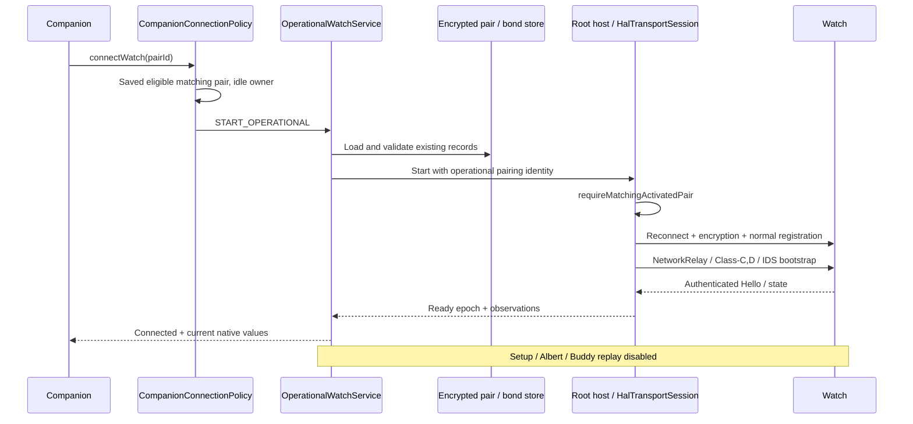

`OperationalWatchService` owns root lifetime, readiness epoch, the bounded command queue, and reconnect. Feature controllers receive `OperationalSessionAccess`; they cannot start a second root owner or replace the pair.

When retries are allowed, failure-count delays are **15 → 30 → 60 seconds**. IDS policy rejection or incomplete paired commit may prohibit reconnect. A timer does not override these conditions.

Disconnect cleans up and releases ownership. A second flow cannot acquire HAL during `STOPPING`. A new reconnect has a new transport epoch; earlier commands are invalidated.

<a id="en-api"></a>
## Complete Companion → Bridge API registry

This registry lists the current Android IPC handlers and separate local adapter methods. Arguments are summarized; exact validation/size rules live in the linked implementation. This is an internal API between two signed applications.

### IPC contract

| Layer | Contract |
| --- | --- |
| Flutter commands | MethodChannel `dev.applewatchandroid.companion/bridge` |
| Flutter observations | EventChannel `dev.applewatchandroid.companion/events` |
| Native service | `dev.applewatchandroid.bridge.CompanionBridgeService` |
| Permission | `dev.applewatchandroid.bridge.permission.COMPANION_IPC`, `signature` protection |
| Messenger request | `1 = SUBSCRIBE`, `2 = GET_STATE`, `3 = COMMAND` |
| Messenger reply | `101 = RESPONSE`, `102 = STATE` |
| Envelope | `version=1`, canonical `requestId` UUID; commands include `method` and typed Bundle args |
| Admission | Companion package and matching signature; at most 4 subscribed clients |
| Companion client | At most 32 pending requests, 5-second deadlines, binding-death recovery |
| Root command | `BRIDGE_COMMAND_V1:` + Base64 binary request `{id, epoch, deadlineMs, command}` |
| Root status | `BRIDGE_COMMAND_STATUS_V1:` + Base64 typed status |

Local text/file adapters use separate `…/text` and `…/face_files` channels; these operations are not Watch IDS commands.

### Connection and Setup

| Method | Path / condition |
| --- | --- |
| `connectWatch` | `START_OPERATIONAL`: same eligible saved pair |
| `disconnectWatch` | `STOP_SESSION`: setup or operational owner |
| `beginPairing` | `START_SETUP`: no saved pair |
| `beginOpticalPairing` | `START_SETUP`: native optical payload and no saved pair |
| `replacePairOptically` | Explicit replacement: matching saved pair, optical code, verified backup |
| `resumeSetup` | Matching saved pair not yet operationalEligible |
| `submitPin` | Forward to the current setup owner |
| `selectDiscoveredWatch` | Forward a temporary discovery token to setup |
| `activationResponse` | Forward a challenge response to setup |
| `confirmSetup` | Activated matching pair; safe owner-confirmed completion |
| `finishSetup` | Explicit `REJECTED` policy; legacy force-finish disabled |
| `auditStockBond` | Separate setup diagnostic flow for matching pair |
| `importStockBond` | Guarded stock bond import flow |
| `alignStockIdentity` | Guarded stock identity diagnostic flow |
| `probeStockReconnect` | Guarded stock reconnect probe |

Sources: [connection policy](apple-watch-bridge/core/src/main/java/dev/applewatchandroid/bridge/CompanionConnectionPolicy.java), [IPC service](apple-watch-bridge/app/src/main/java/dev/applewatchandroid/bridge/CompanionBridgeService.java).

### Operational commands

| Method | Arguments / command | Completion evidence |
| --- | --- | --- |
| `pingWatch` | `PING_WATCH` → FindMyLocalDevice | Correlated response; physical sound verified separately |
| `refreshWatchState` | `REQUEST_DEVICE_ABOUT` | SystemSettings About response / telemetry |
| `refreshFaceCollection` | `REQUEST_FACE_COLLECTION` | Complete accepted native collection snapshot |
| `syncWifi` | `SYNC_CURRENT_WIFI` | V2 archive delivery; network join checked separately |
| `setActiveFace` | `faceId` → `NATIVE_FACE_SELECT:` | Newly confirmed selected UUID |
| `duplicateNativeFace` | `sourceFaceId`; new UUID from requestId | New face/archive in readback |
| `removeNativeFace` | `faceId` | UUID absent from readback; final face cannot be removed |
| `reorderNativeFaces` | Exact permutation in `faceIds` | Full matching order in readback |
| `updateNativeFace` | `faceId`, binary `configuration` | Matching configuration in readback |
| `addNativeFace` | `.watchface` `archive`, up to 128 KiB inline | New target UUID and archive in readback |
| `setNativeMonogram` | `pairId`, `epoch`, `revision`, `text` | New paired monogram observation |
| `setNativePigmentVisibility` | Pair/epoch, timestamps, full baseline sets, `changes` | Paired pigment mirror; queue/ACK insufficient |
| `setWatchSetting` | `setting`, boolean `value` | Native NPS observation of the exact key |
| `sendNotification` | `title`, `message`, `sectionId`, `sectionDisplayName` | Native bulletin path; card/action checked separately |
| `stopPhonePing` | Local Android effect stop | `STOPPED` on successful local stop |

The operational service checks readiness/policy; root validates the envelope again. Face operations also require known current inventory. Root rejects legacy `SET_ACTIVE_FACE:`: native collection protocol is required.

### Archives and local platform actions

| Method | Behavior |
| --- | --- |
| `beginNativeFaceImport` | Creates pair/epoch upload with declared total; optional faceId/baselineHash for resources |
| `appendNativeFaceImport` | Sequential chunks with offset validation |
| `finishNativeFaceImport` | Validates/seals package, queues native add/resources command |
| `cancelNativeFaceImport` | Cancels an unfinished upload |
| `exportNativeFace` | Chunked saved native package export with offset/total/SHA-256 |
| `getState` | Returns `client.observedState`; does not request fresh Watch state |
| `requestConnectionPermissions` | Opens the Bridge permission screen for connection scope |
| `requestPhoneFlashPermission` | Opens the permission screen; `OPENED` does not mean granted |
| `startOpticalDecoder` | Starts native optical worker for declared width/height |
| `processOpticalFrame` | Supplies a bounded packed UV frame; not an IDS packet |
| `stopOpticalDecoder` | Closes reader/worker resources |
| `discardOpticalCandidate` | Discards the temporary native candidate handle |

Upload/export live in [NativeFaceTransferDispatcher](apple-watch-bridge/app/src/main/java/dev/applewatchandroid/bridge/NativeFaceTransferDispatcher.java). The package store also checks limits/lifetime. `replaceNativeFaceResources` is a Dart upload wrapper, not a separate Bridge IPC method.

### Flutter methods without a current Android implementation

| Method | Actual behavior |
| --- | --- |
| `syncSettings` | Adapter error `UNIMPLEMENTED`; use supported per-key `setWatchSetting` |
| `unpairWatch` | Adapter error `UNIMPLEMENTED`; its Dart description does not implement a wipe |
| `triggerCall` | Adapter error `UNIMPLEMENTED`; telephony codecs/topics do not establish real call relay |
| `callAction` | Adapter error `UNIMPLEMENTED`; Android answer/decline flow is not connected |

The native Companion whitelist rejects these before sending Binder commands. A direct unknown method to Bridge also yields `UNIMPLEMENTED`. `finishSetup` remains an explicitly rejected legacy policy method, but the adapter does not forward it.

Sources: [BridgeCommands](apple-watch-companion/lib/services/bridge_commands.dart), [CompanionFlutterBridge](apple-watch-companion/android/app/src/main/kotlin/dev/applewatchandroid/companion/apple_watch_companion/CompanionFlutterBridge.kt). `_invokeConfirmed()` accepts only `APPLIED`, so `QUEUED` does not become confirmed success.

<a id="en-routes"></a>
## IDS routes and handlers

The table follows [IdsApplicationRoute](apple-watch-bridge/core/src/main/java/dev/applewatchandroid/bridge/IdsApplicationRoute.java). **`alloy.X` expands to `com.apple.private.alloy.X`.** All listed application routes use urgent priority. A valid route does not establish complete feature support.

| Topic suffix | Class | Phone codec / consumer | Watch-side purpose |
| --- | --- | --- | --- |
| `alloy.bluetoothregistry` | D | `NanoRegistryPropertyCodec`, Class-D setup | Registry properties / lifecycle |
| `alloy.bluetoothregistryclassc` | C | Initial/property registry path | Class-C registry exchange |
| `alloy.pbbridge` | C | `PbBridgeCodec`, post-commit coordinator | Activation / Buddy / Setup |
| `alloy.preferencessync.pairedsync` | C | `PairedSyncCodec`, paired mirror, sync coordinator | Paired preferences / sync state |
| `alloy.preferencessync` | D | `PreferencesSyncCodec`, NPS consumers | Ordinary preferences |
| `alloy.bulletindistributor` | C | Bulletin transport, notification listener | Notifications / actions |
| `alloy.bulletindistributor.settings` | D | Bulletin settings | Notification policy |
| `alloy.findmylocaldevice` | D | `FindMyLocalDeviceCodec`, `OperationalPhoneFinder` | Play sound / Find Phone |
| `alloy.health.sync.classc` | C | `OperationalHealthController`, encrypted codecs | Health synchronization |
| `alloy.telephony` | C | Telephony research codecs | Telephony route; full native acceptance unproven |
| `alloy.timesync` | D | Timesync messages | Time exchange |
| `alloy.timezonesync` | D | Timezone messages | Timezone exchange |
| `alloy.clockface.sync` | D | `ClockFaceSyncClient/Receiver`, delta session | NanoTimeKit native collection |
| `alloy.systemsettings` | D | `NanoSystemSettingsDiagnostics`, reboot codec | About / native diagnostic operations |
| `alloy.wifi.networksync` | C | `WifiNetworkSyncCodec`, workers | Network archive V2 ADD |
| `alloy.sysdiagnose` | C | `SysdiagnoseArchiveInventory/Collection` | Diagnostic archive operations |
| `alloy.idscredentials` | D | `IdsDeviceInfoExchange`, commands 11/12 | Mutual device credentials, separate from login/activation |

`pairedsync` has its own **Class-C** route; inheriting Class-D from ordinary `preferencessync` is incorrect. Unknown topics are rejected. StateReplicator over NetworkRelay/QUIC is a separate path below.

<a id="en-faces"></a>
## Native faces: read, mutate, import, resources

### Three independent data sets

1. **Native Watch collection:** actual UUIDs, ordering, selection, configurations, and packages received from the Watch.
2. **Local design library:** Flutter designs, HTTP catalog/cache, local files; saving here does not install a Watch face.
3. **Native preview assets/metadata:** original images and Companion parameters; rendering a preview does not confirm installation.

### Reading inventory

```text
refreshFaceCollection
  → REQUEST_FACE_COLLECTION
  → HalTransportSession.drainOutboundAppMessages()
  → ClockFaceSyncClient.reserveHeader()
  → ClockFaceSyncHeaderCodec.fullRequest()
  → NormalLinkIdsSessionBridge.sendClockFaceCollectionRequest()
  → Watch clockface.sync
  → ClockFaceSyncReceiver: session, parts, archive/configuration validation
  → native collection / package persistence
  → publishClockFaceObservation()
  → IPC snapshot → NativeFaceCollection → UI
```

Header sequence/generation is persisted separately. Incomplete multipart data is not published as a complete library. Recovery includes a known unfinished session: this controls native synchronization, not deletion of user faces.

### Mutation: a complete delta transaction

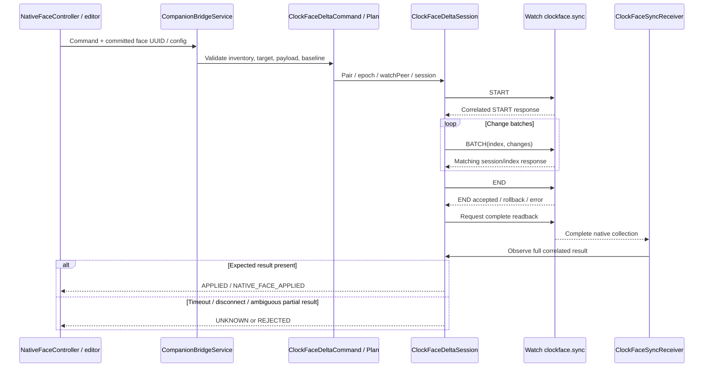

Stages are `START_READY → START_WAIT → BATCH_READY → BATCH_WAIT → END_READY → END_WAIT → READBACK_WAIT → APPLIED`, with terminal `REJECTED` / `UNKNOWN`. Readback timeout is **180 seconds**. Replies must match topic, message identifier, session, Watch peer, and batch index.

A batch/end error can follow a partial write. The state machine does not automatically replay mutations; inspect a fresh observation first. Sources: [delta session](apple-watch-bridge/core/src/main/java/dev/applewatchandroid/bridge/ClockFaceDeltaSession.java), [plan](apple-watch-bridge/core/src/main/java/dev/applewatchandroid/bridge/ClockFaceDeltaPlan.java), [command codec](apple-watch-bridge/core/src/main/java/dev/applewatchandroid/bridge/ClockFaceDeltaCommand.java).

### `.watchface`, Photos, and resources

```text
Native archive → validate structure/configuration/resources → UI draft/review
  → explicit Add / resource replacement
  → inline for Add archive ≤ 128 KiB
  → otherwise beginNativeFaceImport(total, pair, epoch, optional baseline)
  → sequential appendNativeFaceImport(offset, chunk ≤ 64 KiB)
  → finishNativeFaceImport → sealed staged package
  → NATIVE_FACE_ADD_FILE / NATIVE_FACE_RESOURCES_FILE
  → native delta transaction → Watch readback
```

Archive limit is **16 MiB**, and Bridge transfer TTL **30 minutes**. Export returns chunks ≤ **64 KiB**, stable `total`/`sha256`, and checked `offset`. Dart assembles bytes and verifies final SHA-256. A pair/epoch change stops transfer. Unfinished uploads are canceled or expire on Bridge.

Photos crop/resource editing uses actual resources and a baseline package hash. Local preview/draft changes do not themselves submit mutations. Installed-face autosave has a guarded controller; gallery creation requires explicit Add.

### Native UI and previews

Companion includes catalogs/options, AppIntent parameters/identity, complication layout, Photos metadata, pigment/monogram editors, indexed/component preview codecs, and a decode queue. Research captures bind complete configuration identities. One face family's results do not automatically apply to others.

Stage 90 verifies Activity Analog swatch components against **530 independent native reference images**, with maximum premultiplied channel difference **2/255** and alpha difference **0**. This is offline research validation; production generic-option UI integration remains open. Unsupported fractions and native geometry are documented in [stage 90](docs/WATCH_APP_NATIVE_OPTION_SWATCHES_90.md).

<a id="en-preferences"></a>
## Settings, pigments, and monograms

### Watch settings

| API enum | NPS domain | Native key | Notes |
| --- | --- | --- | --- |
| `RIGHT_WRIST` | `com.apple.nano` | `wornOnRightArm` | Two-way preference |
| `INVERT_SCREEN` | `com.apple.nano` | `invertUI` | Two-way preference |
| `TIME_24_HOUR` | `.GlobalPreferences` | `AppleICUForce24HourTime` | Not marked two-way by the codec |

`setWatchSetting → SET_WATCH_SETTING:<enum>:<bool> → WatchSettingsCodec.encode → NPS → Watch preference observer`. Missing or malformed values remain **unknown**, not `false`. Unix time differs from the Apple preference epoch (`978307200` seconds).

### Add Colors / pigment visibility

NPS domain: `com.apple.NanoTimeKit`. Keys: `SelectedPigmentList` and `AutoSelectedPigmentList`. These are pair-scoped palette fullname sets, not individual face JSON fields.

```text
Watch NPS type-0 update
  → NtkPreferenceEnvelope (shared parse)
  → PigmentPreferenceCodec
  → pair-scoped durable PigmentPreferenceMirror
  → Companion baseline: pair / epoch / both timestamps / complete sets
  → manual visibility change
  → setNativePigmentVisibility
  → PigmentPreferenceCommand validates the same baseline
  → guarded paired NPS write
  → new observed mirror confirms values
```

Automatic and manual sets have different lifecycles. The writer validates both baseline collections and preserves native manual opt-out semantics. Limits: **1023 names**, **64 KiB** value bytes. Scoped preferences are not replayed from an inappropriate global cache.

### Monograms

`customMonogram` uses domain `com.apple.NanoTimeKit`, with a separate mirror/revision and writer. The path is Foundation-compatible normalization/rules → current pair/epoch/revision baseline → `setNativeMonogram` → guarded NPS write → paired observation.

The face monogram switch and global text are distinct values. Editor state, delivery receipt, and observed text remain separate. Details: [Foundation normalization](docs/WATCH_APP_FOUNDATION_TEXT_72.md), [native writer](docs/WATCH_APP_MONOGRAM_EDITOR_73.md).

<a id="en-features"></a>
## Notifications, finding devices, Wi-Fi, and Health

### Notifications

```mermaid
flowchart LR
    Apps[Android notification] --> Listener[AppleWatchNotificationListenerService]
    Listener --> Mirror[Bulletin payload / stable identity / revision]
    Mirror --> Op[OperationalWatchService]
    Op --> IDS[IDS bulletindistributor: Class-C]
    IDS --> Watch[Watch bulletin]
    Watch --> Action[Watch action / reply / dismiss]
    Action --> Claims[Durable claim + identity/revision validation]
    Claims --> Effect[Android action / RemoteInput / cancellation]
```

Old actions must not affect newer revisions or another chat. Duplicate claims survive restart. Notification access, per-app policy, and available Android actions require separate checks. Test bulletin delivery does not establish every app, icon, attachment, Focus, or haptic policy.

### Find Watch / Find Phone

**Phone → Watch:** `pingWatch → PING_WATCH → FindMyLocalDeviceCodec → authenticated IDS → Watch sound request → correlated response`.

**Watch → Phone:** native request → `FindMyPhoneIpcCodec` → `OperationalPhoneFinder` → main-thread Android sound/flash effects → durable duplicate claim → correlated result through root/IDS. `stopPhonePing` controls the local effect. Permission receipt `OPENED` does not establish camera/flash availability.

### Wi-Fi

After activation/language/Normal and correlated PrepareInitialSync response, a separate root worker reads the current supported WPA2/CCMP network. A V2 ADD archive travels on `alloy.wifi.networksync` in the same setup session. The worker binds pair/generation, limits retries, and clears late results on stop/link reset.

Operational READY has its own automatic send; `syncWifi` remains a manual retry for the current network. Archive ACK establishes delivery, while actual Watch network join requires separate evidence. Credentials are excluded from public Flutter snapshots.

### Health

```text
Watch encrypted Health message
  → live IDS Class-C lane
  → forwardEncryptedHealthData()
  → app encrypted inbox / replay
  → OperationalHealthController
  → peer identity + registry binding + native decode
  → durable Health session/defaults state
  → limited typed observations → Companion
```

Outbound encrypted requests use scoped `HealthOutboundIpcCodec` with UUID/peer/session correlation. Ciphertext delivery and object decode do not establish native changes acceptance, anchor commits, or complete workout statistics. Limits: [feature plan](docs/WATCH_FEATURE_COVERAGE_PLAN.md), [defaults mirror evidence](docs/live-20261005-sync/HEALTH-375-DEFAULTS-MIRROR-EVIDENCE.md).

<a id="en-replicator"></a>
## Modern StateReplicator and QUIC

This research path implements modern native snapshot exchange. It does not replace the verified `clockface.sync` delta transaction.

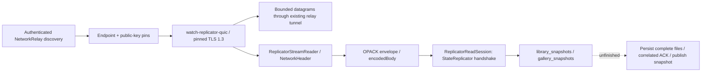

The QUIC engine opens no OS socket. Its caller supplies datagrams/time and consumes outbound datagrams/stream events. TLS identity uses public-key pins from authenticated discovery and proof of key possession, rather than Web PKI for an arbitrary hostname.

Constants: ALPN **`application-service`**, maximum datagram **1200 bytes**, maximum batch **4**. `ReplicatorReadSession` uses envelope protocol **8**, zone protocol **6**, message type **`StateReplicator`**, client **`com.apple.nanotimekit.replicator.library`**.

Handshake and authenticated DATA do not establish complete snapshot records. Current non-DATA file persistence/ACK is unimplemented; snapshot delivery remains unconfirmed. Sources: [Rust engine](crates/watch-replicator-quic/src/lib.rs), [ReplicatorReadSession](apple-watch-bridge/core/src/main/java/dev/applewatchandroid/bridge/ReplicatorReadSession.java), [research report](docs/WATCH_FACES_REPLICATOR_39.md).

<a id="en-ownership"></a>
## Keys, storage, and ownership

| Owner | Responsibility |
| --- | --- |
| `CompanionScope` | Shared Bridge and disposal |
| `WatchBridgeService` | Platform subscription, typed public streams, projections |
| `BridgeIpcClient` | Binder connection, pending requests/deadlines, binding death |
| `BridgeSetupService / Engine` | Setup foreground lifetime, owner input, safe stop |
| `OperationalWatchService` | Saved pair runtime, epoch/readiness, commands/reconnect |
| `RootBluetoothHalHost` | Exclusive HAL lease, startup/exit |
| `HalTransportSession` | Serial packet queue/state machine, transient SAs, cleanup |
| App Keystore/storage adapters | Sealed pair/bond/IDS records and persisted identity |
| `PairingSessionRecord` | Versioned plaintext model inside its owner; sealing required before disk |
| `PairedSyncPreferenceStore` / mirrors | Pair-scoped preferences and write baselines |
| `ClockFaceSyncClient` / package store | Header sequence/generation and validated native packages |
| Health stores | Peer identity, inbox/replay/session/defaults boundaries |
| Rust C ABI | Rust-owned JSON allocations; Dart releases with `aw_core_free` |

Key correlations: **pair UUID** identifies a saved pair; **epoch** the current transport session; **requestId** a command; **message UUID** one IDS message; **generation/sequence/revision** protocol freshness or a baseline.

Keys, PINs, optical payloads, and Wi-Fi passwords are not UI data. Public snapshots contain permitted projections. Pair/epoch changes, close, or timeout invalidate pending commands and late callbacks. Interrupted native mutations must not be replayed automatically.

<a id="en-start"></a>
## Start from a clean machine

Run each block on its stated host and stop if a command fails. Shell blocks use
Bash/zsh; Windows blocks use PowerShell. Build desktop targets on their own OS.
The current Android build scripts use the macOS/Linux NDK layout. The tested
SDK combination is Flutter **3.47.4 / Dart 3.13.3**, Rust **1.98.1**, JDK **17**.
The commands below install tools; they do not upgrade the project's lockfiles.

### 1. Prepare your host

**Linux Mint 22 / Ubuntu 24.04, x86_64:**

```sh
sudo apt-get update
sudo apt-get install -y git curl unzip xz-utils zip python3 build-essential \
  clang cmake ninja-build pkg-config libgtk-3-dev libstdc++-12-dev \
  libglu1-mesa libusb-1.0-0-dev libbluetooth-dev bluez systemd libcap2-bin openjdk-17-jdk
sudo update-alternatives --config java
sudo update-alternatives --config javac
export JAVA_HOME="$(dirname "$(dirname "$(readlink -f "$(command -v javac)")")")"
export PATH="$JAVA_HOME/bin:$PATH"
```

Choose JDK 17 in both alternatives prompts if several JDKs are installed.
Other distributions need equivalent
packages and their own hardware acceptance run. Package requirements follow
[Flutter's Linux setup](https://docs.flutter.dev/platform-integration/linux/setup),
with the project's Java, USB and Bluetooth dependencies added.

**macOS:** install full [Xcode](https://developer.apple.com/xcode/) and
[Homebrew](https://brew.sh/) first, then:

```sh
sudo xcode-select -s /Applications/Xcode.app/Contents/Developer
sudo xcodebuild -runFirstLaunch
sudo xcodebuild -license
brew install python git openjdk@17 cocoapods libusb
export JAVA_HOME="$(brew --prefix openjdk@17)/libexec/openjdk.jdk/Contents/Home"
export PATH="$JAVA_HOME/bin:$PATH"
```

Complete the license prompts. If Xcode is elsewhere, substitute its actual
path. See [Flutter's macOS setup](https://docs.flutter.dev/platform-integration/macos/setup).

**Windows 10/11, x64:** install App Installer/WinGet if `winget` is absent, then
run these commands in PowerShell. The Visual Studio installer may request UAC.

```powershell
winget install --exact --id Git.Git
winget install --exact --id Python.Python.3.13
winget install --exact --id EclipseAdoptium.Temurin.17.JDK
winget install --exact --id Rustlang.Rustup
winget install --exact --id Microsoft.VisualStudio.2022.Community --override "--wait --passive --add Microsoft.VisualStudio.Workload.NativeDesktop --includeRecommended"
Start-Process 'ms-settings:developers'
```

Open a new PowerShell window after installation. Confirm the Visual Studio
**Desktop development with C++** workload and CMake tools are installed;
VS Code alone does not provide them. Enable **Developer Mode** in the opened
Windows Settings page to permit Flutter plugin symlinks. See
[Flutter's Windows setup](https://docs.flutter.dev/platform-integration/windows/setup)
and [Microsoft's installer options](https://learn.microsoft.com/en-us/visualstudio/install/use-command-line-parameters-to-install-visual-studio).

### 2. Install SDKs and obtain the project

For a new **macOS/Linux** environment, install Rust through its
[official installer](https://rustup.rs/) and Flutter at the tested tag:

```sh
curl --proto '=https' --tlsv1.2 -sSf https://sh.rustup.rs -o /tmp/watch-rustup-init.sh
sh /tmp/watch-rustup-init.sh
. "$HOME/.cargo/env"
mkdir -p "$HOME/develop"
git clone --branch 3.47.4 --depth 1 https://github.com/flutter/flutter.git "$HOME/develop/flutter"
export PATH="$HOME/develop/flutter/bin:$PATH"
git clone https://github.com/LordixDemon/apple_watch_connector.git
cd apple_watch_connector
rustup toolchain install 1.98.1 --profile minimal --component rustfmt --component clippy
rustup override set 1.98.1
```

For **Windows**, after the WinGet steps:

```powershell
New-Item -ItemType Directory -Force "$env:USERPROFILE\develop" | Out-Null
git clone --branch 3.47.4 --depth 1 https://github.com/flutter/flutter.git "$env:USERPROFILE\develop\flutter"
$env:Path = "$env:USERPROFILE\develop\flutter\bin;$env:Path"
$env:JAVA_HOME = Split-Path (Split-Path (Get-Command javac.exe).Source -Parent) -Parent
$env:Path = "$env:JAVA_HOME\bin;$env:Path"
git clone https://github.com/LordixDemon/apple_watch_connector.git
cd apple_watch_connector
rustup toolchain install 1.98.1 --profile minimal --component rustfmt --component clippy
rustup override set 1.98.1
```

If an SDK or project directory already exists, use it instead of cloning over
it. Persist the Flutter/Cargo `bin` paths and JDK selection in your own shell
profile or user environment; the exports above apply to the current terminal.
The [official Flutter installation guide](https://docs.flutter.dev/install/manual)
also provides SDK archives. Do not run `flutter upgrade` or `pub upgrade` as
part of reproducing the tested candidate.

On **all hosts**, from the project root:

```sh
git rev-parse --short HEAD
python3 --version
java -version
javac -version
rustc --version
flutter --version
flutter doctor -v
cd apple-watch-companion
flutter pub get --enforce-lockfile
cd ..
```

Use `python` instead of `python3` on Windows. `flutter doctor` must show a
working toolchain for your chosen target; an unrelated Android/Xcode warning
does not block a Linux/Windows build. Expected SDK output is Rust 1.98.1,
Flutter 3.47.4 and Dart 3.13.3; Java and `javac` should use JDK 17.
Record the Git revision when reporting a test.

### 3. Choose the platform path

| Target | Next steps | Current outcome |
| --- | --- | --- |
| Android | [SDK/build](#en-build), then [APK/root installation](#en-android-install) | Tested on rooted OnePlus CPH2653; clean Companion build is blocked by missing optical inputs |
| Linux | [Build](#en-build), then [broker installation and pairing](#en-linux) | Fresh pairing, activation and saved-pair reconnect |
| Windows | [Build](#en-build), then [controller launcher and pairing](#en-windows) | Tested on Windows 10 / Realtek `0bda:b00e`; latest refactor needs hardware retest |
| macOS | [Build and launch](#en-macos) | Discovery and BLE only; full activation/IDS is incomplete |

For a new pair, the Watch must display its pairing screen. A Watch already
paired to another host cannot join a new pair using that host's old PIN.
For an existing pair saved by this installation, use **Connect**, preserving
its records. Keep the Watch nearby and charged. The selected Bluetooth
controller is reserved during a Linux/Windows session.

Successful Linux/Windows setup requires a visible Watch face, owner confirmation
when requested, and `OPERATIONAL` / `watchReady=true`. Android likewise requires
observed setup completion and operational readiness. A Bluetooth connection,
activation reply or delivery ACK alone does not establish completed setup.
Finally disconnect and reconnect: an eligible saved pair should resume without
another PIN. See [troubleshooting](#en-diagnostics) if a stage stalls.

<a id="en-build"></a>
## Build, test, and first run

### Requirements

| Target | Current project requirements |
| --- | --- |
| Java core tests | JDK **17**, existing Gradle wrapper |
| Android Bridge | SDK **36**, Build Tools **36.1.0**, minSdk **33**, targetSdk **36** |
| Native Android QUIC | NDK **28.2.13676358**, Rust target `aarch64-linux-android`; API33 clang in Gradle |
| Companion | Flutter compatible with Dart **`^3.10.3`**, existing `pubspec.lock`; reports used Flutter 3.47.4 / Dart 3.13.3 |
| Rust | Edition **2024**, `Cargo.lock`; workspace compiler checked as **1.98.1** |
| macOS | macOS/Xcode/CoreBluetooth; arm64 verified host, Intel build provided but physically unverified |
| Linux | Flutter Linux toolchain, Rust, Python 3, JDK 17, CMake/Ninja/clang, GTK3 development files, BlueZ/`busctl`, libusb/libbluetooth development files and `setcap` for the HCI broker |
| Windows | Windows 10 version 2004+ / 11, Bluetooth controller, Rust MSVC, Python 3, JDK 17–22, Visual Studio Desktop development with C++ and CMake tools; Flutter Developer Mode |
| Camera/native assets | Required local hash-pinned research inputs for native build scripts; README commands do not download them |
| Android physical runtime | Supported root/HAL handoff and compatible APK signatures; ordinary BLE API is insufficient for this backend |

macOS deployment also depends on Xcode configuration; see [macOS findings](docs/MACOS_PAIRING_TRANSPORT_FINDINGS.md). Linux requires installation of the HCI broker, and Windows requires controller access through WinUSB or the supported UsbDk driver. See the platform connection sections below.

### Android SDK and camera build prerequisite

Install [Android Studio and SDK Command-Line Tools](https://developer.android.com/studio)
first. In Bash/zsh on macOS/Linux, after selecting JDK 17:

```sh
if [ "$(uname -s)" = Darwin ]; then
  export ANDROID_HOME="${ANDROID_HOME:-$HOME/Library/Android/sdk}"
else
  export ANDROID_HOME="${ANDROID_HOME:-$HOME/Android/Sdk}"
fi
export PATH="$ANDROID_HOME/platform-tools:$PATH"
"$ANDROID_HOME/cmdline-tools/latest/bin/sdkmanager" --sdk_root="$ANDROID_HOME" --licenses
"$ANDROID_HOME/cmdline-tools/latest/bin/sdkmanager" --sdk_root="$ANDROID_HOME" \
  "platform-tools" "platforms;android-36" "build-tools;36.1.0" \
  "ndk;28.2.13676358" "cmake;3.22.1"
flutter config --android-sdk "$ANDROID_HOME" --jdk-dir "$JAVA_HOME"
rustup target add aarch64-linux-android
flutter doctor -v
```

Use the installed SDK path if it differs, and adjust `cmdline-tools/latest`
to its installed directory. Review the license prompts. Package installation
uses the [SDK Manager CLI](https://developer.android.com/tools/sdkmanager).

**Clean Android Companion builds are currently blocked in this public checkout.**
`prepareOpticalAsset` requires four local inputs which are not distributed here.
From the project root, check them before attempting `tools/build.py android`:

```sh
test -f firmware/ios-26.6-23G71/extracted/VisualPairing
test -f research-tools/prepare_optical_android_asset.py
test -f research-tools/visual_pairing_reader_oracle.py
test -x research-tools/venv-dis/bin/python
```

If any input is missing, stop the Companion package build. The pinned asset
generation step validates its source; arbitrary substitute files are not a
working decoder. These instructions do not supply the private inputs.
`-x prepareOpticalAsset` is only a source-compilation check and cannot validate
camera pairing. See the [Android release gate](docs/BUILD_AND_RELEASE.md#android-signing).
Bridge can still be built separately with
`(cd apple-watch-bridge && ./gradlew :app:assembleRelease)` after its SDK/NDK setup.

### Build from the project root

```sh
# Workspace Rust tests and Clippy
python3 tools/build.py core

# Bridge and Companion APKs; requires the optical inputs above; no installation
python3 tools/build.py android

# macOS app with embedded Rust dylib and signature verification
python3 tools/build.py macos

# Prepare shared Java dependencies, then build Linux on Linux
(cd apple-watch-bridge && ./gradlew :core:desktopRuntime)
python3 tools/build.py linux

# Windows app with Rust HCI broker, protocol JARs and Java runtime
python tools/build.py windows
```

Bridge `preBuild` invokes `buildReplicatorQuic`. If needed, install its Rust target:

```sh
rustup target add aarch64-linux-android
```

SDK location comes from `apple-watch-bridge/local.properties` / local environment; do not copy another developer's absolute paths. Bridge release currently uses debug signing configuration as a laboratory artifact. Compatible signatures are required for IPC.

### Layer-specific checks

```sh
# Root: host-appropriate workspace tests and Clippy
python3 tools/build.py core
cargo fmt --all --check

# In apple-watch-bridge/
./gradlew :core:test
./gradlew :protocol-runtime:test
./gradlew :app:lintDebug :hal:lintDebug
./gradlew :app:assembleDebug :app:assembleRelease
./gradlew :app:assembleDebugAndroidTest

# In apple-watch-companion/; run flutter pub get for first-time preparation
flutter analyze --no-pub
flutter test --no-pub
flutter build apk --release --no-pub
```

Native captures/builders have `tools/test_native_*.py` checks and documented fixtures. Instrumentation APK build, installation, and execution are separate actions. Offline tests do not establish physical pairing, visual output, sound, or Watch-local application.

### Build outputs

| Artifact | Path |
| --- | --- |
| Bridge debug | `apple-watch-bridge/app/build/outputs/apk/debug/app-debug.apk` |
| Bridge release | `apple-watch-bridge/app/build/outputs/apk/release/app-release.apk` |
| Companion release | `apple-watch-companion/build/app/outputs/flutter-apk/app-release.apk` |
| macOS app | `apple-watch-companion/build/macos/Build/Products/Release/apple_watch_companion.app` |
| Linux bundle (x64) | `apple-watch-companion/build/linux/x64/release/bundle/` |
| Windows bundle (x64) | `apple-watch-companion/build/windows/x64/runner/Release/` |
| Java XML / report | `apple-watch-bridge/core/build/test-results/test/`, `core/build/reports/tests/test/` |

<a id="en-android-install"></a>
### Android installation and first run

The root HAL implementation currently accepts **OnePlus CPH2653 only** and
requires an already rooted, supported phone. This guide does not root the phone.
Enable USB debugging, unlock it, and approve the computer's ADB key. From the
project root, select the phone using its serial from `adb devices`:

```sh
adb devices -l
WATCH_ADB_SERIAL='REPLACE_WITH_ADB_DEVICE_SERIAL'
adb -s "$WATCH_ADB_SERIAL" get-state
adb -s "$WATCH_ADB_SERIAL" shell getprop ro.product.model
adb -s "$WATCH_ADB_SERIAL" shell su -c id
```

Expected: `device`, model `CPH2653`, and root `uid=0` after the Magisk prompt.
`unauthorized` requires approval on the phone; an emulator does not test the
physical HAL. For multiple devices always retain the explicit `-s` selection.

For initial deployment using the checked-in Magisk module:

You can use the [published experimental ZIP](https://github.com/LordixDemon/apple_watch_connector/releases/download/magisk-0.2.427/apple-watch-bridge-magisk-0.2.427.zip)
instead of building it. It contains Bridge **0.2.427 / code 627**, the whitelist
and SELinux rules; Companion is installed separately with a matching signing
certificate. Download and checksums are in the
[release notes](https://github.com/LordixDemon/apple_watch_connector/releases/tag/magisk-0.2.427).
The tested phone remains rooted **OnePlus CPH2653**.

To build your own ZIP from the project root:

```sh
bash apple-watch-bridge/tool/build_magisk_module.sh
adb -s "$WATCH_ADB_SERIAL" push apple-watch-bridge/build/apple-watch-bridge-magisk.zip /sdcard/Download/
```

In **Magisk → Modules → Install from storage**, choose that ZIP and reboot the
phone to apply the module. It supplies the Bridge priv-app, hidden-API whitelist
and SELinux rules. Root access alone does not supply this configuration.
The ZIP embeds the built Bridge APK; rebuild it for your intended version.

Once both APKs are built or supplied as a tested matching pair, verify their
signatures, then install them:

```sh
"$ANDROID_HOME/build-tools/36.1.0/apksigner" verify --print-certs apple-watch-bridge/app/build/outputs/apk/release/app-release.apk
"$ANDROID_HOME/build-tools/36.1.0/apksigner" verify --print-certs apple-watch-companion/build/app/outputs/flutter-apk/app-release.apk
adb -s "$WATCH_ADB_SERIAL" install -r apple-watch-bridge/app/build/outputs/apk/release/app-release.apk
adb -s "$WATCH_ADB_SERIAL" install -r apple-watch-companion/build/app/outputs/flutter-apk/app-release.apk
adb -s "$WATCH_ADB_SERIAL" shell am start -n dev.applewatchandroid.companion.apple_watch_companion/.MainActivity
```

Both signer SHA-256 digests must match for signature-protected IPC. Expected
install output is `Success` for each APK. Ordinary local builds use the debug
key; distribution signing is a separate [release procedure](docs/BUILD_AND_RELEASE.md#android-signing).
For an update, first follow [session shutdown and backup](#en-update).

1. Build both APKs, verify signatures, and prepare a supported root/HAL backend.
2. Before replacing Bridge, stop the active setup/operational service and wait for HAL close/root exit. `adb install -r` preserves app data; do not erase pair storage to update.
3. Install Bridge and Companion, open Companion, and grant the Bluetooth/notification/camera permissions needed by your actions.
4. Use **Connect** for an eligible saved pair. For a fresh pair, open **All Watches** and choose code/PIN or camera.
5. Camera: wait for recognition and explicitly choose Pair/Replace. PIN: select a fresh discovery candidate and supply the requested code.
6. Provide activation owner input when requested. Wait for setup observations; `QUEUED`/ACK cannot substitute for them.
7. If asked to confirm a visible Watch face, confirm the actual Watch screen. Then verify normal reconnect and fresh telemetry.
8. Enable Notification Access, Find Phone effects, and Wi-Fi sync separately; verify each physical result.

Desktop platforms share the Flutter interface through Rust and use code/PIN pairing. Linux and Windows have their own HCI transports; macOS discovery/BLE does not establish complete new pairing capability. Capabilities are explicit, and there is no desktop fallback to Android channels.

<a id="en-macos"></a>
## macOS discovery build

After host/SDK preparation, from the project root:

```sh
rustup target add aarch64-apple-darwin
python3 tools/build.py macos
codesign --verify --deep --strict apple-watch-companion/build/macos/Build/Products/Release/apple_watch_companion.app
open apple-watch-companion/build/macos/Build/Products/Release/apple_watch_companion.app
```

On an Intel Mac use `x86_64-apple-darwin` instead. Allow Bluetooth access when
macOS requests it; select **Scan / Find a Watch** in Companion. Expected result
is an observed BLE device list. A missing permission can be corrected in
**System Settings → Privacy & Security → Bluetooth**. `codesign` verifies the
local app signature; it does not establish Developer ID notarization.
Full Watch pairing, activation and operational IDS remain unavailable on macOS.

<a id="en-linux"></a>
## Linux connection

Build on Linux with the commands above, then install the broker and desktop launcher
as the desktop user:

```sh
python3 tools/install_linux.py apple-watch-companion/build/linux/x64/release/bundle
getcap /usr/local/libexec/watch-companion/watch-linux-hci
./apple-watch-companion/build/linux/x64/release/bundle/apple_watch_companion
```

The example uses the x64 bundle path; use the corresponding `arm64` output for
an ARM64 build. The installer uses `sudo` for the root-owned HCI broker and grants
`cap_net_admin,cap_net_raw`; Flutter and the Java worker run as the desktop user.
Open **Watch Companion**, choose **All Watches → Bluetooth Adapter**, then use
**Find a Watch**, select the observed Watch and enter its six-digit code.

Adapter selection is saved by Bluetooth address and survives HCI index changes.
If the saved controller is missing, choose an available controller explicitly.
During the session, the selected adapter belongs to the HCI broker, so its normal
BlueZ peripherals disconnect. Other adapters remain available.

Pairing, activation and encrypted reconnect were physically verified on Mint
22.3. State is stored under `$XDG_STATE_HOME/watch-companion` or
`~/.local/state/watch-companion`; private records use AES-GCM and restricted
filesystem permissions. An eligible saved pair resumes once on startup.
Desktop Wi-Fi provisioning, watch-face management, notifications and Health
are not yet fully exposed through the desktop command contract. See
[Linux hardware verification](docs/LINUX_COMPANION_91.md) and
[adapter selection](docs/LINUX_ADAPTER_SELECTION_94.md).

Before connection, inspect adapters without opening an HCI session:

```sh
systemctl is-active bluetooth
bluetoothctl list
busctl --system --json=short call org.bluez / org.freedesktop.DBus.ObjectManager GetManagedObjects
```

Expected: Bluetooth service `active`, your controller in the inventory, and
`cap_net_admin,cap_net_raw=ep` on the installed broker. Run the bundle as your
desktop user. If BlueZ is stopped, use `sudo systemctl start bluetooth` and
refresh adapters in Companion. While connected the leased adapter can disappear
from BlueZ; inspect it after **Disconnect**. Do not start the raw HCI broker
manually or run Flutter with `sudo`.

<a id="en-windows"></a>
## Windows connection

Build with `python tools/build.py windows`, or run from Flutter with
`flutter run -d windows -t lib/main_desktop.dart`. CMake builds and copies
`watch_core_ffi.dll` beside the executable automatically. ARM64 builds require
the Rust target `aarch64-pc-windows-msvc`.

The Windows full-protocol backend uses a native Rust USB HCI broker and the
same portable Java pairing/activation/IDS engine as Linux. The bundle contains
the broker, protocol JARs and a minimal Java runtime; building requires a JDK
17–22 (`JAVA_HOME`). The USB identity identifies the internal Bluetooth
controller; the Watch connects wirelessly and needs no USB cable.

For the tested Realtek `0bda:b00e`, start the built interface with
`.\tools\run_windows_companion.ps1`. Its elevated supervisor temporarily binds
only the selected controller to the existing signed Microsoft WinUSB driver;
the interface itself runs as the normal user. Closing the interface restores
the original Bluetooth driver. The launcher discovers compatible USB Bluetooth
controllers: it uses a single available controller, or asks you to choose when
several are present. You can also specify an exact `-InstanceId`;
`-NonInteractive` requires that choice when there are several controllers.
Use `-Check` for a read-only controller inventory and preflight. Recovery information and the supervisor
log are under `%LOCALAPPDATA%/watch-companion/controller-leases`.
No generated driver INF, publisher certificate or signing override is needed.
The native build stages DLL, HCI broker, protocol and JRE together before
replacing the previous complete bundle. Controller discovery refreshes in the
background; opening uses the selected USB identity and its backend.
Rust detects the bound WinUSB controller automatically and restores the
installed OEM RTL8821C RAM firmware after power transitions, checking the chip
cut, firmware project and controller version readback.

Choose the controller in **All Watches → Bluetooth Adapter**, use **Find a
Watch**, select the Watch and enter its observed PIN. Windows Bluetooth devices
using that controller disconnect while the interface reserves it; a dedicated
adapter avoids interrupting other Bluetooth devices. Enumeration sends no HCI
commands and never redirects a controller.

The alternative UsbDk path requires signed
[UsbDk 1.0.21](https://github.com/daynix/UsbDk/releases/tag/v1.00-21), installed
with `tools/install_windows_controller.ps1 -Install`. It produced transfer
errors on the tested Realtek; use the WinUSB launcher for that controller.
UsbDk 1.0.22 is blocked before capture because of its documented Bluetooth
power-management [WDF_VIOLATION regression](https://github.com/daynix/UsbDk/issues/115).
The installer replaces an existing 1.0.22 with the verified signed 1.0.21 package.

Private pairing, bond and installation records are protected using Windows
DPAPI under the current user, with restricted file ACLs. Persistent records and
the filtered `protocol.log` are in `%LOCALAPPDATA%/watch-companion`.
An observed PIN, a BLE link or a queued command never sets `watchReady`;
readiness requires the protocol's activation and operational evidence.
Physical validation on Windows 10 / Realtek `0bda:b00e` with Watch7,5 / watchOS
26.2.0 passed PIN authentication, activation, IDS exchange and reconnection with
the stored LTK and IRK. After the owner confirmed the Watch displayed its face,
the same activated pair reached `OPERATIONAL` with `watchReady=true` without
another PIN. This verifies the tested controller and Watch; other controllers
and Watch versions have not been physically tested.

The earlier WinRT discovery/BLE transport remains in
`crates/watch-transport-windows` for diagnostics; it is not the full-pairing
backend used by the Windows FFI.

### Windows launch and controller recovery commands

From the project root in PowerShell, after building:

```powershell
.\tools\run_windows_companion.ps1 -Check
.\tools\run_windows_companion.ps1
```

The first command reports controller IDs/services and driver signature; the
second starts the controller-selection/UAC flow. For a specific controller,
copy its full ID from `-Check` into the prompt:

```powershell
$watchControllerId = Read-Host 'Controller InstanceId from -Check'
.\tools\run_windows_companion.ps1 -InstanceId $watchControllerId -NonInteractive
```

If scripts are blocked, launch only this invocation with a process-local policy:

```powershell
powershell.exe -NoProfile -ExecutionPolicy Bypass -File .\tools\run_windows_companion.ps1
```

After closing Companion, wait for the supervisor to restore the controller:
use the `$watchControllerId` captured above (set it from `-Check` if you used
automatic selection).

```powershell
Get-PnpDevice -PresentOnly -InstanceId $watchControllerId
Get-PnpDeviceProperty -InstanceId $watchControllerId -KeyName DEVPKEY_Device_Service
Get-ChildItem "$env:LOCALAPPDATA\watch-companion\controller-leases" -Filter restored -Recurse
```

For a controller originally using the Windows Bluetooth stack, its service
should return to `BTHUSB`; inspect the `restored` marker in the matching lease
directory. If driver restoration was interrupted, retain that lease's
`original.json` and start a recovery session with the same controller:

```powershell
$watchRecoveryRecord = Read-Host 'Full path to the matching lease original.json'
.\tools\run_windows_companion.ps1 -InstanceId $watchControllerId -RecoveryRecord $watchRecoveryRecord
```

This starts Companion with the saved restoration information. Close the window
and wait for restoration, then repeat the service check. The record must belong
to that exact controller. This launcher has no restore-only switch.

<a id="en-update"></a>
## Update, backup, and rollback

First use **Disconnect / stop setup** in Companion, wait for HAL/HCI worker
shutdown, and close the app. On Windows also wait for driver restoration before
replacing the bundle. Keep pairing records; updating an app does not require
resetting the Watch or choosing Unpair.

### Linux: keep the state and complete bundle together

From the existing project's root, after stopping the app:

```sh
watch_state="${XDG_STATE_HOME:-$HOME/.local/state}/watch-companion"
watch_backup="$HOME/watch-companion-backups/$(date +%Y%m%d-%H%M%S)"
install -d -m 700 "$watch_backup"
cp -a "$watch_state" "$watch_backup/state"
cp -a apple-watch-companion/build/linux/x64/release/bundle "$watch_backup/bundle"
git status --short
git pull --ff-only
(cd apple-watch-companion && flutter pub get --enforce-lockfile)
(cd apple-watch-bridge && ./gradlew :core:desktopRuntime)
python3 tools/build.py linux
python3 tools/install_linux.py apple-watch-companion/build/linux/x64/release/bundle
./apple-watch-companion/build/linux/x64/release/bundle/apple_watch_companion
```

These backup steps assume a prior successful installation. Stop before pulling
if `git status` lists local changes. Adjust the bundle path for ARM64.
Expected: the saved pair is available and resumes without another PIN.
For rollback, stop the app again and install/run the preserved whole bundle:

```sh
python3 tools/install_linux.py "$watch_backup/bundle"
"$watch_backup/bundle/apple_watch_companion"
```

If the new version changed state incompatibly, with all workers stopped preserve
that state and restore the matching backup first:

```sh
mv "$watch_state" "$watch_backup/state-after-update"
cp -a "$watch_backup/state" "$watch_state"
```

### Windows: same user, saved DPAPI state and whole bundle

In PowerShell, after closing the app and restoring the driver:

```powershell
$watchBackup = Join-Path $env:USERPROFILE ('watch-companion-backups\' + (Get-Date -Format yyyyMMdd-HHmmss))
$watchState = Join-Path $env:LOCALAPPDATA 'watch-companion'
New-Item -ItemType Directory -Path $watchBackup | Out-Null
Copy-Item -LiteralPath $watchState -Destination (Join-Path $watchBackup 'state') -Recurse
Copy-Item -LiteralPath 'apple-watch-companion\build\windows\x64\runner\Release' -Destination (Join-Path $watchBackup 'bundle') -Recurse
git status --short
git pull --ff-only
Push-Location apple-watch-companion
flutter pub get --enforce-lockfile
Pop-Location
python tools/build.py windows
.\tools\run_windows_companion.ps1
```

Keep the backup private, on this Windows installation and under the same account;
DPAPI records are not a portable pairing export. To run the previous version:

```powershell
.\tools\run_windows_companion.ps1 -Bundle (Join-Path $watchBackup 'bundle')
```

If state rollback is required, first close the app and wait for the supervisor,
then preserve the new state and restore the matching backup:

```powershell
Move-Item -LiteralPath $watchState -Destination (Join-Path $watchBackup 'state-after-update')
Copy-Item -LiteralPath (Join-Path $watchBackup 'state') -Destination $watchState -Recurse
```

### Android and macOS updates

Android: stop the session, build a matching-signature pair of APKs, and repeat
the [two `adb install -r` commands](#en-android-install). Keep the installed
signing key and package IDs. `allowBackup=false` means ordinary `adb backup`
does not provide a pair backup. A lower release versionCode can be rejected;
uninstalling/clearing app data to force a downgrade destroys the saved pair.
There is no documented general Android pair-export/restore procedure yet.
Update the Magisk module's embedded APK too when changing its base version.

macOS: quit the app before rebuilding. Keep a copy of the whole old `.app`, then
rebuild/verify/open using the [macOS commands](#en-macos). This build does not
provide an activated pair to migrate. For example, from the project root:

```sh
watch_mac_app=apple-watch-companion/build/macos/Build/Products/Release/apple_watch_companion.app
watch_mac_backup="$HOME/watch-companion-backups/$(date +%Y%m%d-%H%M%S)/apple_watch_companion.app"
mkdir -p "$(dirname "$watch_mac_backup")"
ditto "$watch_mac_app" "$watch_mac_backup"
python3 tools/build.py macos
open "$watch_mac_app"
```

To run the old build, quit the new app and use `open "$watch_mac_backup"`.
On any platform a saved backup cannot
restore a pair after the Watch itself has been reset or paired elsewhere.

<a id="en-diagnostics"></a>
## Diagnostics and research commands

### Finding the failing layer

| Symptom | Check |
| --- | --- |
| Bridge IPC unavailable | APK package/signatures, signature permission, Binder binding/death |
| `PERMISSION_REQUIRED` | Bridge Bluetooth permission; camera/flash have separate gates |
| `BUSY` | Setup/operational owner remains active or stopping |
| Discovery token rejected | Stale advertisement, different candidate, changed session |
| BLE connected but Watch-ready false | BT_CL/security/bond/normal link/IDS not complete |
| Control ready but data unavailable | Class-C/D, route, NWSC, service connector, authenticated Hello |
| Setup requires language/locale | Missing authenticated Watch observation; phone locale cannot replace it |
| `QUEUED` without a visible effect | HAL/IDS statuses, correlated response, fresh native observation |
| Face `UNKNOWN` | Timeout/disconnect/ambiguous apply; read full inventory before deciding to retry |
| No records after Replicator handshake | Open file persistence/ACK/application-stage problem |
| Old battery/settings | Timestamp, pair/epoch, connected state; saved snapshot is not a fresh reply |
| Incorrect native preview | Full configuration identity, family/options/style, assets, unsupported shades |
| macOS pairing unavailable | Authorized bootstrap packet transport remains unfinished |

Read logs separately from Watch commands:

```sh
adb -s "$WATCH_ADB_SERIAL" logcat -d -s WatchBridgeIpc WatchBridge WatchNotification
```

For Linux, after the protocol worker has run:

```sh
watch_state="${XDG_STATE_HOME:-$HOME/.local/state}/watch-companion"
tail -n 100 "$watch_state/protocol.log"
getcap /usr/local/libexec/watch-companion/watch-linux-hci
```

For Windows:

```powershell
Get-Content "$env:LOCALAPPDATA\watch-companion\protocol.log" -Tail 100
.\tools\run_windows_companion.ps1 -Check
```

| Problem | Action and expected check |
| --- | --- |
| Missing `flutter` / `cargo` / `javac` | Reopen the terminal after installation; check PATH, `JAVA_HOME` and version commands in [Start here](#en-start) |
| Linux `Missing shared dependencies` | Run `(cd apple-watch-bridge && ./gradlew :core:desktopRuntime)` before building; do not add arbitrary JARs |
| Linux `LINUX_BACKEND_NOT_INSTALLED` / permission error | Re-run `tools/install_linux.py` on the correct bundle; check broker ownership/capabilities and adapter inventory |
| Windows no raw HCI / controller remains unavailable | Use the WinUSB launcher and its matching UAC flow; check `-Check`, the lease log and [recovery](#en-windows) |
| Android `prepareOpticalAsset` missing input | The public source cannot finish that APK; follow the documented [build prerequisite](#en-build) rather than bypassing it |
| Android signature / IPC denied | Compare both APK signer digests and the installed signing key; use matching builds |
| Wrong/stale PIN or Watch awaiting a new pair | Select a fresh discovery candidate and use the current on-screen PIN; an old PIN/session cannot resume a reset Watch |
| Setup stalls after an ACK | Inspect current phase/journal and actual Watch screen; do not force a success state or repeatedly reset the Watch |
| macOS BLE list empty | Check Bluetooth permission, proximity and the Watch's discoverable pairing state; activation is not supported on this backend |

Log files are created after the worker starts. Review/redact identifiers before
sharing excerpts; never upload pairing stores, keys, account inputs or Wi-Fi secrets.

Journal/projections and retained reports provide other stages. Ordinary diagnosis does not require exposing secrets from encrypted pair records.

### Operational whitelist below Companion API

`OperationalCommandPolicy` additionally allows `REQUEST_REGISTRY`, `REBOOT_WATCH`, `REQUEST_DIAGNOSTIC_ARCHIVES`, `COLLECT_WATCH_DIAGNOSTIC`, `REMOVE_BULLETIN:`, and native staged-resource commands. Reboot/collection are separate diagnostic actions; a whitelist entry does not imply a Companion method or button.

### Root stdin: service and research branches

Parser: [HalCommandReader.java](apple-watch-bridge/protocol-runtime/src/main/java/dev/applewatchandroid/bridge/HalCommandReader.java). It is broader than production Companion; research commands are not a normal Connect flow.

| Group | Names / purpose |
| --- | --- |
| Lifetime | `STOP`; EOF closes the command owner and requires root stop |
| Discovery | `COMPANION_DISCOVERY_V1`, `SELECT_DISCOVERED_WATCH_V1:` |
| Inputs | `OPTICAL_PAIRING_CODE_V1:`, `PIN:`, local identity/local IDS/restored session prefixes |
| Persistence | `BOND-STORED`, `BOND-STORE-FAILED`, `PAIRING-SESSION-STORED`, `PAIRING-SESSION-STORE-FAILED` |
| Typed operational | `BridgeCommandCodec.REQUEST_PREFIX`, Health outbound prefix, FindMyPhone result prefix |
| Native direct input | `PING_WATCH`, `SET_WATCH_SETTING:`, `SEND_BULLETIN:` |
| Generic research send | `SEND_APP_DATA:`, `SEND_APP_PROTOBUF:`; route/payload validation still applies |
| Link / IDS diagnostics | `CLOSE_IKE_SESSION`, `PROBE_IDS_KEYS`, `OPEN_IDS_CONTROL`, `SEED_STALE_FLOW:` |
| Snapshots | `DISCOVER_NATIVE_SNAPSHOTS`; discovery does not prove snapshot reception |
| Activation input | Credential/retry/cancel prefixes in `ActivationChallengeManager` |
| Setup research | `SYNC_PROGRESS:`, `PUBLISH_PAIRED_SYNC`, `FORCE_ACTIVATION_CONFIRMED`, `REDRIVE_ACTIVATION`, `RETRY_ACTIVATION`, `FORCE_SETUP_OBSERVED` |
| Explicit rejection | `FINISH_SETUP`, legacy `SET_ACTIVE_FACE:` |

Force/replay branches are historical research mechanisms. They do not generate physical evidence or replace normal activation/Setup policy. Reproduce experiments from dated reports with their recorded preconditions and outcomes.

<a id="en-evidence"></a>
## Source and evidence map

### Locate a specific call

| Question | Primary source |
| --- | --- |
| Which Companion methods are accepted? | [CompanionBridgeService](apple-watch-bridge/app/src/main/java/dev/applewatchandroid/bridge/CompanionBridgeService.java) |
| How are setup/connect/replacement admitted? | [CompanionConnectionPolicy](apple-watch-bridge/core/src/main/java/dev/applewatchandroid/bridge/CompanionConnectionPolicy.java) |
| Where are UI lifetime and backend selection? | [CompanionScope](apple-watch-companion/lib/app/companion_scope.dart), [backend factory](apple-watch-companion/lib/services/companion_backend.dart) |
| How does Dart form commands? | [BridgeCommands](apple-watch-companion/lib/services/bridge_commands.dart) |
| Who owns the operational pair? | [OperationalWatchService](apple-watch-bridge/app/src/main/java/dev/applewatchandroid/bridge/OperationalWatchService.java) |
| Who owns root HAL? | [RootBluetoothHalHost](apple-watch-bridge/hal/src/main/java/dev/applewatchandroid/bridge/RootBluetoothHalHost.java) |
| Where are handshake and packet events? | [HalTransportSession](apple-watch-bridge/protocol-runtime/src/main/java/dev/applewatchandroid/bridge/HalTransportSession.java) |
| Where is the normal-link/IDS boundary? | [NormalLinkIdsSessionBridge](apple-watch-bridge/core/src/main/java/dev/applewatchandroid/bridge/NormalLinkIdsSessionBridge.java) |
| How does a topic choose its lane? | [IdsApplicationRoute](apple-watch-bridge/core/src/main/java/dev/applewatchandroid/bridge/IdsApplicationRoute.java) |
| Which statuses/ACKs exist? | [BridgeCommandCodec](apple-watch-bridge/core/src/main/java/dev/applewatchandroid/bridge/BridgeCommandCodec.java) |
| Where is durable pairing evidence? | [PairingSessionRecord](apple-watch-bridge/core/src/main/java/dev/applewatchandroid/bridge/PairingSessionRecord.java) |
| How does initial sync complete? | [AppleWatchPostCommitCoordinator](apple-watch-bridge/core/src/main/java/dev/applewatchandroid/bridge/AppleWatchPostCommitCoordinator.java) |
| Who receives native faces? | [ClockFaceSyncReceiver](apple-watch-bridge/core/src/main/java/dev/applewatchandroid/bridge/ClockFaceSyncReceiver.java) |
| Who confirms face mutation? | [ClockFaceDeltaSession](apple-watch-bridge/core/src/main/java/dev/applewatchandroid/bridge/ClockFaceDeltaSession.java) |
| Where are sealed uploads/export? | [NativeFaceTransferDispatcher](apple-watch-bridge/app/src/main/java/dev/applewatchandroid/bridge/NativeFaceTransferDispatcher.java) |
| Where are Monogram/Pigment codecs? | [MonogramPreferenceCodec](apple-watch-bridge/core/src/main/java/dev/applewatchandroid/bridge/MonogramPreferenceCodec.java), [PigmentPreferenceCodec](apple-watch-bridge/core/src/main/java/dev/applewatchandroid/bridge/PigmentPreferenceCodec.java) |
| Where are Health/Find Phone effects? | [OperationalHealthController](apple-watch-bridge/app/src/main/java/dev/applewatchandroid/bridge/OperationalHealthController.java), [OperationalPhoneFinder](apple-watch-bridge/app/src/main/java/dev/applewatchandroid/bridge/OperationalPhoneFinder.java) |
| Where is portable Rust state? | [watch-core session](crates/watch-core/src/session.rs), [watch-pairing](crates/watch-pairing/src/lib.rs) |
| Where is desktop ABI? | [watch-core-ffi](crates/watch-core-ffi/src/lib.rs) |
| Where is QUIC? | [watch-replicator-quic](crates/watch-replicator-quic/src/lib.rs) |

### Protocol and physical reports

| Topic | Document |
| --- | --- |
| Feature groups / acceptance | [registry](docs/WATCH_FEATURE_REGISTRY.md), [coverage plan](docs/WATCH_FEATURE_COVERAGE_PLAN.md) |
| Module boundaries / lifecycle | [Bridge](docs/BRIDGE_ARCHITECTURE.md), [Companion](docs/COMPANION_ARCHITECTURE.md) |
| Camera PSK → activation → visible face | [optical result](docs/live-20261006-optical-pairing/RESULT.md) |
| Setup UI versus native evidence | [setup chain](docs/live-20261005-sync/SETUP_CHAIN.md), [completion 388](docs/SETUP_COMPLETION_388.md) |
| Battery | [physical report](docs/live-20261005-sync/BATTERY-346-HARDWARE-EVIDENCE.md) |
| Notification action claims | [notification 345](docs/live-20261005-sync/NOTIFICATION-345-ACTION-CLAIMS-EVIDENCE.md) |
| Phone finder | [phone ping 350](docs/live-20261005-sync/PHONE-PING-350-COMPANION-EVIDENCE.md) |
| Native preview coverage | [coverage 51](docs/WATCH_FACES_NATIVE_COVERAGE_51.md) |
| Native option rows / swatches | [sections 89](docs/WATCH_APP_NATIVE_OPTION_SECTIONS_89.md), [swatches 90](docs/WATCH_APP_NATIVE_OPTION_SWATCHES_90.md) |
| Modern replication | [Replicator 39](docs/WATCH_FACES_REPLICATOR_39.md) |
| macOS limitations / evidence | [Rust core](docs/MACOS_RUST_CORE.md), [transport findings](docs/MACOS_PAIRING_TRANSPORT_FINDINGS.md) |
| Linux pairing, activation and installation | [Linux Companion 91](docs/LINUX_COMPANION_91.md) |
| Shared-runtime refactor and release candidate | [Stage 92](docs/REFACTOR_RELEASE_92.md), [release guide](docs/BUILD_AND_RELEASE.md) |
| Localization | [LOCALIZATION.md](docs/LOCALIZATION.md) |

When adding a feature, update its API row, route, completion rule, and evidence together. Captures should record build/model, preconditions, input identity/hash, sent/received data, and inference limits. Never reuse ARM addresses or firmware results across builds without verification.

<a id="en-glossary"></a>
## Glossary

| Term | Meaning in this project |
| --- | --- |
| HCI / ACL | Controller interface and Bluetooth data packets |
| L2CAP / CID | Bluetooth channels and negotiated channel identifiers |
| BT_CL | Apple control/service negotiation before dynamic pairing/normal pipes |
| ERTM | L2CAP enhanced retransmission, ordering, and windows |
| uIKE / IKE SA | Pairing/relay security association and authenticated key exchange |
| SMP / OOB | LE Secure Connections and out-of-band authentication material |
| NetworkRelay | Normal-link transport and authenticated relay endpoint negotiation |
| ESP / IPsec | Protection of inner IP packets after SA establishment |
| IDS / Alloy | Apple identity/service delivery and application-topic messaging |
| NWSC | Network.framework service connector routing |
| NanoRegistry / NR | Pair/device registry and lifecycle properties |
| PBBridge | Phone/Watch Setup, activation, and Buddy messages |
| NPS / PairedSync / PSY | Preference transport and synchronization lifecycle/observers |
| NanoTimeKit / NTK | Native watch-face models, collection, and presentation |
| OPACK | Native object serialization for Replicator envelopes/bodies |
| Readback | Fresh Watch observation confirming an expected result |
| Pair / epoch / revision | Pair identity / current session / observed baseline version |
| Receipt | Acceptance/delivery acknowledgment at a particular layer |

Third-party tree/binary licenses and provenance remain in their own `LICENSE`/`NOTICE` files and reports. [Bridge NOTICE](apple-watch-bridge/NOTICE) covers its relevant components. This README does not assign a new blanket license to those materials.

---

<a id="russian"></a>

## Русский

<h2 align="center">⚠️ ТЕСТИРОВАЛОСЬ ТОЛЬКО НА watchOS 26.2 (23S303)</h2>

**Magisk-модуль Android:** [Скачать ZIP Bridge 0.2.427](https://github.com/LordixDemon/apple_watch_connector/releases/download/magisk-0.2.427/apple-watch-bridge-magisk-0.2.427.zip) · [Установка](#ru-android-install)

<p align="center">
  <a href="#english"></a>
  &nbsp;
  <a href="#russian"></a>
  &nbsp;
  <a href="https://www.youtube.com/watch?v=5zvBRTuSM30"></a>
  &nbsp;
  <a href="docs/DONATIONS.md"></a>
</p>

<p align="center">
  <a href="#ru-start">Начать здесь</a> · <a href="#ru-calls">Карта вызовов</a> · <a href="#ru-pairing">Сопряжение</a> · <a href="#ru-api">API</a> · <a href="#ru-build">Сборка</a> · <a href="#ru-evidence">Доказательства</a>
</p>

**Подключение Apple Watch к Android, Linux и Windows через нативные Bluetooth/IDS протоколы и общий Flutter Companion. macOS использует тот же интерфейс с ограниченным Bluetooth-бэкендом.**

Проект воспроизводит путь от обнаружения и сопряжения до активации, повторного подключения, обмена настройками и управления нативными циферблатами. Companion показывает наблюдаемое состояние часов и отправляет команды на всех четырёх платформах. Android Bridge владеет соединением и ключами на телефоне. Linux и Windows используют Rust-бэкенд, нативные HCI-брокеры и общий Java-протокол; macOS — Rust и CoreBluetooth. На Linux и Windows сопряжение выполняется по шестизначному коду часов; камера доступна на Android.

Подготовка релиза: общий Java-модуль `protocol-runtime`, отдельные research/debug
probes, аудит Linux-пакета и единая подпись Android-приложений. См.
[release guide](docs/BUILD_AND_RELEASE.md). Сопряжение, активация и шифрованный
реконнект с Linux и Windows проверены физически на тестовом оборудовании;
поддержка прикладных desktop-функций остаётся частичной.

Rust-бэкенд Linux разделён на состояние, ввод/завершение воркера и команды.
Поздние события не возвращают готовность после отключения или ошибки. Java-модули
используют строгие lockfiles; Linux-архив проверяется по manifest schema 2 и
получает воспроизводимые метаданные. См. [этап 93](docs/REFACTOR_RELEASE_93.md).

> **Срез документации: 9 октября 2026.** Проверяемый основной стенд — Apple Watch Ultra 2, `Watch7,5`, watchOS `26.2 / 23S303`. Версии в исходниках: Bridge **0.2.427 / code 627**, Companion **1.0.85+86**, Rust workspace **0.1.1**. Версия исходников не доказывает установленную на устройстве версию. Camera pairing на Android, сопряжение на Linux Mint 22.3 и Windows 10 / Realtek `0bda:b00e` имеют отдельные физические проверки.

Проект находится в разработке. Физическое сопряжение через камеру, активация и видимый циферблат подтверждены в журнале стенда; полная замена Watch.app, всех функций iPhone и всех моделей Apple Watch ещё не достигнута. Для macOS обнаружение реализовано, но полный физический путь pairing → activation → IDS остаётся незавершённым.

## Навигация

- [Что работает и что остаётся исследованием](#ru-status)
- [Структура проекта](#ru-layout)
- [Общая архитектура](#ru-architecture)
- [Сквозная карта вызовов](#ru-calls)
- [Стек протоколов](#ru-stack)
- [Первичное сопряжение: шаг за шагом](#ru-pairing)
- [Активация и завершение Setup](#ru-setup)
- [Повторное подключение](#ru-reconnect)
- [Полный реестр Companion → Bridge API](#ru-api)
- [Маршруты IDS и обработчики](#ru-routes)
- [Циферблаты: чтение, изменение, импорт, ресурсы](#ru-faces)
- [Настройки, палитры и монограмма](#ru-preferences)
- [Уведомления, поиск, Wi-Fi и Health](#ru-features)
- [Современный StateReplicator и QUIC](#ru-replicator)
- [Ключи, хранилища и время жизни](#ru-ownership)
- [Запуск с чистой системы](#ru-start)
- [Сборка, тестирование и первый запуск](#ru-build)
- [Сборка для обнаружения на macOS](#ru-macos)
- [Подключение в Linux и выбор адаптера](#ru-linux)
- [Подключение в Windows](#ru-windows)
- [Обновление, резервная копия и откат](#ru-update)
- [Диагностика и исследовательские команды](#ru-diagnostics)
- [Карта исходников и доказательств](#ru-evidence)
- [Словарь](#ru-glossary)

<a id="ru-status"></a>
## Что работает и что остаётся исследованием

В таблице разделены реализация в исходниках и факты из сохранённых проверок. Подробности приведены в [реестре функций](docs/WATCH_FEATURE_REGISTRY.md) и [плане приёмки](docs/WATCH_FEATURE_COVERAGE_PLAN.md). Старые записи в этих документах могут описывать уже пройденные этапы.

Статус выпуска: **experimental RC**. [Таблица платформ и проверенные версии](docs/BUILD_AND_RELEASE.md#candidate-versions-and-support), [список изменений](CHANGELOG.md). Перечисленные ниже сервисы относятся к Android, если не указано иначе. Linux/Windows пока предоставляют управление подключением и настройкой пары; macOS — обнаружение и BLE-соединение. Панель Available Features показывает заявленные возможности backend отдельно от готовности соединения.

| Область | Реализованный путь | Подтверждение и границы |
| --- | --- | --- |
| Android discovery / pairing | Реальное обнаружение, выбор часов, PIN и optical PSK ветки | Полный camera pairing с активацией и видимым циферблатом зафиксирован в [optical report](docs/live-20261006-optical-pairing/RESULT.md). Это проверка конкретного стенда |
| Активация / Setup | PBBridge, начальные свойства, язык часов, PairedSync, политика завершения | Активация, завершение интерфейса и operational-ready — отдельные проверки; [completion report](docs/SETUP_COMPLETION_388.md) различает нативное доказательство и подтверждение владельца |
| Operational reconnect | Сохранённая активированная пара, шифрованный link, IDS, отдельный foreground service | Сопряжение и Setup не повторяются при обычном Connect; свежая батарея и Connected проверялись физически |
| Батарея / About | Нативные наблюдения, запрос SystemSettings | [Battery evidence](docs/live-20261005-sync/BATTERY-346-HARDWARE-EVIDENCE.md); отсутствующее значение остаётся неизвестным |
| Wi-Fi | Текущая сеть телефона → native V2 ADD | В стендовом отчёте подтверждены получение сети и подключение часов. Покрытие ограничено поддерживаемой WPA2-PSK/CCMP сетью |
| Native faces | Inventory, select, duplicate, remove, reorder, update, add, ресурсы, export | Нативная библиотека отделена от локальных дизайнов. Успех изменения требует readback; покрытие семейств/превью развивается |
| Watch.app UI / previews | Нативные каталоги, параметры, palette/shades, Photos, monogram, AppIntent metadata | Полное визуальное соответствие и оптимизация не закончены. Stage 90 — исследовательские swatch-компоненты, ещё не production UI |
| Настройки | `RIGHT_WRIST`, `INVERT_SCREEN`, `TIME_24_HOUR` | Разрешён точный набор NPS ключей; наличие остальных экранов настроек не означает поддержку записи |
| Notifications | Bulletin transport, Android listener, привязка actions к revision | Доставка и обработчики реализованы; все приложения, вложения, звук и реальные actions требуют отдельных проверок |
| Find devices | Phone → Watch sound и Watch → Phone effects/result | Реализация различает receipt и фактический эффект; звук/flash зависят от Android permissions и состояния телефона |
| Health | Шифрованный ingress, replay, peer/registry binding, decode, defaults mirror | Это не доказательство полного импорта Health/Activity, корректных anchors и всех типов данных |
| Calls / SMS / contacts | Исследовательские codecs и отдельные Flutter методы | `triggerCall` и `callAction` текущим Companion IPC не реализованы. Полноценный звонок и аудиоканал не подтверждены |
| StateReplicator | Authenticated discovery, pinned QUIC, native framing, handshake | Получение и надёжное сохранение полного native snapshot/file потока ещё не завершены |
| macOS | Общий Flutter UI, Rust C ABI, CoreBluetooth discovery/BLE, portable pairing codecs | Полное физическое pairing/IDS блокируется незавершённым авторизованным bootstrap transport |
| Linux | Rust HCI broker + общий Java-протокол + Flutter UI | Сопряжение, активация и реконнект проверены на Mint 22.3; Wi-Fi credentials и application services ещё не завершены |
| Windows | Rust USB HCI + общий Java protocol + Flutter UI; Windows DPAPI | PIN, активация и encrypted reconnect физически проверены на Windows 10 / Realtek `0bda:b00e` / Watch7,5; остальные модели и полное покрытие сервисов не подтверждены |

<a id="ru-layout"></a>
## Структура проекта

```text
.
├── apple-watch-companion/       Общий Flutter UI; Android IPC и desktop Rust FFI
├── apple-watch-bridge/
│   ├── core/                   Java wire codecs, crypto, policies, mirrors, JVM tests
│   ├── protocol-runtime/       Общий controller/session/stdin runtime; без Android SDK
│   ├── hal/                    Android root entry, Bluetooth HAL и адаптеры файлов
│   └── app/                    Android services, Keystore/SQLite, permissions, Companion IPC
├── crates/
│   ├── watch-protocol/         Rust framing, FE25 advertisements, BT_CL normal handoff
│   ├── watch-pairing/          Portable uIKE control/PIN security; no OS I/O
│   ├── watch-core/             Sessions, observations, transport interface
│   ├── watch-transport-macos/  CoreBluetooth ownership and callbacks
│   ├── watch-transport-linux/  Desktop worker, Linux HCI и Windows USB HCI brokers
│   ├── watch-transport-windows/ WinRT discovery/BLE diagnostic transport
│   ├── watch-core-ffi/         Versioned C ABI for Flutter desktop
│   └── watch-replicator-quic/  Socket-free pinned QUIC engine and Android JNI
├── src/                        Compatibility facade and USB framing utilities
├── tools/                      Builds, native captures, asset builders, verification
├── linux-watch-host/           Linux protocol host
├── windows-watch-host/         Windows protocol host и DPAPI storage
└── docs/                       Architecture, protocol documentation and verification
```

Основные сборочные границы заданы в [Gradle settings](apple-watch-bridge/settings.gradle) и [Cargo workspace](Cargo.toml). `artifacts/`, `target/`, `build/` и исторические `source-before/` содержат много файлов, которые не являются текущими исходниками приложения.

<a id="ru-architecture"></a>
## Общая архитектура

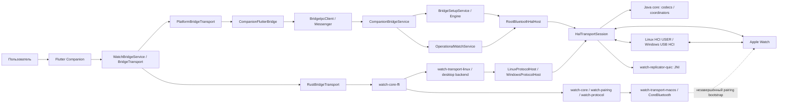

В Android одна сборка Bridge APK содержит `app`, `hal`, `protocol-runtime`, `core` и QUIC `.so`. Companion — отдельный APK. Java package `dev.applewatchandroid.bridge` сохранён между модулями; зависимости направлены `app → hal → protocol-runtime → core` и `app → core`. Linux и Windows workers используют те же `protocol-runtime` и `core` с платформенными адаптерами контроллера и хранилища. Rust управляет временем жизни desktop worker и публичным состоянием; Flutter обращается к нему через C ABI.

Основной пользовательский flow находится во Flutter. Bridge launcher переадресует в Companion; закрытие экрана не прекращает operational foreground service. HAL принадлежит одному владельцу, а последовательность пакетов обрабатывает одна транспортная state machine.

Подробности: [Bridge architecture](docs/BRIDGE_ARCHITECTURE.md), [Companion architecture](docs/COMPANION_ARCHITECTURE.md), [macOS Rust core](docs/MACOS_RUST_CORE.md).

<a id="ru-calls"></a>
## Сквозная карта вызовов

Это карта реализованных межслойных переходов и значимых вызовов. Стрелки в схемах показывают направление работы; некоторые переходы асинхронны и проходят через очередь. Для решения, выполняется ли конкретная ветка, нужны условия в исходниках и runtime evidence.

### Команда из Companion на часы

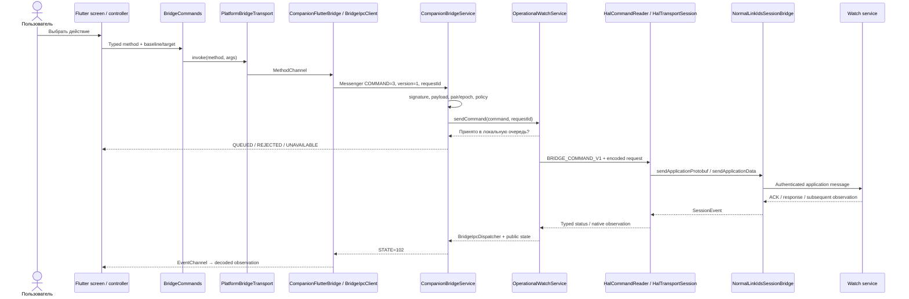

Для pairing/activation используется `BridgeSetupService`, а для больших `.watchface` пакетов перед командой работает `NativeFaceTransferDispatcher`. Привязка Companion к IPC сама по себе не запускает HAL и не создаёт пару.

### Обратный путь: часы → интерфейс

```text
Watch packet
  → Bluetooth HAL callback / HCI ACL
  → HalTransportSession
  → NormalLinkIdsSessionBridge.accept…
  → normal link: ERTM / NetworkRelay / authenticated ESP
  → IDS: IPv6 / TCP / NWSC / control or application stream
  → IdsModernSessionCoordinator.SessionEvent
  → handleIncomingProtobufEvent / feature receiver / typed observation
  → root stdout IPC → OperationalWatchService
  → BridgeIpcDispatcher + CompanionSessionState
  → CompanionBridgeService.state() / STATE=102
  → BridgeIpcClient → BridgeStateProjection
  → EventChannel → WatchBridgeService / BridgeObservation
  → WatchObservationController / WatchConnectionProvider / feature controller
  → Provider → виджеты
```

Публикация сначала декодируется целиком, затем раздаётся проекциям. При потере transport или смене пары connected/native state инвалидируется; поздний ответ прежней epoch не должен оживлять старое состояние.

### Как читать подтверждения

| Значение / событие | Что оно доказывает |
| --- | --- |
| `QUEUED` | Bridge принял запрос в локальную очередь |
| `HAL_ACCEPTED` | Root transport принял структурированный запрос |
| `IDS_QUEUED` | Сообщение поставлено в IDS с привязанным message UUID |
| `APP_ACK_RECEIVED` | Получено соответствующее application ACK |
| `APP_RESPONSE_RECEIVED` | Получен соответствующий ответ приложения; его смысл зависит от протокола |
| `NATIVE_FACE_APPLIED` | Полный коррелированный Watch readback подтвердил результат face transaction |
| `APPLIED` | Значение, которое Flutter confirmed-wrapper принимает за подтверждение; нельзя синтезировать из очереди/ACK |
| `EXPIRED`, `FAILED`, `REJECTED`, `UNKNOWN` | Разные причины незавершённого запроса; `UNKNOWN` не доказывает отсутствие частичного эффекта |
| `OBSERVED` | Ответ на чтение публичного state; свежесть отдельных полей нужно проверять |

Stage enum определён в [BridgeCommandCodec](apple-watch-bridge/core/src/main/java/dev/applewatchandroid/bridge/BridgeCommandCodec.java). Это не универсальная линейная цепочка: не каждый запрос имеет все стадии, а snapshot на диске может быть старым.

<a id="ru-stack"></a>
## Стек протоколов

### Установка link

```text
BLE advertisement / FE25 setup metadata
  → выбранный свежий Watch candidate
  → HCI LE connection
  → L2CAP
  → BT_CL fixed signaling CID 0x003a
  → VERSION / services / CREATE / ACCEPT
  → dynamic pairing pipe
  → uIKE security + PIN/optical authentication
  → OOB / LE Secure Connections SMP / durable Bluetooth bond
  → encrypted normal-link registration
```

### Обычный IDS application packet после установления normal link

```text
Application protobuf / binary plist / resource / native face payload
  ↕ IDS application stream + ServiceMap topic
  ↕ NWSC service connector + TCP + inner IPv6
  ↕ authenticated ESP / Class-C or Class-D IPsec
  ↕ NetworkRelay
  ↕ L2CAP ERTM on negotiated dynamic channels
  ↕ HCI ACL
  ↕ Android Bluetooth HAL / controller
  ↕ BLE link
```

Ключевая граница в [NormalLinkIdsSessionBridge](apple-watch-bridge/core/src/main/java/dev/applewatchandroid/bridge/NormalLinkIdsSessionBridge.java): normal-link слой владеет IKE/ESP/NetworkRelay/ERTM, IDS слой — расшифрованными IPv6/TCP, NWSC и control/data streams. IKE обменивается сообщениями при установлении SAs; обычный application payload идёт через ESP.

**Topic не равен отдельному TCP соединению.** Services с одинаковыми priority и protection class используют общий канонический connector. Class-C/D — классы защищённого маршрута; это не два отдельных приложения или радиоканала.

<a id="ru-pairing"></a>
## Первичное сопряжение: шаг за шагом

### 1. Подготовить владельца сессии

Companion запрашивает `beginPairing` либо `beginOpticalPairing`. `CompanionConnectionPolicy` проверяет Bluetooth permission, известность saved identity и отсутствие другого владельца. Обычный begin не заменяет существующую пару. Явный `replacePairOptically` требует совпадающий UUID сохранённой пары и проверенный encrypted replacement backup.

### 2. Запустить root controller runtime

`BridgeSetupService / BridgeSetupEngine → RootBluetoothHalHost → HalTransportSession.initialize() → runTransportHandshake()`.

Root host проверяет invocation и exclusive HAL lease. Transport настраивает controller, получает устойчивую локальную identity из приложения, ACL buffer/credits и event masks. MainActivity не владеет этим процессом.

### 3. Найти и выбрать именно эти часы

Сканируются advertisements. Валидные setup metadata дают product/watchOS/candidate information. `WatchDiscoverySelection` публикует ограниченный набор временных tokens; Companion отправляет `selectDiscoveredWatch`. Свежесть advertisement проверяется снова перед использованием. Manufacturer data само по себе не доказывает, что устройство можно сопрягать.

### 4. Открыть pairing transport

После LE connection выполняются BT_CL version/service/CREATE/ACCEPT переходы. Dynamic CID получается из переговоров, а не подставляется как константа. В HAL это приводит к `probeControlSaInit()`.

### 5. Установить control security association

Карта вызовов в [HalTransportSession](apple-watch-bridge/protocol-runtime/src/main/java/dev/applewatchandroid/bridge/HalTransportSession.java):

```text
runTransportHandshake()
  → probeControlSaInit()
  → probeAdditionalKeyExchange()
  → probeControlIkeAuth()
  → выбранная ветка аутентификации
```

Эти функции выполняют protocol negotiation и проверку authenticated payloads. Здесь ещё нет доказательства durable bond, IDS-ready или активации.

### 6. Пройти PIN или optical ветку

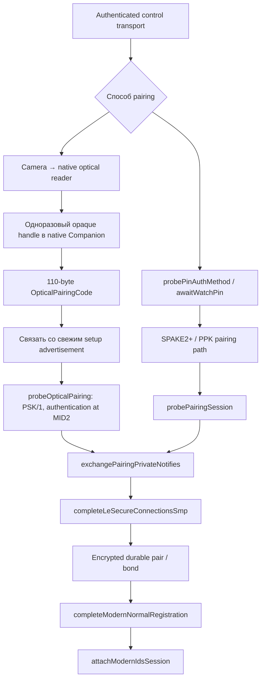

PIN и optical используют разные authentication paths и message counters. Optical code должен соответствовать свежему setup advertisement; декодированное изображение ещё не означает authenticated pair.

На Android camera reader работает в отдельном native `:optical` процессе. Dart получает публичное имя и временный handle, а explicit Pair/Replace передаёт native payload через signature-protected IPC. Handle одноразовый; documented lifetime — 120 секунд, request deadline — 10 секунд.

Текущий spatial reader использует локальный hash-pinned transitional firmware backend `23G71`, генерируемый при сборке. Полностью независимый portable spatial detector ещё не готов. Arm64 поддерживается; другие native ABIs явно отвергают инициализацию. Эти входные бинарники не заменяются произвольными файлами.

### 7. Сохранить security material и bond

`exchangePairingPrivateNotifies()` приводит к OOB/SMP и `completeLeSecureConnectionsSmp()`. Приложение запечатывает records, root получает результат persistence. Переходы с `BOND-STORED` / `PAIRING-SESSION-STORED` отличаются от отправки запроса сохранения; отказ нельзя считать успешным commit.

### 8. Установить normal link и IDS

`completeModernNormalRegistration() → attachModernIdsSession()` поднимают normal pipe и защищённые маршруты. После NetworkRelay/IKE Class-D и Class-C появляются IDS control Hello, service routing и data lanes. Следующий этап — обмен device info и NanoRegistry properties.

Источники: [optical result](docs/live-20261006-optical-pairing/RESULT.md), [typed setup state chain](docs/live-20261006-optical-pairing/SETUP-387-STATE-CHAIN.md), [PairingSessionRecord](apple-watch-bridge/core/src/main/java/dev/applewatchandroid/bridge/PairingSessionRecord.java).

<a id="ru-setup"></a>
## Активация и завершение Setup

### Порядок после security и IDS

| Шаг | Владелец / данные | Условие перехода |
| --- | --- | --- |
| 1. IDS bootstrap | `IdsModernSessionCoordinator`, `IdsBootstrapState`, device-info exchange | Authenticated identity и живые control/data lanes |
| 2. Initial registry | `AppleWatchInitialSetupIdsAdapter`, NanoRegistry properties | Получены обязательные свойства и согласована identity |
| 3. Language / locale | `WatchLocaleSnapshot`, locale preferences archive | Только язык/locale из authenticated Watch observation; fallback на язык Android отсутствует |
| 4. Commit `isPaired` | Initial setup coordinator + durable record | Валидны обязательные предыдущие checkpoint/barrier |
| 5. Activation | `HalPostCommitOrchestrator`, `ActivationProxyWorker`, PBBridge | Реальный результат активации; требуемый owner input передаётся отдельно |
| 6. Normal / initial sync prep | PBBridge 36, затем PBBridge 21 / response 18 | Correlated response; он ещё не означает окончание Setup |
| 7. Wi-Fi | `InitialWifiSyncWorker` | Поддерживаемая сеть, та же pair/generation и live setup Class-C lane |
| 8. PairedSync | NPS domain, active/completed sync state | Нативные observer/saga условия, а не только progress wording |
| 9. Exit Setup | Buddy / Carousel и completion policy | Отдельное доказательство или явное подтверждение владельца видимого циферблата |
| 10. Normal reconnect | Operational policy | Сохранена подходящая та же пара; старый setup transport безопасно остановлен |

### Нативная ветвь часов, реконструированная по бинарникам

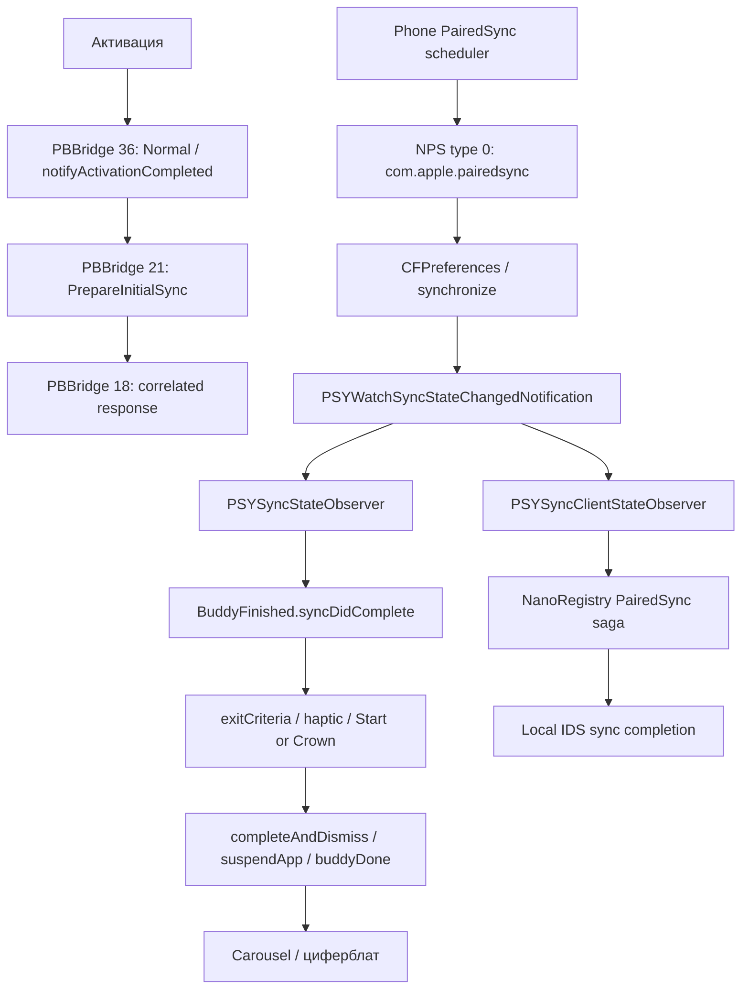

Схема показывает две независимые observer-ветви. PBBridge 4 об активации, response 18, AppACK и отправленный progress сами по себе не доказывают видимый Clock. Точные native handlers и различия сборок `23S303`, `23U67`, `23G71` сохранены в [SETUP_CHAIN.md](docs/live-20261005-sync/SETUP_CHAIN.md).

### Публичные фазы и durable checkpoints

`SetupProgressState.Phase` содержит:

```text
IDLE, STARTING, DISCOVERING, CONNECTING, PIN_REQUIRED, SECURITY, IDS,
REGISTRY, CONFIGURING, ACTIVATING, ACTIVATION_INPUT, ACTIVATED, SYNCING,
WAITING_FOR_WATCH, VERIFYING_RECONNECT, VERIFIED, FAILED, STOPPING, STOPPED
```

Это vocabulary проекций, а не обязательный единственный порядок всех сценариев. `BridgeSetupEngine` запрещает регрессии и очищает поздние owner-input fields.

Durable states `PairingSessionRecord` сохраняют wire numbering:

| Значение | Checkpoint | Значение | Checkpoint |
| ---: | --- | ---: | --- |
| 1 | `PAIRING_MATERIAL_PERSISTED` | 10 | `INITIAL_PROPERTIES_RECEIVED` |
| 2 | `SMP_BONDED_RAW` | 11 | `READY_TO_COMMIT_IS_PAIRED` |
| 3 | `STOCK_BOND_IMPORTED` | 12 | `IS_PAIRED_COMMITTED` |
| 4 | `STOCK_ENCRYPTED_RECONNECT` | 13 | `ACTIVATION_CONFIRMED` |
| 5 | `NETWORK_RELAY_PRELUDE_NEGOTIATED` | 14 | `IS_SETUP_CONFIRMED` |
| 6 | `CLASS_D_ESTABLISHED` | 15 | `PAIRED_SYNC_COMPLETE` |
| 7 | `CLASS_C_ESTABLISHED` | 16 | `SETUP_COMPLETE` |
| 8 | `IDS_CONTROL_READY` | 17 | `CLOCK_VISIBLE_CONFIRMED` |
| 9 | `IDS_DATA_READY` | 18 | `OPERATIONAL_HEALTH_CONFIRMED` |

Проверяются также flags/evidence и identity. Одного большого ordinal недостаточно для допуска к operational mode. Подтверждение владельца хранится отдельно от native evidence; legacy не наблюдавшиеся terminal records не получают автоматическое право на нормальный reconnect.

<a id="ru-reconnect"></a>
## Повторное подключение

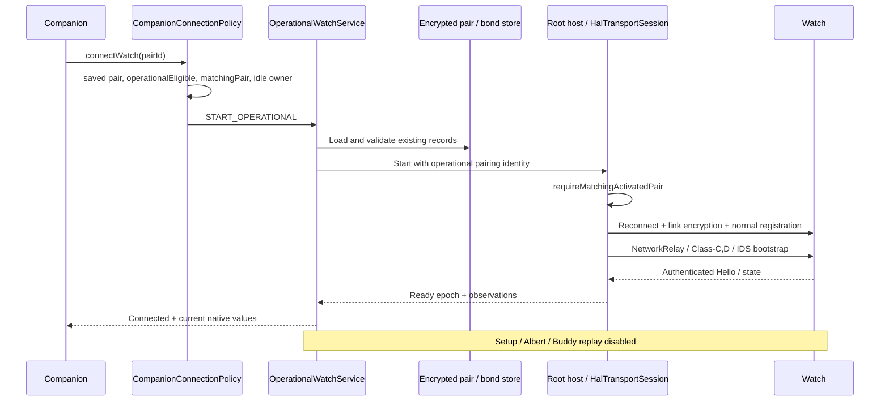

`OperationalWatchService` владеет root lifetime, readiness epoch, ограниченной очередью и reconnect. Feature controllers получают `OperationalSessionAccess`; они не запускают новый root owner и не заменяют пару.

При разрешённом retry policy задержка зависит от failure count: **15 → 30 → 60 секунд**. IDS policy rejection и незавершённый paired commit могут запретить reconnect; таймер сам по себе не даёт права игнорировать эти ограничения.

Disconnect выполняет cleanup и завершает владельца. Пока он `STOPPING`, второй flow не получает HAL. После нового reconnect создаётся новая transport epoch; запросы старой epoch больше не действуют.

<a id="ru-api"></a>
## Полный реестр Companion → Bridge API

Ниже перечислены обработчики текущего Android IPC service и отдельные локальные adapter methods. Аргументы сокращены до значимых; точные validation/size rules находятся в связанной реализации. Это внутренний API двух подписанных приложений.

### Контракт IPC

| Уровень | Контракт |
| --- | --- |
| Flutter commands | MethodChannel `dev.applewatchandroid.companion/bridge` |
| Flutter observations | EventChannel `dev.applewatchandroid.companion/events` |
| Native service | `dev.applewatchandroid.bridge.CompanionBridgeService` |
| Permission | `dev.applewatchandroid.bridge.permission.COMPANION_IPC`, protection level `signature` |
| Messenger request | `1 = SUBSCRIBE`, `2 = GET_STATE`, `3 = COMMAND` |
| Messenger reply | `101 = RESPONSE`, `102 = STATE` |
| Envelope | `version=1`, canonical `requestId` UUID; command включает `method` и typed Bundle args |
| Admission | Разрешён Companion package и совпадающая подпись; максимум 4 subscribed clients |
| Companion client | Максимум 32 pending requests; deadline 5 секунд; binding-death recovery |
| Root command | `BRIDGE_COMMAND_V1:` + Base64 binary request `{id, epoch, deadlineMs, command}` |
| Root status | `BRIDGE_COMMAND_STATUS_V1:` + Base64 typed status |

Нативный text/file adapter использует отдельные channels `…/text` и `…/face_files`; эти операции не являются IDS командами часов.

### Соединение и Setup

| Method | Путь / условие |
| --- | --- |
| `connectWatch` | `START_OPERATIONAL`: та же eligible saved pair |
| `disconnectWatch` | `STOP_SESSION`: setup или operational owner |
| `beginPairing` | `START_SETUP`: сохранённой пары нет |
| `beginOpticalPairing` | `START_SETUP`: native optical payload, сохранённой пары нет |
| `replacePairOptically` | Явный replacement: matching saved pair, optical code, verified backup |
| `resumeSetup` | Сохранённая matching pair ещё не operationalEligible |
| `submitPin` | Forward в действующий setup owner |
| `selectDiscoveredWatch` | Forward временного discovery token в setup |
| `activationResponse` | Forward challenge response в setup |
| `confirmSetup` | Activated matching pair; безопасное owner-confirmed завершение |
| `finishSetup` | Explicit `REJECTED`; legacy force-finish отключён |
| `auditStockBond` | Отдельный setup diagnostic flow для matching pair |
| `importStockBond` | Guarded stock bond import flow |
| `alignStockIdentity` | Guarded stock identity diagnostic flow |
| `probeStockReconnect` | Guarded stock reconnect probe |

Sources: [connection policy](apple-watch-bridge/core/src/main/java/dev/applewatchandroid/bridge/CompanionConnectionPolicy.java), [IPC service](apple-watch-bridge/app/src/main/java/dev/applewatchandroid/bridge/CompanionBridgeService.java).

### Operational commands

| Method | Аргументы / command | Что подтверждает результат |
| --- | --- | --- |
| `pingWatch` | `PING_WATCH` → FindMyLocalDevice | Correlated response и отдельная физическая проверка звука |
| `refreshWatchState` | `REQUEST_DEVICE_ABOUT` | SystemSettings About response / telemetry observation |
| `refreshFaceCollection` | `REQUEST_FACE_COLLECTION` | Полный принятый native collection snapshot |
| `syncWifi` | `SYNC_CURRENT_WIFI` | V2 archive delivery; join сети проверяется отдельно |
| `setActiveFace` | `faceId` → `NATIVE_FACE_SELECT:` | Новое подтверждённое selected UUID |
| `duplicateNativeFace` | `sourceFaceId`; новый UUID из requestId | Новый face/archive в readback |
| `removeNativeFace` | `faceId` | Readback без UUID; последний face удалить нельзя |
| `reorderNativeFaces` | `faceIds`, точная перестановка inventory | Полный matching порядок в readback |
| `updateNativeFace` | `faceId`, binary `configuration` | Matching config в readback |
| `addNativeFace` | `.watchface` `archive`, до 128 KiB inline | Новый target UUID и архив в readback |
| `setNativeMonogram` | `pairId`, `epoch`, `revision`, `text` | Новое paired monogram observation |
| `setNativePigmentVisibility` | Pair/epoch, timestamps, полные baseline sets, `changes` | Paired pigment mirror; очередь/ACK недостаточны |
| `setWatchSetting` | `setting`, boolean `value` | Native NPS observation точного ключа |
| `sendNotification` | `title`, `message`, `sectionId`, `sectionDisplayName` | Native bulletin path; действие/карточка проверяются отдельно |
| `stopPhonePing` | Локальный stop Android effect | `STOPPED` при успешном локальном stop |

Operational service проверяет readiness и policy, root повторно проверяет envelope. Face commands дополнительно требуют известный актуальный inventory. Legacy строка `SET_ACTIVE_FACE:` в root reader отвергается: используется native collection protocol.

### Архивы и локальные platform actions

| Method | Поведение |
| --- | --- |
| `beginNativeFaceImport` | Создаёт upload для pair/epoch, объявленного total; optional faceId/baselineHash для ресурсов |
| `appendNativeFaceImport` | Последовательные chunks, проверка offset |
| `finishNativeFaceImport` | Проверяет/seals пакет и ставит native add/resources command в очередь |
| `cancelNativeFaceImport` | Отменяет незавершённый upload |
| `exportNativeFace` | Chunked export сохранённого native package с offset/total/SHA-256 |
| `getState` | Локальный adapter возвращает последний `client.observedState`; это не fresh Watch request |
| `requestConnectionPermissions` | Локальный adapter открывает Bridge permission screen для connection scope |
| `requestPhoneFlashPermission` | Локальный adapter открывает permission screen; `OPENED` не означает granted |
| `startOpticalDecoder` | Запускает native optical worker для объявленных width/height |
| `processOpticalFrame` | Передаёт bounded packed UV frame native reader; не IDS packet |
| `stopOpticalDecoder` | Закрывает reader/worker resources |
| `discardOpticalCandidate` | Удаляет временный native candidate handle |

Методы upload/export находятся в [NativeFaceTransferDispatcher](apple-watch-bridge/app/src/main/java/dev/applewatchandroid/bridge/NativeFaceTransferDispatcher.java); staging/export limits и lifetime проверяются также в package store. `replaceNativeFaceResources` — Dart wrapper над upload API, а не отдельный Bridge IPC method.

### Методы Flutter, которые текущий Android service не реализует

| Method | Реальное поведение текущего Bridge |
| --- | --- |
| `syncSettings` | Adapter error `UNIMPLEMENTED`; используйте поддерживаемый `setWatchSetting` для конкретных ключей |
| `unpairWatch` | Adapter error `UNIMPLEMENTED`; описание Dart метода не означает реализованный wipe |
| `triggerCall` | Adapter error `UNIMPLEMENTED`; telephony codec/topic недостаточен для real call relay |
| `callAction` | Adapter error `UNIMPLEMENTED`; answer/decline Android call flow ещё не подключён |

Эти вызовы отвергаются whitelist нативного Companion adapter ещё до отправки Binder command. При прямом вызове неизвестного method Android Bridge также возвращает `UNIMPLEMENTED`. `finishSetup` отдельно существует в policy как отвергаемый legacy method, но adapter его не пропускает.

Sources: [BridgeCommands](apple-watch-companion/lib/services/bridge_commands.dart), [CompanionFlutterBridge](apple-watch-companion/android/app/src/main/kotlin/dev/applewatchandroid/companion/apple_watch_companion/CompanionFlutterBridge.kt). `_invokeConfirmed()` принимает только receipt `APPLIED`, поэтому `QUEUED` не возвращается как подтверждённый успех.

<a id="ru-routes"></a>
## Маршруты IDS и обработчики

Таблица соответствует whitelist в [IdsApplicationRoute](apple-watch-bridge/core/src/main/java/dev/applewatchandroid/bridge/IdsApplicationRoute.java). Сокращение **`alloy.X` означает `com.apple.private.alloy.X`**. Все перечисленные application routes используют urgent priority. Наличие route означает возможность маршрутизации, а не полную готовность соответствующей функции.

| Topic suffix | Class | Телефон: codec / consumer | Смысл на стороне часов |
| --- | --- | --- | --- |
| `alloy.bluetoothregistry` | D | `NanoRegistryPropertyCodec`, Class-D setup | Registry properties / lifecycle |
| `alloy.bluetoothregistryclassc` | C | NanoRegistry initial/property path | Class-C registry exchange |
| `alloy.pbbridge` | C | `PbBridgeCodec`, post-commit coordinator | Activation / Buddy / Setup |
| `alloy.preferencessync.pairedsync` | C | `PairedSyncCodec`, paired mirror, sync coordinator | Paired preferences и sync state |
| `alloy.preferencessync` | D | `PreferencesSyncCodec`, NPS consumers | Ordinary preference route |
| `alloy.bulletindistributor` | C | Bulletin transport, notification listener | Notifications / actions |
| `alloy.bulletindistributor.settings` | D | Bulletin settings | Notification policy |
| `alloy.findmylocaldevice` | D | `FindMyLocalDeviceCodec`, `OperationalPhoneFinder` | Play sound / Find Phone |
| `alloy.health.sync.classc` | C | `OperationalHealthController`, encrypted Health codecs | Health synchronization |
| `alloy.telephony` | C | Telephony research codecs | Telephony route; full native acceptance не доказана |
| `alloy.timesync` | D | Timesync messages | Time exchange |
| `alloy.timezonesync` | D | Timezone messages | Timezone exchange |
| `alloy.clockface.sync` | D | `ClockFaceSyncClient/Receiver`, delta session | NanoTimeKit native face collection |
| `alloy.systemsettings` | D | `NanoSystemSettingsDiagnostics`, reboot codec | About / native system diagnostic operations |
| `alloy.wifi.networksync` | C | `WifiNetworkSyncCodec`, Wi-Fi workers | Network archive V2 ADD |
| `alloy.sysdiagnose` | C | `SysdiagnoseArchiveInventory/Collection` | Diagnostic archive operations |
| `alloy.idscredentials` | D | `IdsDeviceInfoExchange`, commands 11/12 | Mutual credentials/device info; отдельны от account login / activation |

`pairedsync` имеет собственный **Class-C** route: наследовать Class-D от обычного `preferencessync` неправильно. Unknown topic whitelist отвергает. StateReplicator по NetworkRelay/QUIC — отдельный путь, описанный ниже.

<a id="ru-faces"></a>
## Циферблаты: чтение, изменение, импорт, ресурсы

### Три независимых вида данных

1. **Native Watch collection** — реальные UUID, порядок, selection, configurations и packages, полученные от часов.
2. **Local design library** — Flutter designs, HTTP catalog/cache и локальные файлы; сохранение здесь не устанавливает face на часы.
3. **Native preview assets/metadata** — исходные изображения и параметры для Companion; показ красивого preview не подтверждает установленный face.

### Чтение inventory

```text
refreshFaceCollection
  → REQUEST_FACE_COLLECTION
  → HalTransportSession.drainOutboundAppMessages()
  → ClockFaceSyncClient.reserveHeader()
  → ClockFaceSyncHeaderCodec.fullRequest()
  → NormalLinkIdsSessionBridge.sendClockFaceCollectionRequest()
  → Watch clockface.sync
  → ClockFaceSyncReceiver: session, parts, archive/configuration validation
  → native collection / package persistence
  → publishClockFaceObservation()
  → IPC public snapshot → NativeFaceCollection → UI
```

Header sequence/generation хранятся отдельно. Неполный multipart пакет не публикуется как готовая библиотека. При recovery передаётся known unfinished session; это управление native synchronization session, а не удаление пользовательских faces.

### Изменение: полноценная delta transaction


Реальные stages: `START_READY → START_WAIT → BATCH_READY → BATCH_WAIT → END_READY → END_WAIT → READBACK_WAIT → APPLIED`, с terminal `REJECTED` / `UNKNOWN`. Readback timeout — **180 секунд**. Ответ обязан совпадать по topic, message identifier, session, Watch peer и batch index.

Batch/end error может следовать за частично применённой записью. Автоматический повтор mutation запрещён этой state machine; сначала нужно разобраться с новым наблюдением. Файлы: [delta session](apple-watch-bridge/core/src/main/java/dev/applewatchandroid/bridge/ClockFaceDeltaSession.java), [delta plan](apple-watch-bridge/core/src/main/java/dev/applewatchandroid/bridge/ClockFaceDeltaPlan.java), [command codec](apple-watch-bridge/core/src/main/java/dev/applewatchandroid/bridge/ClockFaceDeltaCommand.java).

### `.watchface` и Photos/resources

```text
Native archive → validate structure/configuration/resources → UI draft/review
  → явный Add / resource replacement
  → inline, если Add archive ≤ 128 KiB
  → иначе beginNativeFaceImport(total, pair, epoch, optional baseline)
  → appendNativeFaceImport(offset, chunk ≤ 64 KiB), последовательно
  → finishNativeFaceImport → sealed staged package
  → NATIVE_FACE_ADD_FILE / NATIVE_FACE_RESOURCES_FILE
  → обычная native delta transaction → Watch readback
```

Общий archive limit — **16 MiB**, Bridge transfer TTL — **30 минут**. Export возвращает chunks ≤ **64 KiB**, постоянные `total`/`sha256` и проверяемый `offset`; Dart собирает bytes и проверяет итоговый SHA-256. Смена pair/epoch прекращает transfer. Незавершённый upload отменяется либо истекает на Bridge стороне.

Photos crop/resource editing работает с настоящими resources и baseline package hash. Локальная правка preview/draft сама по себе не отправляет изменение. Installed-face autosave имеет собственный guarded controller; gallery creation требует явного Add.

### Native UI и превью

Companion содержит catalogs/options, AppIntent parameters/identity, complication layout, Photos metadata, pigment/monogram editor, indexed/component preview codecs и decode queue. Нативные research captures привязаны к полным configuration identities; перенос результата одной face family на остальные не предполагается.

Текущий stage 90 доказал Activity Analog swatch-компоненты: **530 независимых native reference images**, max premultiplied channel delta **2/255**, alpha delta **0**. Это offline validation исследовательских программ; production generic-option UI ещё требует интеграции. Границы, unsupported shade fractions и native geometry подробно описаны в [stage 90](docs/WATCH_APP_NATIVE_OPTION_SWATCHES_90.md).

<a id="ru-preferences"></a>
## Настройки, палитры и монограмма

### Настройки часов

| API enum | NPS domain | Native key | Особенность |
| --- | --- | --- | --- |
| `RIGHT_WRIST` | `com.apple.nano` | `wornOnRightArm` | Two-way native preference |
| `INVERT_SCREEN` | `com.apple.nano` | `invertUI` | Two-way native preference |
| `TIME_24_HOUR` | `.GlobalPreferences` | `AppleICUForce24HourTime` | Codec не помечает как two-way |

`setWatchSetting → SET_WATCH_SETTING:<enum>:<bool> → WatchSettingsCodec.encode → NPS → Watch preference observer`. Чтение преобразует отсутствующий или malformed value в **unknown**, а не `false`. Unix time и Apple preference epoch (`978307200` секунд) различаются.

### Add Colors / pigment visibility

NPS domain — `com.apple.NanoTimeKit`, keys — `SelectedPigmentList` и `AutoSelectedPigmentList`. Это fullname sets глобальной для пары палитры, а не поля конкретного face JSON.

```text
Watch NPS type-0 update
  → NtkPreferenceEnvelope (общий parse)
  → PigmentPreferenceCodec
  → pair-scoped durable PigmentPreferenceMirror
  → Companion baseline: pair / epoch / both timestamps / complete sets
  → ручное изменение visibility
  → setNativePigmentVisibility
  → PigmentPreferenceCommand validates same baseline
  → guarded paired NPS write
  → новое observed mirror подтверждает значения
```

Автоматические и ручные sets имеют разный lifecycle. Writer проверяет обе baseline collections и сохраняет native manual opt-out semantics. Предел codec — **1023 имени**, value bytes — **64 KiB**. Scoped data не воспроизводится из неподходящего global cache.

### Monogram

`customMonogram` находится в том же domain `com.apple.NanoTimeKit`, но имеет отдельный mirror/revision и writer. Путь: Foundation-compatible text normalization/rules → current pair/epoch/revision baseline → `setNativeMonogram` → guarded NPS write → paired observation.

Monogram face switch и глобальный текст — разные значения. UI editor, delivery receipt и реальное observed text не смешиваются. Документы: [Foundation normalization](docs/WATCH_APP_FOUNDATION_TEXT_72.md), [native writer](docs/WATCH_APP_MONOGRAM_EDITOR_73.md).

<a id="ru-features"></a>
## Уведомления, поиск, Wi-Fi и Health

### Уведомления


Старый action не должен применяться к новому revision или соседнему чату. Duplicate claims переживают restart. Notification access, per-app policy и доступные Android actions проверяются отдельно. Test bulletin sender не доказывает все реальные приложения, icons, attachments, Focus и haptic policy.

### Find Watch / Find Phone

**Phone → Watch:** `pingWatch → PING_WATCH → FindMyLocalDeviceCodec → authenticated IDS → Watch sound request → correlated response`.

**Watch → Phone:** native request → `FindMyPhoneIpcCodec` → `OperationalPhoneFinder` → main-thread Android sound/flash effects → durable duplicate claim → correlated result обратно через root/IDS. `stopPhonePing` управляет локальным эффектом. Permission-screen receipt `OPENED` не означает, что камера/flash доступна.

### Wi-Fi

После activation/language/Normal и correlated PrepareInitialSync response отдельный root worker получает текущую валидную WPA2/CCMP сеть. V2 ADD archive отправляется на `alloy.wifi.networksync` в той же setup session. Worker связан с pair/generation, ограничивает retries и очищает late results при stop/link reset.

При operational READY есть отдельная автоматическая отправка; `syncWifi` остаётся ручным retry для текущей сети. Archive ACK означает доставку архива; Watch join сети — отдельное физическое доказательство. Credentials не передаются в публичный Flutter snapshot.

### Health

```text
Watch encrypted Health message
  → live IDS class-C lane
  → forwardEncryptedHealthData()
  → app encrypted inbox / replay
  → OperationalHealthController
  → peer identity + registry binding + native decode
  → durable Health session/defaults state
  → limited typed observations → Companion
```

Встречный encrypted request использует scoped `HealthOutboundIpcCodec`; UUID/peer/session correlation сохраняется. Доставка ciphertext и decode объекта не равны native changes acceptance, успешному commit anchors или полноценной статистике тренировок. Подробные границы — в [Health feature plan](docs/WATCH_FEATURE_COVERAGE_PLAN.md) и [defaults mirror evidence](docs/live-20261005-sync/HEALTH-375-DEFAULTS-MIRROR-EVIDENCE.md).

<a id="ru-replicator"></a>
## Современный StateReplicator и QUIC

Это отдельная исследовательская ветвь современного native snapshot обмена, а не замена подтверждённой `clockface.sync` delta transaction.

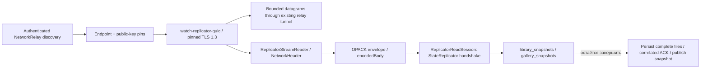

QUIC engine не создаёт ОС socket: caller передаёт datagrams и время, получает outbound datagrams/stream events. TLS peer проверяется по public keys из authenticated discovery, с проверкой владения ключом; это не Web PKI сертификат по произвольному hostname.

Текущие constants: ALPN **`application-service`**, max datagram **1200 bytes**, max batch **4**. Handshake `ReplicatorReadSession` использует envelope protocol **8**, zone protocol **6**, message type **`StateReplicator`**, client **`com.apple.nanotimekit.replicator.library`**.

Handshake и authenticated DATA не доказывают, что complete snapshot records получены. В текущем reader non-DATA file persistence/ACK не реализованы; отчёт о snapshot delivery остаётся неподтверждённым. Sources: [Rust engine](crates/watch-replicator-quic/src/lib.rs), [ReplicatorReadSession](apple-watch-bridge/core/src/main/java/dev/applewatchandroid/bridge/ReplicatorReadSession.java), [native research](docs/WATCH_FACES_REPLICATOR_39.md).

<a id="ru-ownership"></a>
## Ключи, хранилища и время жизни

| Owner | Что хранит / чем владеет |
| --- | --- |
| `CompanionScope` | Общий Bridge и его dispose |
| `WatchBridgeService` | Platform subscription, typed public streams, projections |
| `BridgeIpcClient` | Binder connection, pending requests/deadlines, binding death |
| `BridgeSetupService / Engine` | Setup foreground lifetime, owner input, safe stop |
| `OperationalWatchService` | Existing pair runtime, epoch/readiness, commands/reconnect |
| `RootBluetoothHalHost` | Exclusive HAL lease, startup/exit |
| `HalTransportSession` | Serial packet queue/state machine, transient SAs, idempotent cleanup |
| App Keystore/storage adapters | Запечатанные pair/bond/IDS records и persisted identity |
| `PairingSessionRecord` | Versioned plaintext model внутри владельца; перед диском обязательно sealing |
| `PairedSyncPreferenceStore` / mirrors | Pair-scoped preference state и write baselines |
| `ClockFaceSyncClient` / package store | Header sequence/generation, validated native packages |
| Health stores | Peer identity, inbox/replay/session/defaults boundaries |
| Rust C ABI | Rust-owned JSON allocations; Dart освобождает через `aw_core_free` |

Основные привязки: **pair UUID** обозначает сохранённую пару, **epoch** — текущую transport session, **requestId** — команду, **message UUID** — конкретное IDS сообщение, **generation/sequence/revision** — protocol freshness/baseline.

Ключи, PIN, optical payload и Wi-Fi passwords не являются UI data. Public snapshots содержат только разрешённые проекции. Смена пары, epoch, close или timeout инвалидирует pending commands/late callbacks; interrupted native mutation не должна автоматически переигрываться.

<a id="ru-start"></a>
## Запуск с чистой системы

Выполняйте каждый блок на указанной ОС и останавливайтесь при ошибке команды.
Shell-блоки рассчитаны на Bash/zsh, Windows-блоки — на PowerShell. Desktop-цели
собираются на своей ОС. Текущая Android-сборка использует NDK для macOS/Linux.
Проверенный набор SDK: Flutter **3.47.4 / Dart 3.13.3**, Rust **1.98.1**, JDK
**17**. Команды устанавливают инструменты и сохраняют зависимости из lockfiles.

### 1. Подготовка системы

**Linux Mint 22 / Ubuntu 24.04, x86_64:**

```sh
sudo apt-get update
sudo apt-get install -y git curl unzip xz-utils zip python3 build-essential \
  clang cmake ninja-build pkg-config libgtk-3-dev libstdc++-12-dev \
  libglu1-mesa libusb-1.0-0-dev libbluetooth-dev bluez systemd libcap2-bin openjdk-17-jdk
sudo update-alternatives --config java
sudo update-alternatives --config javac
export JAVA_HOME="$(dirname "$(dirname "$(readlink -f "$(command -v javac)")")")"
export PATH="$JAVA_HOME/bin:$PATH"
```

Если установлено несколько JDK, в обоих запросах alternatives выберите JDK 17.
Для других дистрибутивов нужны
эквивалентные пакеты и отдельная проверка оборудования. За основу взяты
[требования Flutter для Linux](https://docs.flutter.dev/platform-integration/linux/setup),
добавлены Java, USB и Bluetooth-зависимости проекта.

**macOS:** сначала установите полный [Xcode](https://developer.apple.com/xcode/)
и [Homebrew](https://brew.sh/), затем:

```sh
sudo xcode-select -s /Applications/Xcode.app/Contents/Developer
sudo xcodebuild -runFirstLaunch
sudo xcodebuild -license
brew install python git openjdk@17 cocoapods libusb
export JAVA_HOME="$(brew --prefix openjdk@17)/libexec/openjdk.jdk/Contents/Home"
export PATH="$JAVA_HOME/bin:$PATH"
```

Завершите запросы лицензии. Если Xcode расположен в другом месте, укажите его
путь. См. [подготовку macOS для Flutter](https://docs.flutter.dev/platform-integration/macos/setup).

**Windows 10/11, x64:** если нет `winget`, установите App Installer/WinGet.
Выполните команды в PowerShell; установщик Visual Studio может запросить UAC.

```powershell
winget install --exact --id Git.Git
winget install --exact --id Python.Python.3.13
winget install --exact --id EclipseAdoptium.Temurin.17.JDK
winget install --exact --id Rustlang.Rustup
winget install --exact --id Microsoft.VisualStudio.2022.Community --override "--wait --passive --add Microsoft.VisualStudio.Workload.NativeDesktop --includeRecommended"
Start-Process 'ms-settings:developers'
```

После установки откройте новое окно PowerShell. Проверьте наличие workload
**Desktop development with C++** и CMake tools в Visual Studio. Одного VS Code
недостаточно. В открытой странице Windows Settings включите **Developer Mode**
для symlinks Flutter-плагинов. См. [подготовку Windows для Flutter](https://docs.flutter.dev/platform-integration/windows/setup)
и [параметры установщика Microsoft](https://learn.microsoft.com/en-us/visualstudio/install/use-command-line-parameters-to-install-visual-studio).

### 2. SDK и получение проекта

В новой среде **macOS/Linux** установите Rust через
[официальный установщик](https://rustup.rs/), а Flutter — на проверенном теге:

```sh
curl --proto '=https' --tlsv1.2 -sSf https://sh.rustup.rs -o /tmp/watch-rustup-init.sh
sh /tmp/watch-rustup-init.sh
. "$HOME/.cargo/env"
mkdir -p "$HOME/develop"
git clone --branch 3.47.4 --depth 1 https://github.com/flutter/flutter.git "$HOME/develop/flutter"
export PATH="$HOME/develop/flutter/bin:$PATH"
git clone https://github.com/LordixDemon/apple_watch_connector.git
cd apple_watch_connector
rustup toolchain install 1.98.1 --profile minimal --component rustfmt --component clippy
rustup override set 1.98.1
```

На **Windows**, после установки через WinGet:

```powershell
New-Item -ItemType Directory -Force "$env:USERPROFILE\develop" | Out-Null
git clone --branch 3.47.4 --depth 1 https://github.com/flutter/flutter.git "$env:USERPROFILE\develop\flutter"
$env:Path = "$env:USERPROFILE\develop\flutter\bin;$env:Path"
$env:JAVA_HOME = Split-Path (Split-Path (Get-Command javac.exe).Source -Parent) -Parent
$env:Path = "$env:JAVA_HOME\bin;$env:Path"
git clone https://github.com/LordixDemon/apple_watch_connector.git
cd apple_watch_connector
rustup toolchain install 1.98.1 --profile minimal --component rustfmt --component clippy
rustup override set 1.98.1
```

Если каталог SDK или проекта уже существует, используйте его. Добавьте Flutter,
Cargo `bin` и выбранный JDK в профиль своего shell или пользовательскую среду;
показанные переменные действуют в текущем терминале. Архивы SDK доступны в
[официальной инструкции Flutter](https://docs.flutter.dev/install/manual).
Для воспроизведения проверенной сборки не выполняйте `flutter upgrade` или
`pub upgrade`.

На **всех ОС**, из корня проекта:

```sh
git rev-parse --short HEAD
python3 --version
java -version
javac -version
rustc --version
flutter --version
flutter doctor -v
cd apple-watch-companion
flutter pub get --enforce-lockfile
cd ..
```

На Windows используйте `python` вместо `python3`. В `flutter doctor` должен
работать toolchain выбранной платформы. Предупреждение Android/Xcode, не
относящееся к сборке Linux/Windows, её не блокирует. Ожидаемые версии: Rust
1.98.1, Flutter 3.47.4 и Dart 3.13.3; `java` и `javac` должны использовать JDK 17.
При сообщении о результатах сохраните Git revision.

### 3. Выбор сценария

| Платформа | Следующие шаги | Текущий результат |
| --- | --- | --- |
| Android | [SDK/сборка](#ru-build), затем [установка APK/root](#ru-android-install) | Проверено на rooted OnePlus CPH2653; чистая сборка Companion блокируется отсутствующими optical inputs |
| Linux | [Сборка](#ru-build), затем [установка broker и сопряжение](#ru-linux) | Новая пара, активация и реконнект сохранённой пары |
| Windows | [Сборка](#ru-build), затем [launcher и сопряжение](#ru-windows) | Проверено на Windows 10 / Realtek `0bda:b00e`; последний рефакторинг требует повторной проверки на устройстве |
| macOS | [Сборка и запуск](#ru-macos) | Обнаружение и BLE; полная активация/IDS пока не завершены |

Для новой пары часы должны показывать экран сопряжения. Часы, связанные с
другим устройством, не создадут новую пару по его старому PIN. Для пары,
сохранённой этой установкой приложения, используйте **Connect** и сохраните её
записи. Держите часы рядом и заряженными. Во время сессии Linux/Windows выбранный
Bluetooth-контроллер занят приложением.

Успешная настройка Linux/Windows требует рабочего циферблата, подтверждения
пользователя, если оно запрошено, и `OPERATIONAL` / `watchReady=true`. На Android
также необходимы наблюдаемое завершение настройки и operational readiness.
Одного Bluetooth-соединения, ответа активации или ACK доставки недостаточно.
После настройки отключите и подключите часы: сохранённая готовая пара должна
восстановиться без нового PIN. При зависшем этапе см. [диагностику](#ru-diagnostics).

<a id="ru-build"></a>
## Сборка, тестирование и первый запуск

### Требования

| Target | Требования из текущего проекта |
| --- | --- |
| Java core tests | JDK **17**, существующий Gradle wrapper |
| Android Bridge | Android SDK **36**, Build Tools **36.1.0**, minSdk **33**, targetSdk **36** |
| Android native QUIC | NDK **28.2.13676358**, Rust target `aarch64-linux-android`; Gradle использует API33 clang |
| Companion | Flutter SDK, совместимый с Dart constraint **`^3.10.3`**, существующий `pubspec.lock`; в reports использовались Flutter 3.47.4 / Dart 3.13.3 |
| Rust | Edition **2024**, `Cargo.lock`; текущий compiler в workspace проверялся как **1.98.1** |
| macOS | macOS/Xcode/CoreBluetooth; arm64 — проверявшийся host, Intel build предусмотрен, физически не подтверждён |
| Linux | Flutter Linux toolchain, Rust, Python 3, JDK 17, CMake/Ninja/clang, GTK3 development files, BlueZ/`busctl`, libusb/libbluetooth development files и `setcap` для HCI broker |
| Windows | Windows 10 version 2004+ / 11, Bluetooth controller, Rust MSVC, Python 3, JDK 17–22, Visual Studio Desktop development with C++ и CMake tools; Flutter Developer Mode |
| Camera decoder / native assets | Локальные hash-pinned research inputs, требуемые native build scripts; они не скачиваются README командой |
| Android physical runtime | Поддерживаемый root/HAL handoff и совместимая подпись двух APK; обычного BLE API недостаточно для этого backend |

Для macOS также важна Xcode build configuration; ограничения приведены в [macOS findings](docs/MACOS_PAIRING_TRANSPORT_FINDINGS.md). Linux требует установки HCI broker, Windows — доступа к контроллеру через WinUSB или поддерживаемый UsbDk. Подробности приведены ниже в разделах подключения.

### Android SDK и условия сборки камеры

Сначала установите [Android Studio и SDK Command-Line Tools](https://developer.android.com/studio).
В Bash/zsh на macOS/Linux, после выбора JDK 17:

```sh
if [ "$(uname -s)" = Darwin ]; then
  export ANDROID_HOME="${ANDROID_HOME:-$HOME/Library/Android/sdk}"
else
  export ANDROID_HOME="${ANDROID_HOME:-$HOME/Android/Sdk}"
fi
export PATH="$ANDROID_HOME/platform-tools:$PATH"
"$ANDROID_HOME/cmdline-tools/latest/bin/sdkmanager" --sdk_root="$ANDROID_HOME" --licenses
"$ANDROID_HOME/cmdline-tools/latest/bin/sdkmanager" --sdk_root="$ANDROID_HOME" \
  "platform-tools" "platforms;android-36" "build-tools;36.1.0" \
  "ndk;28.2.13676358" "cmake;3.22.1"
flutter config --android-sdk "$ANDROID_HOME" --jdk-dir "$JAVA_HOME"
rustup target add aarch64-linux-android
flutter doctor -v
```

Если SDK установлен в другом месте, укажите его путь; `cmdline-tools/latest`
замените на установленный каталог. Прочитайте запросы лицензий. Используется
[CLI SDK Manager](https://developer.android.com/tools/sdkmanager).

**Чистая Android-сборка Companion сейчас заблокирована в публичном репозитории.**
`prepareOpticalAsset` требует четыре локальных компонента, которые здесь не
распространяются. Перед `tools/build.py android` проверьте их из корня проекта:

```sh
test -f firmware/ios-26.6-23G71/extracted/VisualPairing
test -f research-tools/prepare_optical_android_asset.py
test -f research-tools/visual_pairing_reader_oracle.py
test -x research-tools/venv-dis/bin/python
```

Если чего-то нет, остановите сборку APK Companion. Генерация закреплённого asset
проверяет исходный файл; произвольная заглушка не создаст работающий декодер.
Эта инструкция не предоставляет приватные компоненты. `-x prepareOpticalAsset`
пригоден только для проверки компиляции исходников и не подтверждает camera
pairing. См. [блокер Android-релиза](docs/BUILD_AND_RELEASE.md#android-signing).
Bridge можно собрать отдельно командой
`(cd apple-watch-bridge && ./gradlew :app:assembleRelease)` после подготовки SDK/NDK.

### Сборка из корня

```sh
# Rust tests + Clippy для всего workspace
python3 tools/build.py core

# APK Bridge и Companion; нужны optical inputs выше; без установки
python3 tools/build.py android

# macOS app с embedded Rust dylib и проверкой подписи
python3 tools/build.py macos

# Подготовить общие Java dependencies, затем собрать Linux на Linux
(cd apple-watch-bridge && ./gradlew :core:desktopRuntime)
python3 tools/build.py linux

# Windows app с Rust HCI broker, protocol JAR и Java runtime
python tools/build.py windows
```

Android Bridge `preBuild` сам вызывает `buildReplicatorQuic`. Если target ещё не установлен:

```sh
rustup target add aarch64-linux-android
```

SDK location задаётся существующим `apple-watch-bridge/local.properties` / локальной средой; пути другого разработчика переносить не нужно. Bridge release сейчас подписывается debug signing config и является laboratory artifact. Совместимые подписи требуются IPC service.

### Проверки по слоям

```sh
# Из корня: workspace-тесты для текущей ОС и Clippy
python3 tools/build.py core
cargo fmt --all --check

# Из apple-watch-bridge/
./gradlew :core:test
./gradlew :protocol-runtime:test
./gradlew :app:lintDebug :hal:lintDebug
./gradlew :app:assembleDebug :app:assembleRelease
./gradlew :app:assembleDebugAndroidTest

# Из apple-watch-companion/ после flutter pub get при первой подготовке
flutter analyze --no-pub
flutter test --no-pub
flutter build apk --release --no-pub
```

Native captures/builders имеют свои `tools/test_native_*.py` проверки и documented input fixtures. Instrumentation APK собирается отдельно; установка и запуск на телефоне — отдельная операция. Offline/unit tests не подтверждают физическое сопряжение, картинку, звук или Watch-local apply.

### Результаты сборок

| Artifact | Путь |
| --- | --- |
| Bridge debug | `apple-watch-bridge/app/build/outputs/apk/debug/app-debug.apk` |
| Bridge release | `apple-watch-bridge/app/build/outputs/apk/release/app-release.apk` |
| Companion release | `apple-watch-companion/build/app/outputs/flutter-apk/app-release.apk` |
| macOS app | `apple-watch-companion/build/macos/Build/Products/Release/apple_watch_companion.app` |
| Linux bundle (x64) | `apple-watch-companion/build/linux/x64/release/bundle/` |
| Windows bundle (x64) | `apple-watch-companion/build/windows/x64/runner/Release/` |
| Java test XML / report | `apple-watch-bridge/core/build/test-results/test/`, `core/build/reports/tests/test/` |

<a id="ru-android-install"></a>
### Установка Android и первый запуск

Текущая реализация root HAL допускает **только OnePlus CPH2653** и требует
уже подготовленный rooted-телефон. Получение root не входит в эту инструкцию.
Включите USB debugging, разблокируйте телефон и разрешите ADB-ключ компьютера.
Из корня проекта выберите телефон по серийному номеру из `adb devices`:

```sh
adb devices -l
WATCH_ADB_SERIAL='REPLACE_WITH_ADB_DEVICE_SERIAL'
adb -s "$WATCH_ADB_SERIAL" get-state
adb -s "$WATCH_ADB_SERIAL" shell getprop ro.product.model
adb -s "$WATCH_ADB_SERIAL" shell su -c id
```

Ожидается `device`, модель `CPH2653` и root `uid=0` после запроса Magisk.
При `unauthorized` подтвердите доступ на телефоне. Эмулятор не проверяет физический
HAL. При нескольких устройствах всегда сохраняйте явный выбор через `-s`.

Первичная подготовка через Magisk-модуль из репозитория:

Вместо сборки можно взять [опубликованный экспериментальный ZIP](https://github.com/LordixDemon/apple_watch_connector/releases/download/magisk-0.2.427/apple-watch-bridge-magisk-0.2.427.zip).
В нём Bridge **0.2.427 / code 627**, whitelist и SELinux rules; Companion
устанавливается отдельно с совпадающим сертификатом подписи. Загрузка и
контрольные суммы — в
[релизе](https://github.com/LordixDemon/apple_watch_connector/releases/tag/magisk-0.2.427).
Проверенный телефон — rooted **OnePlus CPH2653**.

Для самостоятельной сборки ZIP из корня проекта:

```sh
bash apple-watch-bridge/tool/build_magisk_module.sh
adb -s "$WATCH_ADB_SERIAL" push apple-watch-bridge/build/apple-watch-bridge-magisk.zip /sdcard/Download/
```

В **Magisk → Modules → Install from storage** выберите ZIP и перезагрузите
телефон для применения модуля. Он добавляет Bridge priv-app, hidden-API whitelist
и SELinux rules; одного root для этого недостаточно. ZIP содержит собранный APK
Bridge — пересоберите его для нужной версии.

Когда оба APK собраны или получены как проверенная совместимая пара, проверьте
подписи и установите их:

```sh
"$ANDROID_HOME/build-tools/36.1.0/apksigner" verify --print-certs apple-watch-bridge/app/build/outputs/apk/release/app-release.apk
"$ANDROID_HOME/build-tools/36.1.0/apksigner" verify --print-certs apple-watch-companion/build/app/outputs/flutter-apk/app-release.apk
adb -s "$WATCH_ADB_SERIAL" install -r apple-watch-bridge/app/build/outputs/apk/release/app-release.apk
adb -s "$WATCH_ADB_SERIAL" install -r apple-watch-companion/build/app/outputs/flutter-apk/app-release.apk
adb -s "$WATCH_ADB_SERIAL" shell am start -n dev.applewatchandroid.companion.apple_watch_companion/.MainActivity
```

SHA-256 сертификата подписанта у обоих APK должен совпадать для IPC с проверкой
подписи. Для каждой установки ожидается `Success`. Обычная локальная сборка
использует debug key; подпись для распространения описана в
[релизной инструкции](docs/BUILD_AND_RELEASE.md#android-signing). При обновлении
сначала выполните [остановку сессии и резервное копирование](#ru-update).

1. Собрать оба APK, проверить подписи и подготовить поддерживаемый root/HAL backend.
2. При замене Bridge остановить действующий setup/operational service и дождаться HAL close/root exit. `adb install -r` сохраняет приложение; не очищать pair storage ради обновления.
3. Установить Bridge и Companion, открыть Companion, предоставить используемые Bluetooth/notification/camera permissions.
4. Для сохранённой eligible pair использовать **Connect**. Для новой пары открыть **All Watches** и выбрать code/PIN либо camera route.
5. Для camera дождаться распознавания, выбрать явное Pair/Replace; для PIN выбрать свежий discovery candidate и ввести запрошенный код.
6. Пройти activation owner input, если он запрошен. Дождаться setup observations; `QUEUED` или ACK не заменяют этот этап.
7. Если интерфейс предлагает подтверждение реально видимого циферблата, подтвердить только фактический экран часов. Затем проверить normal reconnect и свежую telemetry.
8. Включать Notification Access, Find Phone effects и Wi-Fi sync отдельно; проверять результат каждого действия на устройстве.

Desktop-платформы используют общий Flutter UI через Rust и сопряжение по коду/PIN. Linux и Windows имеют собственные HCI-транспорты; discovery/BLE на macOS не означает доступность полного нового pairing. Возможности зависят от backend; Android fallback на desktop отсутствует.

<a id="ru-macos"></a>
## Сборка для обнаружения на macOS

После подготовки системы и SDK, из корня проекта:

```sh
rustup target add aarch64-apple-darwin
python3 tools/build.py macos
codesign --verify --deep --strict apple-watch-companion/build/macos/Build/Products/Release/apple_watch_companion.app
open apple-watch-companion/build/macos/Build/Products/Release/apple_watch_companion.app
```

На Intel Mac используйте `x86_64-apple-darwin`. Разрешите Bluetooth по запросу
macOS и выберите **Scan / Find a Watch** в Companion. Ожидаемый результат —
список обнаруженных BLE-устройств. Разрешение можно изменить в
**System Settings → Privacy & Security → Bluetooth**. `codesign` проверяет
локальную подпись приложения, но не подтверждает Developer ID notarization.
Полное сопряжение часов, активация и operational IDS на macOS пока недоступны.

<a id="ru-linux"></a>
## Подключение в Linux

Собрать приложение на Linux командами выше, затем установить broker и desktop
launcher от обычного пользователя:

```sh
python3 tools/install_linux.py apple-watch-companion/build/linux/x64/release/bundle
getcap /usr/local/libexec/watch-companion/watch-linux-hci
./apple-watch-companion/build/linux/x64/release/bundle/apple_watch_companion
```

В примере указан x64 bundle; для ARM64 используется соответствующий output
`arm64`. Установщик использует `sudo` для root-owned HCI broker и назначает
`cap_net_admin,cap_net_raw`; Flutter и Java worker работают от обычного пользователя.
Открыть **Watch Companion**, выбрать **All Watches → Bluetooth Adapter**, затем
**Find a Watch**, обнаруженные часы и ввести их шестизначный код.

Адаптер сохраняется по Bluetooth-адресу, поэтому смена HCI index не сбивает выбор.
Если сохранённый контроллер отсутствует, необходимо явно выбрать доступный.
Во время сессии выбранный адаптер принадлежит HCI broker: обычные BlueZ peripherals
на нём отключаются, остальные адаптеры продолжают работать.

Сопряжение, активация и encrypted reconnect проверены физически на Mint 22.3.
Состояние хранится в `$XDG_STATE_HOME/watch-companion` либо
`~/.local/state/watch-companion`; приватные записи защищены AES-GCM и правами файлов.
Сохранённая eligible pair подключается один раз при запуске.
Desktop Wi-Fi provisioning, управление циферблатами, notifications и Health
ещё не полностью доступны через desktop command contract. См.
[проверку Linux на устройстве](docs/LINUX_COMPANION_91.md) и
[выбор адаптера](docs/LINUX_ADAPTER_SELECTION_94.md).

Перед подключением проверьте адаптеры, не открывая HCI-сессию:

```sh
systemctl is-active bluetooth
bluetoothctl list
busctl --system --json=short call org.bluez / org.freedesktop.DBus.ObjectManager GetManagedObjects
```

Ожидается статус Bluetooth `active`, контроллер в списке и
`cap_net_admin,cap_net_raw=ep` у установленного broker. Запускайте bundle от
обычного пользователя. Если BlueZ остановлен, выполните
`sudo systemctl start bluetooth` и обновите список адаптеров в Companion.
Во время подключения арендованный адаптер может исчезнуть из BlueZ — проверяйте
после **Disconnect**. Не запускайте raw HCI broker вручную или Flutter через `sudo`.

<a id="ru-windows"></a>
## Подключение в Windows

Windows 10 / 11 использует нативный Rust USB HCI broker и общий с Linux Java
движок сопряжения, активации и IDS. Сборка включает broker, JAR и Java runtime.
Часы подключаются по Bluetooth; USB обозначает интерфейс контроллера компьютера.

Для проверенного Realtek `0bda:b00e` запускайте готовый интерфейс через
`.\tools\run_windows_companion.ps1`. Запускатель временно назначает выбранному
контроллеру подписанный Microsoft WinUSB; после закрытия окна возвращает исходный
Bluetooth драйвер. Запускатель обнаруживает совместимые USB Bluetooth-контроллеры:
использует единственный доступный либо предлагает выбор из нескольких.
Можно явно передать `-InstanceId`; режим `-NonInteractive` требует этого при
наличии нескольких контроллеров. `-Check` показывает список и выполняет проверку
без изменений. Остальные Bluetooth
устройства на этом контроллере отключаются на время работы интерфейса.

Сборка сначала готовит DLL, HCI broker, Java protocol и JRE во временном каталоге,
затем заменяет прежний полный комплект. Поиск контроллеров обновляется в фоне;
открытие использует выбранный USB identity и соответствующий backend.

Сохранённые ключи защищены пользовательским Windows DPAPI. На Windows 10 с
Realtek `0bda:b00e` и Watch7,5 / watchOS 26.2.0 физически проверены PIN,
активация и повторное подключение по сохранённым LTK/IRK. После подтверждения
циферблата владельцем интерфейс достиг `OPERATIONAL IDS READY` без нового PIN.
Проверка этой пары не подтверждает работу всех моделей или всех сервисов часов.

Подробности сборки, восстановления прошивки Realtek и альтернативного UsbDk
— в [Windows connection](#en-windows).

### Команды запуска Windows и восстановления контроллера

Из корня проекта в PowerShell, после сборки:

```powershell
.\tools\run_windows_companion.ps1 -Check
.\tools\run_windows_companion.ps1
```

Первая команда показывает ID/сервисы контроллеров и подпись драйвера, вторая
запускает выбор контроллера и UAC. Для явного выбора скопируйте полный ID из
`-Check` в запрос:

```powershell
$watchControllerId = Read-Host 'Controller InstanceId from -Check'
.\tools\run_windows_companion.ps1 -InstanceId $watchControllerId -NonInteractive
```

Если выполнение скриптов заблокировано, разрешите только этот запуск:

```powershell
powershell.exe -NoProfile -ExecutionPolicy Bypass -File .\tools\run_windows_companion.ps1
```

После закрытия Companion дождитесь восстановления контроллера supervisor:
используйте `$watchControllerId` из примера выше (при автоматическом выборе
задайте его по результату `-Check`).

```powershell
Get-PnpDevice -PresentOnly -InstanceId $watchControllerId
Get-PnpDeviceProperty -InstanceId $watchControllerId -KeyName DEVPKEY_Device_Service
Get-ChildItem "$env:LOCALAPPDATA\watch-companion\controller-leases" -Filter restored -Recurse
```

Если контроллер изначально использовал Windows Bluetooth stack, его сервис должен
вернуться к `BTHUSB`. Проверьте маркер `restored` в каталоге нужной аренды. Если
восстановление драйвера прервалось, сохраните её `original.json` и запустите
recovery-сессию с тем же контроллером:

```powershell
$watchRecoveryRecord = Read-Host 'Full path to the matching lease original.json'
.\tools\run_windows_companion.ps1 -InstanceId $watchControllerId -RecoveryRecord $watchRecoveryRecord
```

Команда запускает Companion с сохранёнными сведениями о восстановлении. Закройте
окно, дождитесь возврата драйвера и повторите проверку сервиса. Запись должна
принадлежать этому контроллеру. Отдельного restore-only параметра у launcher нет.

<a id="ru-update"></a>
## Обновление, резервная копия и откат

Сначала выберите **Disconnect / остановку настройки** в Companion, дождитесь
завершения HAL/HCI worker и закройте приложение. На Windows также дождитесь
восстановления драйвера, прежде чем заменять bundle. Сохраните записи пары;
обновление приложения не требует сброса часов или выбора Unpair.

### Linux: состояние и полный bundle вместе

Из корня существующего проекта, после остановки приложения:

```sh
watch_state="${XDG_STATE_HOME:-$HOME/.local/state}/watch-companion"
watch_backup="$HOME/watch-companion-backups/$(date +%Y%m%d-%H%M%S)"
install -d -m 700 "$watch_backup"
cp -a "$watch_state" "$watch_backup/state"
cp -a apple-watch-companion/build/linux/x64/release/bundle "$watch_backup/bundle"
git status --short
git pull --ff-only
(cd apple-watch-companion && flutter pub get --enforce-lockfile)
(cd apple-watch-bridge && ./gradlew :core:desktopRuntime)
python3 tools/build.py linux
python3 tools/install_linux.py apple-watch-companion/build/linux/x64/release/bundle
./apple-watch-companion/build/linux/x64/release/bundle/apple_watch_companion
```

Резервное копирование предполагает успешную предыдущую установку. Если
`git status` показывает локальные изменения, остановитесь до pull. Для ARM64
замените путь bundle. Ожидаемый результат — доступная сохранённая пара и
реконнект без нового PIN. Для отката снова остановите приложение и установите
сохранённый полный bundle:

```sh
python3 tools/install_linux.py "$watch_backup/bundle"
"$watch_backup/bundle/apple_watch_companion"
```

Если новая версия несовместимо изменила состояние, сначала, при остановленных
workers, сохраните его и восстановите соответствующую резервную копию:

```sh
mv "$watch_state" "$watch_backup/state-after-update"
cp -a "$watch_backup/state" "$watch_state"
```

### Windows: тот же пользователь, DPAPI-состояние и полный bundle

В PowerShell, после закрытия приложения и восстановления драйвера:

```powershell
$watchBackup = Join-Path $env:USERPROFILE ('watch-companion-backups\' + (Get-Date -Format yyyyMMdd-HHmmss))
$watchState = Join-Path $env:LOCALAPPDATA 'watch-companion'
New-Item -ItemType Directory -Path $watchBackup | Out-Null
Copy-Item -LiteralPath $watchState -Destination (Join-Path $watchBackup 'state') -Recurse
Copy-Item -LiteralPath 'apple-watch-companion\build\windows\x64\runner\Release' -Destination (Join-Path $watchBackup 'bundle') -Recurse
git status --short
git pull --ff-only
Push-Location apple-watch-companion
flutter pub get --enforce-lockfile
Pop-Location
python tools/build.py windows
.\tools\run_windows_companion.ps1
```

Храните копию приватно, в этой установке Windows и под тем же пользователем:
DPAPI-записи не являются переносимым экспортом пары. Запуск предыдущей версии:

```powershell
.\tools\run_windows_companion.ps1 -Bundle (Join-Path $watchBackup 'bundle')
```

Если требуется откат состояния, сначала закройте приложение и дождитесь
supervisor, затем сохраните новое состояние и восстановите соответствующую копию:

```powershell
Move-Item -LiteralPath $watchState -Destination (Join-Path $watchBackup 'state-after-update')
Copy-Item -LiteralPath (Join-Path $watchBackup 'state') -Destination $watchState -Recurse
```

### Обновление Android и macOS

Android: остановите сессию, соберите два APK с совместимой подписью и повторите
[две команды `adb install -r`](#ru-android-install). Сохраните ключ установленной
версии и package IDs. Из-за `allowBackup=false` обычный `adb backup` не создаёт
резервную копию пары. Пониженный release versionCode может быть отклонён;
удаление приложения или очистка данных для принудительного downgrade уничтожит
сохранённую пару. Общего документированного экспорта/восстановления Android-пары
пока нет. При смене базовой версии обновите и APK внутри Magisk-модуля.

macOS: завершите приложение перед сборкой. Сохраните полный старый `.app`, затем
соберите, проверьте и откройте новый по [командам macOS](#ru-macos). У этой сборки
нет активированной пары для переноса. Пример из корня проекта:

```sh
watch_mac_app=apple-watch-companion/build/macos/Build/Products/Release/apple_watch_companion.app
watch_mac_backup="$HOME/watch-companion-backups/$(date +%Y%m%d-%H%M%S)/apple_watch_companion.app"
mkdir -p "$(dirname "$watch_mac_backup")"
ditto "$watch_mac_app" "$watch_mac_backup"
python3 tools/build.py macos
open "$watch_mac_app"
```

Для запуска старой версии закройте новую и выполните `open "$watch_mac_backup"`.
На любой платформе резервная копия не
восстановит пару после сброса часов или сопряжения с другим устройством.

<a id="ru-diagnostics"></a>
## Диагностика и исследовательские команды

### Где искать неисправность

| Симптом | Слой / что проверить |
| --- | --- |
| Bridge IPC недоступен | APK package/signatures, signature permission, Binder binding/death |
| `PERMISSION_REQUIRED` | Bluetooth permission на Bridge стороне; camera/flash имеют отдельные gates |
| `BUSY` | Setup/operational owner ещё существует или останавливается |
| Discovery token rejected | Advertisement устарел, выбран другой candidate или сессия сменена |
| BLE connected, Watch-ready false | BT_CL/security/bond/normal link/IDS ещё не завершены |
| Control ready, data unavailable | Class-C/D, route, NWSC, service connector, authenticated Hello |
| Setup требует language/locale | Не получено authenticated Watch observation; язык телефона его не заменяет |
| `QUEUED`, но ничего не изменилось | Проверить HAL/IDS statuses, correlated response и fresh native observation |
| Face `UNKNOWN` | Timeout/disconnect/ambiguous apply; сначала полный inventory/readback, затем решение о повторе |
| Нет face snapshot records после Replicator handshake | Открытая file persistence/ACK/application-stage проблема |
| Старые battery/settings | Timestamp, pair/epoch, connected state; stored snapshot не является fresh response |
| Native preview неправильный | Полная config identity, family/options/style, asset catalog и unsupported shades |
| macOS pairing unavailable | Авторизованный bootstrap packet transport ещё не реализован |

Читать логи можно отдельно от команд часов:

```sh
adb -s "$WATCH_ADB_SERIAL" logcat -d -s WatchBridgeIpc WatchBridge WatchNotification
```

На Linux, после запуска protocol worker:

```sh
watch_state="${XDG_STATE_HOME:-$HOME/.local/state}/watch-companion"
tail -n 100 "$watch_state/protocol.log"
getcap /usr/local/libexec/watch-companion/watch-linux-hci
```

На Windows:

```powershell
Get-Content "$env:LOCALAPPDATA\watch-companion\protocol.log" -Tail 100
.\tools\run_windows_companion.ps1 -Check
```

| Проблема | Действие и ожидаемая проверка |
| --- | --- |
| Не найдены `flutter` / `cargo` / `javac` | Откройте новый терминал после установки; проверьте PATH, `JAVA_HOME` и версии в [начале инструкции](#ru-start) |
| Linux `Missing shared dependencies` | До сборки выполните `(cd apple-watch-bridge && ./gradlew :core:desktopRuntime)`; не подставляйте произвольные JAR |
| Linux `LINUX_BACKEND_NOT_INSTALLED` / ошибка прав | Повторите `tools/install_linux.py` для нужного bundle; проверьте владельца/capabilities broker и список адаптеров |
| Windows нет raw HCI / контроллер недоступен | Используйте WinUSB launcher и его UAC-сценарий; проверьте `-Check`, журнал аренды и [восстановление](#ru-windows) |
| Android `prepareOpticalAsset`: нет входного файла | Публичные исходники не позволяют завершить этот APK; следуйте [условиям сборки](#ru-build), не обходите этап |
| Android несовпадение подписи / отказ IPC | Сравните сертификаты обоих APK и ключ установленной версии; используйте совместимые сборки |
| Неверный/старый PIN или часы ждут новую пару | Выберите свежий discovery candidate и текущий PIN на экране; старая сессия не продолжает работу со сброшенными часами |
| Настройка зависла после ACK | Проверьте phase/journal и реальный экран часов; не подставляйте статус успеха и не сбрасывайте часы многократно |
| macOS: список BLE пуст | Проверьте разрешение Bluetooth, расстояние и экран сопряжения часов; активация этим backend не поддерживается |

Логи появляются после запуска worker. Перед публикацией фрагментов проверьте
и скройте идентификаторы; не отправляйте pairing stores, ключи, данные аккаунта
или Wi-Fi secrets.

Journal/projections и сохранённые reports дают дополнительные этапы. Не выводить secrets из encrypted pair records для обычной диагностики.

### Operational whitelist ниже Companion API

Помимо UI методов `OperationalCommandPolicy` допускает `REQUEST_REGISTRY`, `REBOOT_WATCH`, `REQUEST_DIAGNOSTIC_ARCHIVES`, `COLLECT_WATCH_DIAGNOSTIC`, `REMOVE_BULLETIN:` и native staged-resource commands. Reboot/collection — отдельные диагностические действия; наличие whitelist не означает отдельную кнопку или Companion method.

### Root stdin: служебные и исследовательские ветви

Полный parser — [HalCommandReader.java](apple-watch-bridge/protocol-runtime/src/main/java/dev/applewatchandroid/bridge/HalCommandReader.java). Его API шире production Companion; напрямую повторять исследовательские строки как обычный Connect нельзя.

| Группа | Имена / назначение |
| --- | --- |
| Lifetime | `STOP`; EOF закрывает command owner и требует stop root session |
| Discovery | `COMPANION_DISCOVERY_V1`, `SELECT_DISCOVERED_WATCH_V1:` |
| Inputs | `OPTICAL_PAIRING_CODE_V1:`, `PIN:`; local identity / local IDS / restored session prefixes |
| Persistence receipts | `BOND-STORED`, `BOND-STORE-FAILED`, `PAIRING-SESSION-STORED`, `PAIRING-SESSION-STORE-FAILED` |
| Typed operational | `BridgeCommandCodec.REQUEST_PREFIX`, Health outbound prefix, FindMyPhone result prefix |
| Native direct inputs | `PING_WATCH`, `SET_WATCH_SETTING:`, `SEND_BULLETIN:` |
| Generic research send | `SEND_APP_DATA:`, `SEND_APP_PROTOBUF:`; route/payload validations остаются обязательными |
| Link / IDS diagnosis | `CLOSE_IKE_SESSION`, `PROBE_IDS_KEYS`, `OPEN_IDS_CONTROL`, `SEED_STALE_FLOW:` |
| Snapshots | `DISCOVER_NATIVE_SNAPSHOTS`; инициирует native discovery, не доказывает получение snapshots |
| Activation interaction | Credential / retry / cancel prefixes `ActivationChallengeManager` |
| Setup research | `SYNC_PROGRESS:`, `PUBLISH_PAIRED_SYNC`, `FORCE_ACTIVATION_CONFIRMED`, `REDRIVE_ACTIVATION`, `RETRY_ACTIVATION`, `FORCE_SETUP_OBSERVED` |
| Explicit rejection | `FINISH_SETUP`, legacy `SET_ACTIVE_FACE:` |

Force/replay branches — исторические исследовательские механизмы; они не создают физическое evidence и не заменяют нормальную activation/Setup policy. Для воспроизведения конкретного эксперимента использовать его dated report с preconditions и recorded results.

<a id="ru-evidence"></a>
## Карта исходников и доказательств

### Куда идти за конкретным вызовом

| Вопрос | Главный источник |
| --- | --- |
| Какие методы принимает Companion? | [CompanionBridgeService](apple-watch-bridge/app/src/main/java/dev/applewatchandroid/bridge/CompanionBridgeService.java) |
| Как разрешается setup/connect/replacement? | [CompanionConnectionPolicy](apple-watch-bridge/core/src/main/java/dev/applewatchandroid/bridge/CompanionConnectionPolicy.java) |
| Где UI lifetime и backend choice? | [CompanionScope](apple-watch-companion/lib/app/companion_scope.dart), [backend factory](apple-watch-companion/lib/services/companion_backend.dart) |
| Как Dart формирует native команды? | [BridgeCommands](apple-watch-companion/lib/services/bridge_commands.dart) |
| Кто держит работающую пару? | [OperationalWatchService](apple-watch-bridge/app/src/main/java/dev/applewatchandroid/bridge/OperationalWatchService.java) |
| Кто владеет root HAL? | [RootBluetoothHalHost](apple-watch-bridge/hal/src/main/java/dev/applewatchandroid/bridge/RootBluetoothHalHost.java) |
| Где handshake и входящие packet events? | [HalTransportSession](apple-watch-bridge/protocol-runtime/src/main/java/dev/applewatchandroid/bridge/HalTransportSession.java) |
| Где normal-link/IDS boundary? | [NormalLinkIdsSessionBridge](apple-watch-bridge/core/src/main/java/dev/applewatchandroid/bridge/NormalLinkIdsSessionBridge.java) |
| Как topic выбирает protected lane? | [IdsApplicationRoute](apple-watch-bridge/core/src/main/java/dev/applewatchandroid/bridge/IdsApplicationRoute.java) |
| Какие ACK/status допустимы? | [BridgeCommandCodec](apple-watch-bridge/core/src/main/java/dev/applewatchandroid/bridge/BridgeCommandCodec.java) |
| Где durable pairing evidence? | [PairingSessionRecord](apple-watch-bridge/core/src/main/java/dev/applewatchandroid/bridge/PairingSessionRecord.java) |
| Как завершается initial sync? | [AppleWatchPostCommitCoordinator](apple-watch-bridge/core/src/main/java/dev/applewatchandroid/bridge/AppleWatchPostCommitCoordinator.java) |
| Кто принимает native faces? | [ClockFaceSyncReceiver](apple-watch-bridge/core/src/main/java/dev/applewatchandroid/bridge/ClockFaceSyncReceiver.java) |
| Кто подтверждает face mutation? | [ClockFaceDeltaSession](apple-watch-bridge/core/src/main/java/dev/applewatchandroid/bridge/ClockFaceDeltaSession.java) |
| Где sealed uploads/export? | [NativeFaceTransferDispatcher](apple-watch-bridge/app/src/main/java/dev/applewatchandroid/bridge/NativeFaceTransferDispatcher.java) |
| Где current Monogram/Pigment? | [MonogramPreferenceCodec](apple-watch-bridge/core/src/main/java/dev/applewatchandroid/bridge/MonogramPreferenceCodec.java), [PigmentPreferenceCodec](apple-watch-bridge/core/src/main/java/dev/applewatchandroid/bridge/PigmentPreferenceCodec.java) |
| Где Health и Find Phone эффекты? | [OperationalHealthController](apple-watch-bridge/app/src/main/java/dev/applewatchandroid/bridge/OperationalHealthController.java), [OperationalPhoneFinder](apple-watch-bridge/app/src/main/java/dev/applewatchandroid/bridge/OperationalPhoneFinder.java) |
| Где Rust portable state? | [watch-core session](crates/watch-core/src/session.rs), [watch-pairing](crates/watch-pairing/src/lib.rs) |
| Где desktop ABI? | [watch-core-ffi](crates/watch-core-ffi/src/lib.rs) |
| Где QUIC engine? | [watch-replicator-quic](crates/watch-replicator-quic/src/lib.rs) |

### Протокольные и физические отчёты

| Тема | Документ |
| --- | --- |
| Все группы возможностей и приёмка | [feature registry](docs/WATCH_FEATURE_REGISTRY.md), [coverage plan](docs/WATCH_FEATURE_COVERAGE_PLAN.md) |
| Границы модулей и lifecycle | [Bridge architecture](docs/BRIDGE_ARCHITECTURE.md), [Companion architecture](docs/COMPANION_ARCHITECTURE.md) |
| Camera PSK → activation → visible face | [optical result](docs/live-20261006-optical-pairing/RESULT.md) |
| Setup UI versus native evidence | [setup chain](docs/live-20261005-sync/SETUP_CHAIN.md), [completion 388](docs/SETUP_COMPLETION_388.md) |
| Батарея | [physical battery report](docs/live-20261005-sync/BATTERY-346-HARDWARE-EVIDENCE.md) |
| Notification action claims | [notification 345](docs/live-20261005-sync/NOTIFICATION-345-ACTION-CLAIMS-EVIDENCE.md) |
| Phone finder | [phone ping 350](docs/live-20261005-sync/PHONE-PING-350-COMPANION-EVIDENCE.md) |
| Native face preview coverage | [coverage 51](docs/WATCH_FACES_NATIVE_COVERAGE_51.md) |
| Native option rows / swatches | [sections 89](docs/WATCH_APP_NATIVE_OPTION_SECTIONS_89.md), [swatches 90](docs/WATCH_APP_NATIVE_OPTION_SWATCHES_90.md) |
| Modern replication | [Replicator 39](docs/WATCH_FACES_REPLICATOR_39.md) |
| macOS limitations и evidence | [Rust core](docs/MACOS_RUST_CORE.md), [transport findings](docs/MACOS_PAIRING_TRANSPORT_FINDINGS.md) |
| Linux pairing, activation, installation и limitations | [Linux Companion 91](docs/LINUX_COMPANION_91.md) |
| Общий runtime, cleanup и подготовка релиза | [Stage 92](docs/REFACTOR_RELEASE_92.md), [release guide](docs/BUILD_AND_RELEASE.md) |
| Локализация | [LOCALIZATION.md](docs/LOCALIZATION.md) |

При добавлении функции обновлять одновременно API row, route, completion rule и evidence. Для новых captures записывать build/model, preconditions, input identity/hash, что реально отправлено, что получено и где предел вывода. Не переносить ARM адреса или результаты одной версии firmware на другую без проверки.

<a id="ru-glossary"></a>
## Словарь

| Термин | Значение здесь |
| --- | --- |
| HCI / ACL | Интерфейс controller и транспорт Bluetooth data packets |
| L2CAP / CID | Каналы Bluetooth и negotiated channel identifiers |
| BT_CL | Apple control/service negotiation перед pairing/normal dynamic pipes |
| ERTM | L2CAP enhanced retransmission mode, ordering/retransmission/window |
| uIKE / IKE SA | Pairing/relay security association и authenticated key exchange |
| SMP / OOB | LE Secure Connections pairing и out-of-band authentication material |
| NetworkRelay | Транспорт normal-link и authenticated relay endpoint negotiation |
| ESP / IPsec | Защита inner IP packets после установления SAs |
| IDS / Alloy | Apple identity/service delivery и application-topic messaging |
| NWSC | Network.framework service connector routing |
| NanoRegistry / NR | Registry пары/устройства и lifecycle properties |
| PBBridge | Сообщения Phone/Watch Setup, активации и Buddy flow |
| NPS / PairedSync / PSY | Preference transport и sync lifecycle/observers |
| NanoTimeKit / NTK | Нативные модели, коллекции и представление циферблатов |
| OPACK | Native object serialization для Replicator envelopes/bodies |
| Readback | Новое наблюдение с часов, подтверждающее ожидаемый результат |
| Pair / epoch / revision | Identity пары / текущая сессия / версия observed baseline |
| Receipt | Подтверждение приёма/доставки запроса на определённом слое |

Лицензии и provenance сторонних деревьев/бинарных входов сохраняются в их собственных `LICENSE`/`NOTICE` и reports; [Bridge NOTICE](apple-watch-bridge/NOTICE) описывает соответствующие компоненты. README не устанавливает общую новую лицензию для этих материалов.
