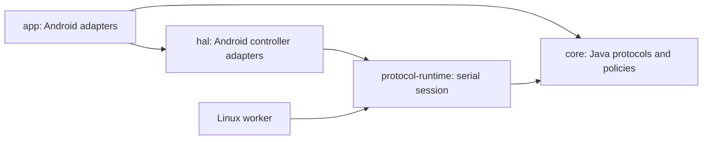

# Bridge architecture — shared protocol runtime and release boundaries

Stage 92 separates `protocol-runtime` (pure Java) from Android `hal`.
Both the Android HAL host and Linux worker reuse its controller interface,
serial session and stdin dispatcher. Face-export ownership is a platform hook;
Android supplies chown/SELinux restoration while desktop files belong to the
unprivileged user. Offline probes are in `core/src/research`, and local Android
receiver probes are only in `app/src/debug`.

LinuxProtocolHost now owns orchestration; LinuxIdentityStore owns atomic,
validated installation identity/migration; LinuxProtocolOutput owns private
IPC interception, bounded journals and stdout restoration on every exit path.
The wire handshake and completion policies remain unchanged. See
[release guide](../release/README.md) and [Linux evidence](LINUX_COMPANION_91.md).

SetupProgressState owns the public setup sequence independently of transport
lifetime and journal wording. HalTransportSession publishes bounded typed phase
events from the post-commit coordinator snapshot, including activation and
initial-sync delivery. BridgeSetupEngine prevents regressions, resets new runs,
and clears late owner-input fields. Active owner face confirmation stops the
setup transport cleanly before saving normal mode for the same activated pair.
Delivery/APP_ACK do not establish a physical face. See the 387 state-chain audit
in docs/live-20261006-optical-pairing/SETUP-387-STATE-CHAIN.md.

Setup language belongs to the authenticated Watch observation. The initial IDS
adapter retains NanoRegistry preferredLanguages/currentUserLocale with owned
copies; WatchLocaleSnapshot validates the ordered array and locale string after
identity validation. HalPostCommitOrchestrator uses those exact values in
PBBridge25 and its preferences archive. Android/app locale is never a fallback.
Missing values stop before IsPaired/activation. Operational reconnect does not
replay this setup stage. Hardware validation awaits the next fresh pairing.

InitialWifiSyncWorker reads the current validated WPA2/CCMP phone network in a
separate root thread after activation, language/Normal and the correlated
PrepareInitialSync response. HalTransportSession sends its V2 ADD archive on the
same live setup IDS Class-C lane; no operational reconnect or button is required.
The worker binds pair/generation, bounds retries, expires archives and wipes late
results on stop/link reset. The matching app ACK reports archive receipt only.
Operational READY still performs its own automatic sync; the manual button is
retained for retries and later phone network changes.

The optical branch accepts a validated native110-byte code, binds it to a fresh
setup advertisement, negotiates PSK/1 and authenticates at IKE MID2 before the
ordinary private-notify/OOB/SMP/IDS/setup path. PIN retains its original message
counters and SPAKE2+/PPK branch. Explicit replacement requires the current saved
pair UUID, idle ownership and a verified encrypted PairingReplacementBackup.
The live camera pairing completed activation and the user observed a Watch face.
Legacy force-finish is rejected; setup completion is not inferred from ACKs.

The refactor separates compile boundaries and lifecycle ownership while preserving
the activated-pair protocol. Portable codecs/policies belong to core and the shared
controller/session runtime to protocol-runtime. Root/HCI framework code belongs to hal; Android
components/resources/persistence adapters belong to app. Version 0.2.380 moves
the user connection/setup screens into Flutter Companion; Bridge now owns the
background HAL/service flow rather than a native setup screen.

Gradle compiles core without app/HAL classes and hal without app classes. The
existing dev.applewatchandroid.bridge package is deliberate: root binary entry
points and package-private codec APIs stay compatible within one APK. These
are compile boundaries, not separate Android sandboxes.

## Owners

| Owner | Responsibility |
| --- | --- |
| MainActivity | Redirects the launcher into Flutter Companion; no setup screen or process ownership |
| BridgeSetupService / BridgeSetupEngine | Foreground service and UI-free setup/recovery/probes, activation interaction and setup worker/root lifetime |
| BridgePermissionActivity | Android system permission interaction; no pairing or presentation flow |
| CompanionSessionState | Public saved identity/session/setup/challenge/discovery/journal projection; no exported pair secrets |
| CompanionConnectionPolicy | Serial setup/operational ownership, matching pair and permission gates; rejects implicit saved-pair replacement |
| BridgeActivityJournal | Persistent journal, 120 visible records, batching and bounded clipboard; UI delivery closes with its owner |
| OperationalWatchService | Activated-pair root lifetime, epoch/readiness, bounded commands, reconnect and safe stop; survives Activity close |
| OperationalSessionAccess | Live state, existing executor/handler and logger; no start/reset/replace API for feature controllers |
| OperationalHealthController | Health inbox, peer/registry binding, pending session receipts and observation worker lifetime |
| OperationalPhoneFinder | Main-thread phone effects, durable duplicate claims, correlated result delivery and alarm lifetime |
| BridgeConnectionNotification | Native notification presentation; receives state values without process ownership |
| RootBluetoothHalHost | Invocation validation, exclusive HAL lease, startup/exit and process-local command state |
| HalCommandReader | stdin framing/dispatch into existing queues; no HCI lease ownership |
| HalTransportSession | HCI callbacks/packet queue, ordered handshake, live transport and idempotent cleanup |
| WatchDiscoverySelection | Bounded live candidate tokens, explicit user selection and stale-advertisement rejection |

The packet state machine stays serial in one transport owner. An active handshake
is not split between independently scheduled workers. Existing wire coordinators,
crypto and codecs have separate owners in core; they were moved without rewriting
their implementations. HalTransportSession remains a large transport state machine;
the refactor separates ownership rather than promising smaller wire algorithms.

## Invariants

- Application ID, signing key, manifest components and signature IPC permission remain stable.
- Root entry names and main(String[]) ABI remain stable.
- IPC prefixes, request IDs, epoch/deadline gates and QUEUED versus native-result distinctions remain stable.
- Keystore aliases, encrypted pair/bond/IDS files, database paths and migrations remain stable.
- Reconnect accepts the same activated pair; setup/Albert/Buddy replay remains disabled.
- Health observations/defaults mirror remain separate from unimplemented native data/anchor acceptance.
- Bridge notification/permission strings stay Android resources. Connection,
  setup and diagnostic screen strings are Companion English ARB resources.

BridgeScreen, BridgeUi, BridgeSetupController and PhoneFindPermissionActivity
were removed. Native notifications open Companion. Operational ownership covers
stopping too, so a second flow cannot acquire HAL while the first is closing.
Fresh pairing still refuses a saved record; replacement after a reset requires
an explicit encrypted backup/replacement path, not removal of that guard.

Portable optical signature/convolution/packet/payload modules are now in core
and verified against a real camera sample. The PSK branch is integrated into HAL
and completed a real camera pairing with human-confirmed Watch face. Companion's
raw-image reader currently uses the documented transitional original-firmware
backend; the independent spatial detector remains unfinished. See
[optical status](live-20261006-optical-pairing/RESULT.md).

The cleanup improvement cancels closed Activity-journal UI delivery; durable
writes remain possible while an existing setup worker finishes. JVM tests now
live in core, and Android SQLite instrumentation stays in app. Build commands
are in [README](../apple-watch-bridge/README.md); physical packaging/lifecycle and
Companion checks are recorded in the [379 report](live-20261006-bridge-refactor/RESULT.md).
