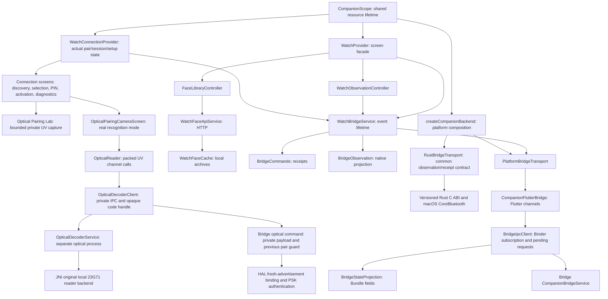

# Companion architecture after 1.0.16

The macOS build now runs the same AppleWatchCompanionApp, CompanionScope,
Cupertino tabs and All Watches/setup screens as the phone. The composition
factory selects PlatformBridgeTransport on Android or RustBridgeTransport on
macOS; providers and widgets consume the same WatchBridgeService contract.
CompanionPlatform controls supported input modes and diagnostics. Mac permits
six-digit code pairing only, while Android keeps its camera and code routes.
Native runtime capabilities separately control discovery, pairing and Wi-Fi.
The Rust adapter provides physically verified discovery/BLE and a portable
control-SA/salted-PIN engine. Its ScalablePipe adapter is wired to the engine,
but this host's bluetoothd forces bootstrap encryption without Apple's internal
Bluetooth entitlement. The normal app reports pairing unavailable. OOB bonding,
durable pair storage, activation and operational IDS remain unfinished.
Neither a discovered UUID nor a queued request creates a saved/ready Watch.
See [MACOS_RUST_CORE.md](MACOS_RUST_CORE.md) for transport status and evidence.
The [physical transport findings](MACOS_PAIRING_TRANSPORT_FINDINGS.md) separate
the tested protocol from the missing Mac pairing acceptance gates.

The connection card and setup panel share setupProgressLabel and the native
effective phase. setupRunning identifies backend ownership; setupWorking
controls the activity indicator. Activated, delivered/waiting and completed
states no longer spin indefinitely. Provider progress revisions clear old and
late command receipts. Visible-face confirmation is available during setup and
requests a safe stop/save from Bridge; Flutter does not invent completion.

The refactor keeps Provider, Cupertino screens and the existing platform-channel
and Messenger contracts. It separates application composition, native observations,
local catalog/persistence, rendering and Android engine/binding lifetime. The
connection/setup user flow now belongs to Flutter. The diagnostic optical
capture is separate from the live recognition route. A native worker decodes
real frames. An explicit Pair/Replace action consumes a short-lived native code
handle through signature-protected Bridge IPC. The live camera→PSK→fresh pair→
activation route produced a visible Watch face on the actual phone/Watch.

These are source-level owners in one Flutter/Android application, not separate
pub packages. Only the optical worker runs in a separate process. Bridge owns HAL, encrypted records and protocol state;
Flutter owns presentation and user input. Camera 0.12.1 and modular English ARB
strings were added in 1.0.11–12. The old fake PairingProvider/scanner are removed.

| Owner | Lifetime and responsibility |
| --- | --- |
| CompanionScope | Owns the shared Bridge; Provider disposes feature consumers on tree removal |
| WatchProvider | Stable screen API, local settings/app presentation and feature delegation |
| WatchConnectionProvider / WatchConnectionState | Public saved identity, real session/setup phases, discovery tokens, PIN and activation challenges; independent of face library state |
| Connection screens / SetupPanel | User selection, typed Bridge commands, PIN/activation forms and public progress; does not invent percentages or promote receipts into protocol completion |
| OpticalFrame / OpticalCapture / OpticalPairingLabScreen | Plane-layout validation and packed UV copying; bounded explicit private sample; serialized camera lifecycle and cleanup |
| OpticalPairingCameraScreen / OpticalReader | Real rear-camera preview and bounded recognition; close/retry/lifecycle handling; public code candidate, never an authenticated-pair claim |
| OpticalDecoderClient | Serial worker binding, 10-second request deadline, native payload retained behind a 120-second single-use handle; clear on close/failure; no key in Dart |
| OpticalDecoderService / JNI backend | Non-exported :optical process, one worker thread, max90 frames/bounded128MiB arena; hash-pinned locally supplied PAC-adapted 23G71 reader; wipe frame/decoder memory at close |
| WatchObservationController | Device, native settings, face inventory, phone-finder and Health subscriptions; cancels its own listeners |
| FaceLibraryController | Local designs and remote catalog; ignores late startup results after disposal; closes an API only when it owns it |
| WatchFaceApiService / WatchFaceCache | HTTP client versus existing filesystem/archive storage; cache can be injected |
| WatchBridgeService | Routes events and owns broadcast streams/platform subscription; idempotent disposal rejects new commands |
| BridgeCommands | Receipt semantics and request payloads, independent of event projection |
| BridgeObservation | Decodes the whole connection publication before individual projections are emitted |
| BridgeTransport / PlatformBridgeTransport | Injectable transport and production MethodChannel/EventChannel boundary |
| RustBridgeTransport / OwnedBridgeTransport | macOS observations into the same contract; bounded discovery, ABI guard, polling/cancellation and one native stop at disposal |
| CompanionPlatform / createCompanionBackend | Input policy and backend selection at composition; Mac code-only, Android optical/code; shared UI remains platform-independent |
| WatchFaceView | Preview layout/time/ticker; delegates vector drawing to seven painter libraries |
| MainActivity | Android Flutter lifecycle; engine cleanup and destruction close the adapter idempotently |
| CompanionFlutterBridge | Flutter channel handlers and permission-screen interaction; closes its Binder client |
| BridgeIpcClient | Signature-checked subscription, at most 32 pending receipts, five-second deadlines, binding-death recovery and cleanup |
| BridgeStateProjection | Presence-sensitive Bundle decoding including native face projection |

## Preserved contracts

- Platform channels remain `dev.applewatchandroid.companion/bridge` and
  `dev.applewatchandroid.companion/events`.
- Android app ID, signing configuration and Bridge signature IPC remain stable.
  Optional camera feature/permission was added; audio recording is disabled.
- Messenger version 1, request UUIDs, message numbers and Bundle keys stay stable.
- Only `APPLIED` establishes the confirmation returned by confirmed commands.
  `QUEUED`, HAL acceptance and IDS/app ACKs remain delivery stages.
- Native collection selection is confirmed by new pair/epoch-matching observations;
  local catalog save/import does not publish a Watch inventory or selected UUID.
- Unknown/stale telemetry and missing native settings stay explicit.
- Preference keys, documents/watchfaces path and .watchface codec remain unchanged.
- English ARB resources remain the localization source; new connection/camera
  strings are generated through the same modular localization path.

## Camera pairing status

Companion1.0.15 has a live recognition route at All Watches → Pair with Camera.
Its release JNI worker restored byte-identical code from the actual 90-frame
camera fixture after20frames on CPH2653. Flutter receives only public name and
an opaque temporary handle. Explicit Pair/Replace consumes it once through
native IPC; the real camera run recognized after11frames and completed PSK,
fresh pairing and activation, with a human-confirmed visible Watch face.
The transitional native backend uses original local firmware, not the independent
Java spatial port. It is generated from hash-pinned source at build time; arm64
is supported and other native ABIs explicitly reject initialization. Portable
spatial grid detection is unfinished. Saved-pair replacement requires matching
identity, idle ownership and a verified encrypted backup; no implicit overwrite.
See [verified stages and remaining work](live-20261006-optical-pairing/RESULT.md).
Flutter61 tests/analyze0 and release build PASS. Explicit private device-test
fixtures and instrumentation APK were removed after verification.

Bridge385 also sends the supported current phone Wi-Fi network automatically in
the setup session after activation/language/Normal and PrepareInitialSync response.
Flutter's Send phone Wi-Fi network action remains an operational manual retry;
setup no longer depends on pressing it or establishing a second connection.
Fresh pairing proof for385 awaits the owner's next scan; the Watch was reset again.

## Lifecycle corrections

The application now disposes the shared Bridge and its owned HTTP API. A standalone
provider does not close borrowed services. Late cache/remote startup results cannot
publish into a disposed library; pending setup attempts still use the existing
attempt gate. Transport error or event-stream completion invalidates connected
telemetry/native projections. Closed Binder clients ignore late connections,
messages and requests, and clear timeouts/pending results on close.

These changes do not implement unverified native Watch features. Preview mock
complications, local preference screens and incomplete native capabilities retain
their previous behavior. Rendering tests establish successful painting/ticker
cleanup; they are not a measured 60fps performance claim. See the
[physical/test report](live-20261006-companion-refactor/RESULT.md).
