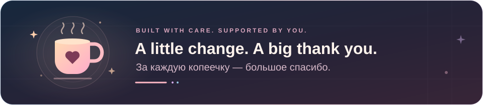

<p align="center">
  
</p>

<h1 align="center">Support the developer · Поддержать разработчика</h1>

<p align="center">
  The developer would be very happy if you could spare a little change. ❤️<br>
  Разработчик будет очень рад, если подкинете копеечку. ❤️
</p>

<p align="center">
  <strong>Choose a network · Выберите сеть</strong>
</p>

<p align="center">
  <a href="#bitcoin" title="Bitcoin"></a>
  &nbsp;
  <a href="#evm" title="Ethereum"></a>
  &nbsp;
  <a href="#evm" title="BNB Smart Chain"></a>
  &nbsp;
  <a href="#evm" title="Polygon"></a>
  &nbsp;
  <a href="#ton" title="TON"></a>
  &nbsp;
  <a href="#solana" title="Solana"></a>
  &nbsp;
  <a href="#tron" title="TRON"></a>
</p>

<p align="center"></p>

<a id="bitcoin"></a>

###  Bitcoin · BTC

```text
bc1qdr269fv9r749hdz3x84ze6un0t86g5uk504r6m
```

<p align="center"></p>

<a id="evm"></a>

###  Ethereum ·  BNB Smart Chain ·  Polygon

One address for all three networks · Один адрес для всех трёх сетей.

```text
0xc113dcfb116E31A15Db83c3C6d4131ED08F14edD
```

<p align="center"></p>

<a id="ton"></a>

###  TON

```text
UQAwn_-rWNLJ3Mo86N7hy2Vf13236tukdR79FdFbI0Vu0-Bx
```

<p align="center"></p>

<a id="solana"></a>

###  Solana · SOL

```text
HhHLNmXLxinHNLHDFW5TacAUy8eXNC8iUNGTjDhzkTip
```

<p align="center"></p>

<a id="tron"></a>

###  TRON · TRX

```text
TYAfk1SRP3CxhcZULoFpgLNYe4GzfQ6sxw
```

<p align="center"></p>

<p align="center">
  Thank you for supporting the project! · Спасибо за поддержку проекта!<br>
  <a href="../README.md#english">← English README</a> · <a href="../README.md#russian">← README на русском</a>
</p>
