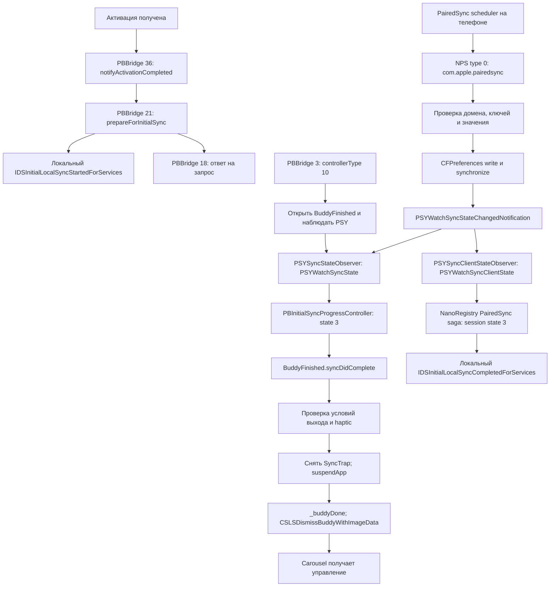

# Цепочка после отправки setup: native поведение и факты стенда

## Успешный результат на332 и гипотеза порядка observer

Пользователь подтвердил активацию после ordinary NPS terminal PSYWatch
state3/progress100 и PSYClient state3,00:49:01.236. Перед этим на уже открытом
Buddy ordinary NPS progress50/state2 отправлен00:43:54.608. AppACK обеих
публикаций не является причиной признания успеха: есть ответ пользователя.
PB16 nonresponse954B00:49:01.473 пока не классифицирован.

Exact23S303 PSYSyncStateObserver.initWithDelegate:queue:19a566360 вызывает
_refreshSyncState до weak delegate/queue assignment. PB progress controller
init100032888 создаёт observer; addObserver100032b6c только добавляет observer,
не replay текущего состояния. PBBuddyFinished.init10002aa08 подписывается на
progress controller. Поэтому старый порядок PSY terminal → NPS → Buddy push
может терять UI notification; это гипотеза конкретного зависания.
333 staged открывает Buddy до beginning/Prepare и не повторяет navigation
на terminal. continuePairedSync10002b324 также читает global complete state;
не считать race неизбежной для всех native routes. Evidence:
chain-watch262-psy-observer-init-333.log,
chain-watch262-passcode-prep-pass-333.log.

Unpruned NPS100011704 и asm подтверждают CFPropertyList values, protected
defaults first-unlock gate, setObject лишь при изменении значения и Darwin
notification после write/synchronize. Не утверждать, что Watch locked, без
наблюдения. Evidence: chain-watch262-nps-unpruned-333.log,
nps-value-decode-333.log,nps-apply-333-arm64e.asm.txt,nps-write-notify-333.asm.txt
(полные имена файлов начинаются chain-watch262-).

## Проверка 332: разделять локальные состояния телефона и экран часов

Обычный NewWatchPairing exact23S303100050738: MakeDevicePaired →
StartAppConduit → EnableWatchGraduation → DismissSetup → PairedSyncTransaction →
TellIDSLocalPairingSetupComplete → WriteMiniStore → LegalBackstop. В этой ветви
не найден migration WaitForSyncToStart. DismissSetup block1000e08cc для normal
account только transactionDidComplete; xpcFakePairedSyncIsComplete — alt account.
Evidence: chain-watch262-finalize-normal-332.log, finalize-blocks-332.log,
finalize-local-ids-332.log. Не смешивать route order с физическим порядком UI.

Телефон iOS26.6 использует отдельную локальную цепочку:

1. COSSetupFinishedViewController при создании view, если local isSetup=false,
   вызывает NRPairedDeviceRegistry.setWatchBuddyCompletedSetupSteps(callback=nil).
   Evidence: chain-phone-finished-flow.log:228.
2. Framework1e4aaf9f0 отправляет локальному daemon XPC
   xpcWatchBuddyCompletedSetupSteps. Это IPC телефона, не IDS Watch сообщение.
3. Daemon10003ec80 → block10003ef6c → _queueMarkDeviceIsSetup10003f650.
   Если ещё не paired, сохраняет pairingID для последующего перехода.
4. _markDeviceIsSetupWhereApplicable10003fa58 применяет local
   NRDeviceDiff(isSetup=true). Требует isPaired=true; для earlyPairedSync
   capabilityb4c9f855-8bbe-5bd6-81ce-0a24d8e4aa74 также pairingClients.count==0.
   Учитывает прежнее isSetup и bypassIsSetupNoCheck; не переписывает уже true.

Evidence: chain-phone-nr-framework-completed-332.log, buddy-completed-332.log,
queue-setup-origin-332.log, isSetup-producers-332.log, isSetup-source-332.log.
WatchNR wire isSetup и локальный phone registry isSetup нельзя считать одним
событием. Историческое утверждение live0.2.190, что gizmoDidFinishActivating
равно xpcWatchBuddyCompletedSetupSteps, новой цепочкой не подтверждено.
Bridge должен моделировать локальный lifecycle отдельно от remote observations;
любая такая коррекция не является доказательством стабильного циферблата.

Exact Watch IDS: TellIDS block1000d93d0 требует Bluetooth UUID и normal account,
вызывает IDSLocalPairingSetupCompletedForPairedDevice. XPC handler1003d5e98
вызывает IDSUTunDeliveryController.localSetupCompleted1001edaf0:
setLocalSetupInProgress(false) и _updateLocalSetupInProgressState(false).
Последний, при готовом NR preferences handler, вызывает localSetUpCompleted
10017bc7c → NRDevicePreferences.deviceSetupCompleted. В разобранном участке
нет сетевой команды закрытия Setup; дальнейшие NRDevicePreferences эффекты
ещё не установлены. Evidence: ids-setup-completed-pass-332.log,
ids-local-complete-332.log, ids-setup-flags-pass-332.log,
ids-peer-setup-wire-pass-332.log и соответствующие selector asm.

Физический выход UI: Buddy.syncDidComplete10002cc0c → exitCriteria10002d290 →
haptic/Start/Crown → completeAndDismiss10002cee4 → suspendApp10001624c →
_buddyDone100015fdc → tellCarouselDismissBuddy → terminateWithSuccess.
Новый этап приложения не следует подменять ручной повторной PSY completion.
На00:33 связь332 жива, actual Clock остаётся неподтверждённым.

Актуальное дополнение 6 октября: пользователь сообщил о повторном сбросе после
писка и краткой кнопки «Начать». Полноценной настройки нет. Старые состояния
ниже исторические. Exact262 EPSagaTransactionWaitForSyncToStart100017dc8
проверяет syncSessionType==0 и activeActivityLabels.count>0, независимо от
круга Setup. Таймер600s100017130/1001068f8; timeout100017698 записывает
Sync start timeout. PSY client constructor19a566d6c читает activeActivityLabels
и completedActivityLabels. Bridge пока отправлял только terminal state3,
без начальной активной сессии. Пропуск доказан, live reset причинность не доказана.
Exact Setup syncDidComplete10002cc0c, exitCriteria10002d290, dismiss10002cee4
содержат haptic/Crown/IDS completion/SyncTrap OFF, но не erase.
Нужно воспроизвести обе ветви протокола; AppACK не доказывает ни одну из них.

Уточнение332: caller WaitForSyncToStart100015948 разрешён через block10001564c
в EPSagaTransactionWatchMigration::buildRoutingSlipEntries100015528. Поэтому
его600s timeout нельзя автоматически приписывать NewWatchPairing или данному
сбросу. Beginning state2/active labels теперь отправляется перед PB21, но успех
исправления требует живого выхода Setup. NewWatchPairing100050738 после
MakeDevicePaired→StartAppConduit→EnableWatchGraduation→DismissSetup запускает
PairedSyncTransaction1000b7f80; block1000b80bc сначала требует device.isPaired
и isActive, затем для обычной учётной записи вычисляет тип sync черезblock1000b8240.
Evidence: chain-watch262-new-pair-route-332.log, start-route-context-332.log,
route-owners-332.log. Текущая fresh332 genuine activation подтверждена00:13:37;
completion доставлена, физический результат и isSetup пока не подтверждены.

Состояние на 5 октября 2026, после прогона 0.2.314. Часы остаются на первой
отметке progress ring. Активация подтверждена; физический выход Setup не подтверждён.
Историческое состояние выше относится к314–315. Текущее продолжение330:
paired IDS работает, синхронизация на физическом экране ещё не подтверждена.
Exact23S303 Setup pushControllerType1000186f4 → block10001876c → type map1000180b0
подтверждает10=PBBuddyFinished; прежние26.6 push addresses не использовать для262.
Actual Watch spindump UUID совпадает с262 Setup и содержит BringDevicesNear
language animation, но это не доказательство видимого controller при overlay.
Unified prefix даёт только Activity для Setup; текстовой причины gate пока нет.
Resource diagnostic receiver исправлен: BE64 offset вне per-chunk gzip (329),
IDS ACK/AppAck только whole-file completion (330), TCP/ERTM ACK независимы.
Подробнее текущее состояние и evidence — RESULT.md и SUMMARY.md.

## Границы доказательств

Это реконструкция из бинарников Apple, а не доступные оригинальные исходники.
Setup, nanoprefsyncd, PSY observers и NR PairedSync saga разобраны для watchOS 26.2/23S303, ранее
сообщённой часами в IDS credentials. PBBridge и часть PSY разбирались также по
watchOS 26.6/23U67; iPhone сторона — iOS 26.6/23G71. Адреса разных сборок не смешивать.
Применение состояния внутри физических часов не выводить из одного IDS AppAck.

## Последовательность и независимые ветви

Стрелка 36 → 21 показывает порядок текущего Android сценария, а не гарантию
атомарного применения на часах. Ответ 18 не является завершением ветви NPS/PSY.
Финальная видимость циферблата требует отдельного наблюдения после передачи Carousel.

## Команды и обработчики

| Этап | Native обработчик и условие | Подтверждение на стенде / предел |
|---|---|---|
| Активация | Setup.finishedActivating → tellCompanionGizmoFinishedActivating; watch→phone PBBridge 4 | Активация подтверждена. Type 4 не означает Buddy/Clock completion |
| Normal | phone PBBridge 36 → PBBridgeGizmoController.updateNanoRegistryToNormalState → Setup.updateNanoRegisryToNormalState | 36 отправлен. Native Setup при compatibilityState < 3 лишь откладывает действие; иначе вызывает NR.notifyActivationCompleted(device, success=true) |
| Подготовка | phone PBBridge 21, пустое protobuf тело → PBBridgeGizmoController.doInitialSyncPrep → delegate.prepareForInitialSync | Correlated PBBridge 18 получен 20:32:05.224. Native handler посылает 18 даже при отсутствии подходящего delegate |
| Начало IDS sync | Setup.prepareForInitialSync → IDSInitialLocalSyncStartedForServices(NULL) | Это локальная API операция часов, не protobuf 18 и не настройка progress |
| Публикация PSY | iPhone pairedsyncd PSDWatchSyncStateObserver._updateWithSyncState:andSyncClientState: сохраняет две plist и вызывает NPS synchronizeNanoDomain:keys: | Android primary PSY получил correlated AppAck 20:32:05.320. Native запись на часах не наблюдалась |
| Приём NPS | nanoprefsyncd регистрирует type 0 на ordinary preferences и preferences.pairedsync | Подтверждено и на 26.2. Type 1 — managed configuration; type 2 — отдельный backup на ordinary preferences |
| Применение | NPS domain/key permitlist → binary plist decode → NPSSettingAccessor.setObject:forKey: → synchronize → Darwin notification | AppAck не доказывает прохождение всех этих проверок. Без изменения значения notification может не публиковаться |
| Обновление круга | PSYSyncStateObserver читает PSYWatchSyncState; PBInitialSyncProgressController получает globalProgress/syncProgressState | state 3 вызывает syncDidComplete; иначе globalProgress / 100 обновляет progress |
| Завершение NR saga | PSYSyncClientStateObserver.syncState.syncSessionState == 3 | watch 26.2 querySyncStateForActiveDevice → doneWaitingForPairedSync → локальный IDS completion и transactionDidComplete |
| Финальный экран | PBBridge 3, controllerType=10, bytes 08 0a → PBBuddyFinishedViewController | Открылся Apple/progress ring. Это вход в финальный controller, не его успешное завершение |
| Выход | BuddyFinished.syncDidComplete → _evaluateExitCriteria → haptic/exit → _completeAndDismissSetup | На часах пока не наблюдался |
| Передача UI | suspendApp → _buddyDone → tellCarouselToDismissBuddy → CSLSDismissBuddyWithImageData → terminateWithSuccess | Native путь доказан в Setup 26.2/26.6; физический Clock остаётся неподтверждённым |

## NPS wire schema и значения PSY

Для protobuf type 0 outer message: timestamp — fixed64 field 1; domain — string
field 2; repeated keys — field 3. В каждом key: key string=1, value bytes=2,
optional twoWaySync=3, optional timestamp fixed64=4. Value — обычный binary plist,
не NSKeyedArchiver. Topic выбирается по capability
36A0EB23-E045-4E99-9D71-8FB9A853ADA7; ordinary handler существует независимо от выбора.

Домен com.apple.pairedsync:

- PSYWatchSyncState: version=1, globalProgress=100, syncProgressState=3.
- PSYWatchSyncClientState: version=1, syncProgressState=3, syncSessionType=0,
  migrationSync=false. Ключ plist syncProgressState превращается в API syncSessionState.

В 23S303 PairedSyncWatchSettings.bundle разрешает оба ключа, NPSPerGizmo=true,
notification PSYWatchSyncStateChangedNotification. Проверены 85 bundles и 387
domain entries: SystemPreferencesSync.bundle отдельно разрешает
com.apple.nanoprefsyncd/past-initial-sync для групп Local/Tinker и задаёт notification
com.apple.nanopreferencessync.initialSyncCompletion.

past-initial-sync также выставляет локальный NPSServer.setHasPerformedInitialSync
через NPSDeviceRegistry.domainAccessor. Его разрешение на wire доказано;
утверждение «ответ/отправка ключа уже завершили native sync» не доказано.
В исследованной watch 26.2 EPSagaTransactionPairedSync.updatePairedSyncNotifyToken
пустой; querySyncStateForActiveDevice проверяет PSY client session state 3.
Не переносить iPhone/другую сборку notification gate на часы автоматически.

Type 2 backup имеет другую outer schema: optional container string=1,
domain string=2, repeated keys=3. Это не type-0 тело с заменённым номером.
Backup также имеет собственные разрешения restore и не подменяет штатный sync.
Диагностический backup 20:34:59 попал в заполненную TCP очередь (0 frames),
его доставка не подтверждена.

## Условия выхода из BuddyFinished

Exact23S303 дополнительная проверка: init10002aa08 всегда добавляет observer
PBInitialSyncProgressController; avoidSyncController10002b248 зависит от NR isAltAccount.
showGuidedTour10002aa00 возвращает false. fallBackToOldSyncPattern10002b54c зависит
от BetterTogether/capabilityB4C9F855-8BBE-5BD6-81CE-0A24D8E4AA74. Этот выбор не отменяет
PSY observer. PBBridgeSupport PBPairedSyncCompleteState0xa138 читает dictionary
com.apple.pairedsync/PSYWatchSyncState/syncProgressState и сравнивает с3;
PBPairingGlobalProgress0xa49c читает globalProgress из той же dictionary.
Отдельного обязательного preference key для legacy/new progress не обнаружено.
Evidence: chain-watch262-buddy-sync-mode.log, exact PBBridgeSupport.arm64e disassembly.

syncDidComplete устанавливает _syncProgressComplete и progress=1, затем вызывает
_evaluateExitCriteria. Последний проверяет completion/avoidSyncController,
NanoRegistry status, внутренний Walkabout, guided tour, Crown и haptic.
Обычный progress controller позволяет завершить sync trap после completion.
В ветке guided tour без progress controller и без отвлечения пользователя
может потребоваться Crown. Первая отметка круга сама по себе не доказывает эту ветку.

_completeAndDismissSetup вызывает локальный IDSInitialLocalSyncCompletedForServices,
setSyncTrapEnabled(false), затем обычный suspendApp или отдельную MiniBuddy ветку.
suspendApp выполняет _buddyDone, передаёт Carousel dismissal screenshot и завершает
Setup. Application.setupComplete снимает assertion; само имя метода не является
подтверждением появления циферблата.

## Что в Android требует пересмотра

1. Прежний комментарий AppleWatchPostCommitCoordinator о том, что response 18
   доказал применение Normal 36, исправлен: native handler не даёт такой гарантии.
   NR Normal observation, отправку 36 и ответ 18 учитывать отдельно; изменение
   runtime prerequisite требует проверки доступного источника NR observation.
2. PBBridge 19 может остаться диагностикой, но не приводить к progress/Setup evidence.
3. Отслеживать PSY и past-initial-sync отправку, AppAck и apply evidence раздельно.
   Current completionOutputs объединяет PSY, NPS key и Buddy, но correlated receipt
   координатора относится к primary PSY.
4. Комментарий backup type 2 исправлен; декодирование этого типа необходимо
   разделить с type 0, если путь нужен: у него другая схема и отдельный handler.
5. Не ждать isSetup до публикации PSY: это может образовать цикл ожидания.
   Но и не получать isSetup/Clock из PBBridge 4 или транспортной квитанции.
6. Стабилизировать доставка Class D до дальнейших массовых preference mirrors.
   В 314 backlog завис с TCP SACK; staged 315 обновляет TCP retransmit timestamps.
   Подтверждение влияния на доставку и экран ещё требуется.

## Источники и незавершённая верификация

Файлы в этом каталоге:

- chain-phone-pb-prepare.log — iOS PBBridge команды 36/21 и response handler 18.
- chain-watch-pb-prepare.log — watch 26.6 handler и безусловный response 18.
- chain-phone-finished-flow.log — iPhone hold до activation + initialSyncPrep,
  отдельное наблюдение sync completion и isSetup.
- chain-phone-psd-publish.log — iOS pairedsyncd генерирует обе PSY plist и
  synchronizeNanoDomain:keys:; state finished задаёт progress 100/state 3.
- chain-watch262-setup-exact.log, chain-watch262-setup-progress.log — точная
  watch 26.2 цепочка, progress, Normal prerequisite и UI handoff.
- chain-watch262-nps-exact.log, chain-watch262-nps-permitted.log — точная NPS
  маршрутизация и локальный handler; входящие значения могут быть отвергнуты.
- chain-watch262-nr-psy-gates.log — точный native gate PSY client session state 3.
- pairedsync-observer-refresh.log, pairedsync-plist.log — PSY observer/парсер 26.6.
- chain-watch262-psy-exact.log — PSY observer/парсер 26.2: подтверждены оба
  ключа, plist syncProgressState и чтение CFPreferences mobile/anyHost.
- chain-watch262-nps-bundles-extract.log — полный набор bundle permitlists 23S303.
- phone-314.log — live последовательность отправок и correlated AppAck.

Проект WatchPsyChain262 импортирован. Первый поиск по полным именам дал 0 matches;
повторный разбор по ObjC адресам из исходного dyld cache дал все четыре body:
19a565e7c, 19a566088, 19a566d6c, 19a5667d4. 315 прошла 637 tests/lint/assemble.
Следующий live прогон должен проверить доставку/apply на прежней паре без стирания.

Критерий завершения задачи: реально закрытый Setup и физический циферблат,
затем программный paired reconnect с сохранённой активацией.
